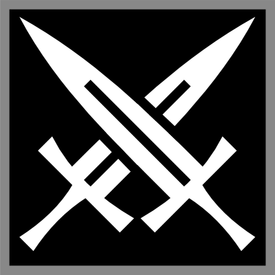
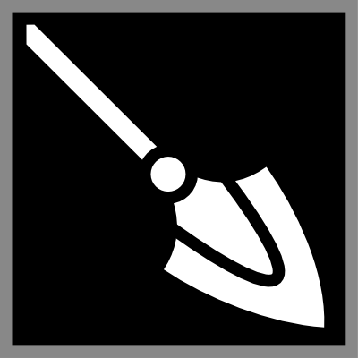
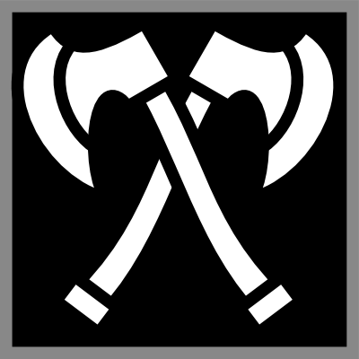

# ◈ La Confrontation

## Présentation

Les confrontations représentent bien souvent des moments importants voir clés d’une aventure. Qu’elles soient des affrontements armés ou verbeux, leur dénouement compte parmi les plus importants tournant d’une histoire.

Ce chapitre vise à creuser les possibilités d’interprétation en poussant un peu plus loin l’aspect tactique et l’importance du choix des armes ou des mots.

## Généralités

Une grande partie de la notion de confrontation passe par la notion de triangle : Certaines armes ou méthodes sont efficaces contre d’autres armes ou types de personnalités.

Chaque choix revêt ainsi une importance décuplée.

### Les Triangles Tactiques

Les différents triangles tactiques mettent en avant le fait que certains armes ou méthodes donnent un avantage certains face à des opposants adoptant des moyens peu ou pas adaptés.

Lorsqu’un personnage tente une action de confrontation (combat ou joute) sur un individu et que celui-ci tente une défense :

- Il reçoit un désavantage si son arme est « faible » contre celle du personnage.
- Il reçoit un avantage si son arme est « faible » contre celle du personnage.

Ces désavantages affectent toutes les actions visant à se défendre d’une attaque ou d’une tactique, qu’elles emploient effectivement l’arme ou non.

SI un individu oublie de rappeler le désavantage imposé à son adversaire c’est que le personnage ne maitrise pas le sujet ou que le feu de l’action l’a privé de son avantage : C’est donc une règle qui peut être oublié sans que cela ne soit problématique.

## L’Art du Combat

L’art du combat est celui des affrontements armés.

Un individu est rattaché à l’arme qu’il porte en main directrice. A défaut d’arme, comme par exemple au début d’un combat lorsque les armes sont rengainées, un individu n’a pas d’armes rattachées et se trouve donc hors de portée du triangle des armes. En cas d’armes multiples (une arme dans chaque main ou des armes naturelles multiples) c’est la dernière arme employée pour une action qui doit être considéré.

### Le Triangle des Armes

On fait appel à ce triangle lors des tests de combat en mêlée.

|  |  |  |
| --- | --- | --- |
| Fort contre | < DEX > Finesse | Fort contre |
|  |  |  |
| < AGI > Souplesse | Fort contre | < FOR > Brutalité |

L’appartenance à un groupe est surtout le fruit d’un élément bien précis : Le type de prise. C’est cela qui définit la façon dont une arme est employée, vers où et comment est exercé le point de force, etc… Les armes d’escrime, dont l’usage repose sur une garde et la Dextérité, sont constituées de la grande majorité des lames, etc… On dit que cette façon de combattre tire parti de la finesse. Ces armes ont bien souvent une taille et un calibre équilibrés. Les armes de choc, dont l’usage repose sur un manche et la Force, sont constituées des masses, haches, etc… On dit que cette façon de combattre tire parti de la brutalité. Ces armes sont bien souvent larges ou lourdes. Les armes d’hast, dont l’usage repose sur une hampe et l’Agilité, sont constituées des lances, bâtons, etc… On dit que cette façon de combattre tire parti de la souplesse. Ces armes sont bien souvent longues.

!!! note "Note"
    Mais, pourriez-vous penser, d’où vient cette logique concernant les armes de mêlée ? Pourquoi épées supérieures aux haches, elles même supérieures aux lances, elles même supérieures aux épées ? Voici la logique derrière ce choix :

    Les épées ont un centre de gravité situé près de leur garde ce qui les rends particulièrement maniables et ce qui leur donne un énorme avantage sur les armes d’hampes dont l’équilibre doit se faire à partir de la tête de l’arme à la place. Les épéistes peuvent donc plus aisément feinter les combattants faisant usage d’une arme aussi difficile à manier. Les épées ont cependant une portée inférieure à une arme d’hampe et ont bien du mal à dévier un coup porté sur une certaine distance, la garde étant trop proche de soi pour exercer une force suffisante pour dévier le bout d’une lance emportée dans son élan, un élan qui provient de toute la flexibilité du corps de l’attaquant ! Ce que les armes de manches, maniées en imprimant une certaine inertie en tête d’arme afin de compenser son poids, peuvent faire en revanche, tout en gagnant un certain contrôle du fait de la forme non longiligne de ces extrémités.

    Dans les faits les lances ont, de tout temps, toujours eux un avantage certains sur toutes les autres armes dû à leurs portées (et leur moindre cout), mais c’est ici un jeu de rôle donc on fait quelques raccourcis :) !

Ce qui compte pour ce triangle ci est donc le type de prise. Il existe en effet des exceptions notables dans la corrélation entre « poignée » et « attribut » c’est pourquoi il ne faut pas se baser sur ce dernier afin de définir comment le triangle offensif des armes se comporte.

### Les cas spéciaux

Il y a quelques cas spécifiques à considérer en plus des triangles classiques des armes.

Les armes exotiques & les armes naturelles sont rattachées aux triangles en fonction de l’attribut employé pour en faire usage.

Par exemple les griffes d’un loup sont des armes naturelles faisant intervenir la Dextérité, c’est donc une arme classée « finesse ». Les actions faisant usage des griffes (généralement des attaques d’attaques ou des actions tactiques) sont donc avantagées contre un adversaire muni d’une arme à manche.

### Les cas exclus du triangle

Les armes à poignée (bouclier, etc) et à distance sont exclues du triangle des armes.

### Les armes et les conditions

Selon le groupe d’une arme, il est possible de réaliser certaines conditions (et pas d’autres).

Les armes brutales (FOR) permettent d’infliger : Blessé, Vulnérable, Désorientation, Torpeur,

Les armes fines (DEX) permettent d’infliger : Accablé, Léthargie, Asthénie,

Les armes souples (AGI) permettent d’infliger : Exposé, Faiblesse, Faille, Lent, Errance,

Les armes défensives (CON) permettent d’infliger :

Les armes à distance (PER) permettent d’infliger : Inactif,

### Le Triangle des Armures

Il existe une relation étroite entre le type d’arme employée et l’armure de la cible affectant le jet de dégâts, on parle de triangle des armures.

Les armes tranchantes ont des dégâts maximisés contre les armures de cuirs & peaux (catégorie 2). Les armes contondantes ont des dégâts maximisés contre les armures de plaques et de plates (catégorie 4). Les armes perforantes ont des dégâts maximisés contre les armures de mailles et écailles (catégorie 3). Les armes flexibles ont des dégâts maximisés contre les étoffes et le tissu, voir la peau nue (catégorie 1 et inférieure).

Les dégâts maximisés considèrent les dés affichant 2 ou moins comme des 3 pour ce qui est des dégâts.

## L’Art Oratoire

L’art du combat est celui des joutes et des méthodes. Un individu est rattaché à la dernière méthode qu’il a employée. A défaut, comme au début d’une joute avant que des propos aient pu être tenus, un individu n’a pas de méthode rattachée et se trouve donc hors de portée de la trinité rhétorique.

### La Trinité Rhétorique

La trinité rhétorique est l'équivalent du triangle des armes dans le cadre des joutes.

On fait appel à cette trinité lors des tests de joutes. La trinité des méthodes implique 3 groupes de méthodes que voici :

| Fort contre | < RUS > Coercition (Delta) | Fort contre |
| --- | --- | --- |
| < SAG > Suggestion (Bêta) | Fort contre | < CHA > Persuasion (Alpha) |

L’appartenance à un groupe est surtout le fruit d’un élément bien précis : Le type de la méthode. C’est cela qui définit la teneur des propos et le point de pression recherché. La Coercition, généralement employée par les personnalités Delta est efficace contre ceux qui pratiquent la Persuasion. La Persuasion, généralement employée par les personnalités Delta est efficace contre ceux qui pratiquent la Suggestion. La Suggestion, généralement employée par les personnalités Delta est efficace contre ceux qui pratiquent la Coercition.

Rappel : La personnalité est matérialisée par une tendance qui est définit par le caractère et le comportement d’une personne.

### Le cas des dégâts en Joute

Sans faire partie des trinités des méthodes, il existe une relation étroite entre le type des méthodes employé et la personnalité du personnage ainsi que les propos tenus par l’adversaire.

La Persuasion réalise des dégâts avantagés lorsqu’elle est pratiquée par des personnalités Alpha. La Coercition réalise des dégâts avantagés lorsqu’elle est pratiquée par des personnalités Delta. La Suggestion réalise des dégâts avantagés lorsqu’elle est pratiquée par des personnalités Bêta.

La Persuasion réalise des dégâts avantagés contre ceux qui sont associés à la méthode de Suggestion (Bêta). La Suggestion réalise des dégâts avantagés contre ceux qui sont associés à la méthode de Coercition (Delta). La Coercition réalise des dégâts avantagés contre ceux qui sont associés à la méthode de Persuasion (Alpha).

Exemple : 1) Robert a une personnalité Alpha et il tente de persuader un interlocuteur sans méthodes définis : Ses dégâts seront avantagés (car il utilise la méthode adapté à son caractère). 2) Roger a une personnalité Bêta et il tente de persuader un interlocuteur aux méthodes delta (il a donc tenté une coercition en dernière action de joute) : Ses dégâts seront avantagés (car la persuasion marche bien sur ceux qui pratique la méthode delta). 3) Robert est toujours Alpha et il tente de persuader un interlocuteur rattaché aux méthodes bêta (il a donc tenté une suggestion en dernière action de joute) : Ses dégâts seront doublement avantagés (puisqu’il emploie une méthode adapté à son caractère ET qui marche bien sur ceux qui pratique la méthode bêta).

## Règles Optionnelles

Il est possible d’ajouter et modifier les règles existantes à l’aide de règles optionnelles.

### Le Type d’Arme définit la Défense

Avec cette règle le type d’une arme (tranchant, perforant, contondant) a bien plus d’importance qu’avant : Désormais c’est le type qui définit sur quel attribut l’arme employé attaque, pas l’attribut employé pour attaquer. La règle part du principe que si la façon d’agripper l’arme détermine bien la précision qui découle de son usage, la forme de l’arme est effectivement ce à quoi la cible est confrontée lorsqu’il s’agit de se défendre ! Il résultat de cette règle qu’il y a ainsi 9 possibilités différentes de classe d’arme (ATT d’attaque/ATT de défense) au lieu de 3 uniquement.

Avant la règle optionnelle :

|  | Garde (DEX) | Hampe (AGI) | Manche (FOR) |
| --- | --- | --- | --- |
| Tranchant Perforant Contondant | Epée (Sabre/etc) Dague Poignard | Lance Bâton | Hache Marteau |

Après la règle optionnelle :

|  | Garde (DEX) | Hampe (AGI) | Manche (FOR) |
| --- | --- | --- | --- |
| Tranchant (DEX) | Sabre Dague | Hallebarde | Hache |
| Perforant (AGI) | Rapière Poignard | Lance | Pique Pioche |
| Contondant (FOR) | Fouet | Bâton | Marteau |

Le système n’en est alors que plus profond et plus intéressant. La contrepartie, bien entendu, c’est que cela peut alourdir la compréhension des règles de combat…

### Les Familles d’Arme

Avec cette règle les familles d’une arme (hache, masse, lance…) ont bien plus d’importance qu’avant : Désormais la famille d’une arme définit plus profondément son utilité en combat.

Dans les règles de base seules quelques armes disposées d’un tel traitement afin de renforcer l’utilité que l’on attendait d’elles. Désormais chaque arme reçoit une particularité… sauf les épées qui font office de références, comme souvent.

Notons qu’un modificateur d’Attaque, Défense ou Tactique est appliquée à la catégorie.

| Famille d’Arme | Bonus | Malus | Prix de réf. |
| --- | --- | --- | --- |
| Epée | - | - |  |
| Hache | Attaque +1 | Tactique -1 Défense -1 Pénalité +1 | +2 |
| Lance | Allonge +2 Tactique +1 Défense +1 | Attaque -1 Solidité -1 | -2 |
| Masse | Tactique +1 Solidité +2 | Vitesse -2 Rapidité -2 | +0 |
| Marteau | Tactique +1 Solidité +2 Def Adv -1 | Vitesse -4 Rapidité -4 Charge +2 | +0 |
| Bouclier | Défense +2 | Attaque -2 | +0 |
| Main Gauche | Défense +1 Att +2 Contre | Attaque -1 | -2 |
| Lame de Poignet | Rapidité +2 Def Adv -1 | Tactique -1 Allonge -1 | +3 |
| … | … | … | … |

Le système n’en est plus profond encore et le choix des armes compte plus que jamais. La contrepartie, bien entendu, c’est que cela peut alourdir (encore une fois) la compréhension des règles de combat…
