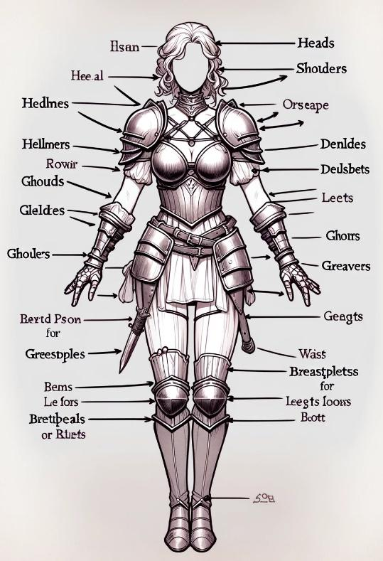

## Généralités

Voici quelques règles (passablement optionnelle mais intéressante malgré tout car structurante) afférentes au sujet de l'équipement.

### Exhaustivité != Nécessité

La variété des objets proposée ici se veut exhaustive pour répondre aux attentes des joueurs et à leur imagination débordante mais pas dans l'objectif de permettre aux personnages de développer des capacités ubuesques. Il est donc important de préciser qu'il est attendu du MJ une régulation basée sur la logique (c'est-à-dire en jouant sur l'accessibilité, etc) et sur les règles présentées ci-dessous concernant les limites.

### Limites du port d'équipement

Il peut être crucial de connaître les limites techniques associables au port d'équipement, tant ces derniers sont impactant sur la capacité d'un personnage et au vu de la variété proposée. Évidemment, la première limite au port d'équipement est matérialisée par la capacité de charge d'un personnage, c'est-à-dire sa capacité à gérer la charge que représente l'équipement qui est équipé de nombreuses pièces d'équipement générant naturellement de la charge. Cependant il y a également une limite plus pragmatique qui peut être observée afin d'assurer une bonne tenue du jeu (et dans une certaine mesure de la logique). Voici donc la liste des équipements qui peuvent être équipés (et donc pas simplement placés dans un sac à dos, car ici les règles d'encombrement suffisent).

Il y a aussi une limite aux promotions mineures : Un personnage ne peut soutenir que 5 + modificateur d'équilibre rangs totaux de promotions mineures, sans quoi il doit faire des choix (lors de ses repos longs) et n'appliquer les effets que de certains d'entre eux.

#### Armes (& Outils)

De manière générale les règles du jeu traitent les outils comme des « moyens adaptés à faire telle ou telle action / tâche » et en ce sens les armes sont des outils comme les autres (qui servent donc à blesser/tuer un adversaire).

Armes et outils sont définis par une qualité en plus d'une catégorie et peuvent être améliorés, promus, modifiés, etc…

Main Directrice Peux être occupé par une arme ou un outil. ⚠ Son poids doit être supporté par la poigne. ⚠ Son poids est compris dans le poids total du matériel équipé. ▶ Catégorie ▶ Qualité ▶ Amélioration(s) (dépendant de la qualité) ▶ Promotion(s) majeur (dépendant de la qualité) ▶ Matière (dépendant de la qualité) ▶ Modification(s) (gabarit, taille, forme)

Main non directrice Même chose que pour la main directrice. ⚠ Peut être utilisée pour porter le même objet que la main directrice. ⚠ L'arme / outils dont le poids est le plus faible n'est comptabilisé qu'à moitié dans le poids total d'un personnage.

!!! note "Note"
    L'équipement directement équipées sont associés à une limitation notable : La capacité de poigne du personnage doit être suffisante pour supporter le poids de l'objet.

    Dans le cas d'une arme ou outils il est possible de sacrifier sa main non directrice afin que cette dernière apporte un soutien à la main directrice afin de porter un poids plus important (voir règles).

#### Armure

L'armure est l'association de plusieurs pièces d'armure qui constitue l'armure complète. Dans les règles de base l'armure est généralement présentée sous sa forme complète (occupant donc toutes les parties du corps) avec un petit encadré pour gérer le cas plus spécifique (et plus rarement utile) des pièces d'armures.

Torse C'est la pièce d'armure principale. Peut être occupé par un plastron, veste ou autre vêtement de corps, mais peut donc s'étendre sur les autres parties du corps selon l'armure (complète ou semi complète). ⚠ Seule la pièce d'armure principale peut disposer de promotions. ⚠️ Son poids doit être supporté par la poigne. ⚠️ Son poids est compris dans le poids total du matériel équipé. ▶ Catégorie ▶ Qualité ▶ Amélioration(s) (dépendant de la qualité) ▶ Promotion(s) majeur (dépendant de la qualité) ▶ Matière (dépendant de la qualité) ▶ Modification(s) (gabarit, taille, forme)

Tête / Bras / Jambes Tête, bras (gauche et droite) et jambes (gauche et droites) constituent des pièces d'armure qui, si elles ne sont pas intégrées à l'armure, peuvent être équipées indépendamment. Sur la tête peuvent être équipés des casques et autre couvre-chefs. Sur les bras peuvent être équipés des brassards. Sur les jambes peuvent être équipés des cuissardes et autres jambières. ⚠️ Les améliorations et la matière, si différentes de la pièce d'armure principale, n'affecte QUE cette partie du corps, dans le cas d'un coup reçu localisé par exemple. Le seul cas où ces particularités sont prises en considération en plus de l'armure c'est lorsqu'elles affectent la charge ou le poids de l'objet. ⚠️ Joue sur le poids total du matériel équipé. ▶ Catégorie ▶ Qualité ▶ Amélioration(s) (dépendant de la qualité) ▶ Promotion(s) mineure (dépendant de la qualité) ▶ Matière (dépendant de la qualité) ▶ Modification(s) (gabarit, taille, forme)

!!! note "Note"
    Les règles gérant les pièces d'armures n'ont été introduites que pour gérer des cas spéciaux afin de conserver un certain degré de précision et réaliste en cas de besoin.

    Il n'est pas conseillé d'utiliser les pièces d'armures afin de démultiplier les effets, d'ailleurs en cas configuration abusive qui échappe aux règles il est conseillé de rapidement couper court et revenir à des solutions simples : La pièce d'armure principale est la plus importante, ses effets prévalent sur les autres en cas de démultiplications, point.

#### Sous pièces d'Armure

Les sous pièces d'armures ne sont pas nécessairement considérées comme faisant partie d'une armure complète, ce sont des éléments qui peuvent faire partie de l'ensemble MAIS qui en termes de règle sont à gérer à part, tant en termes de coût que d'effets. La charge de ces pièces est par ailleurs calculée en plus du reste.

Visage Peux être occupées par un masque, des lunettes ou une visière. Cette sous pièce d'armure protège contre les attaques sous localisées sur la tête. ⚠️ Joue sur le poids total du matériel équipé. ▶ Qualité ▶ Catégorie ▶ Amélioration(s) (dépendant de la qualité) ▶ Promotion(s) mineure (dépendant de la qualité)

Épaules Peut être occupée par des épaulières par exemple. Cette sous pièce d'armure protège contre les attaques sous localisées sur le torse. ⚠️ Joue sur le poids total du matériel équipé. ▶ Qualité ▶ Catégorie ▶ Amélioration(s) (dépendant de la qualité) ▶ Promotion(s) mineure (dépendant de la qualité)

Dos Peut être occupée une cape ou manteau par exemple. Cette sous pièce d'armure protège contre les attaques non localisées. ⚠️ Joue sur le poids total du matériel équipé. ▶ Qualité ▶ Catégorie ▶ Amélioration(s) (dépendant de la qualité) ▶ Promotion(s) mineure (dépendant de la qualité)

Mains Peut être occupée par des gants ou des gantelets par exemple. Cette sous pièce d'armure protège contre les attaques sous localisées sur les bras. ⚠️ Joue sur le poids total du matériel équipé. ▶ Qualité ▶ Catégorie ▶ Amélioration(s) (dépendant de la qualité) ▶ Promotion(s) mineure (dépendant de la qualité)

Pieds Peut être occupée par des bottes ou des grèves par exemple. Cette sous pièce d'armure protège contre les attaques sous localisées sur les jambes. ⚠️ Joue sur le poids total du matériel équipé. ▶ Qualité ▶ Catégorie ▶ Amélioration(s) (dépendant de la qualité) ▶ Promotion(s) mineure (dépendant de la qualité)

#### Colifichets

On considère comme colifichets tout ce qui se porte comme on le ferait avec des bijoux etc… On pourrait s'attendre logiquement à ce que ce type d'équipement puisse être équipé en quantité très importante, mais en réalité ces objets sont nécessairement très encadrés. L'explication peut déprendre du contexte : qu'il s'agisse de magie dont la proximité d'autres objets compromettrait les effets, ou d'effets purement cosmétique dont l'excès ne produirait rien de très pertinent, l'empilement n'est jamais une option.

Notons que la description donnée par d'équivalent afin de rappeler qu'il existe bien des façons d'interpréter les choses, mais dans les faits cela ne change rien au fait que cet emplacement existe et peut être occupé.

Notons également que nombre de ces objets ne peuvent avoir d'effet d'amélioration que dans un contexte où la magie est présente.

Poignets (x2) Peut être occupé par l'équivalent d'un bracelet. Limite : Un personnage ne peut faire usage que d'un seul objet de ce type par emplacement, soit deux en tout. ▶ Qualité ▶ Amélioration(s) (dépendant de la qualité) ▶ Promotion(s) mineure (dépendant de la qualité)

Doigts (x2) Peut être occupé par l'équivalent d'une bague. Limite : Un personnage ne peut faire usage que d'un seul objet de ce type par emplacement, soit deux en tout. ▶ Qualité ▶ Amélioration(s) (dépendant de la qualité) ▶ Promotion(s) mineure (dépendant de la qualité)

Cou Peut être occupé par l'équivalent d'un pendentif. Limite : Un personnage ne peut faire usage que d'un seul objet de ce type. ▶ Qualité ▶ Amélioration(s) (dépendant de la qualité) ▶ Promotion(s) mineure (dépendant de la qualité)

Taille Peut être occupé par l'équivalent d'une ceinture. Limite : Un personnage ne peut faire usage que d'un seul objet de ce type. ▶ Qualité ▶ Amélioration(s) (dépendant de la qualité) ▶ Promotion(s) mineure (dépendant de la qualité)

!!! note "Note"
    Les bonus issus de l'équipement sont de type **Équipement**. Deux bonus Équipement portant sur le même effet ne se cumulent pas — seul le plus élevé s'applique. Ils se cumulent en revanche avec des bonus d'autres types (Inné, Conditionné, Situationnel). Voir les règles de cumul des bonus (Chapitre 0).

#### Accessoires

Plutôt que d'être classés par localisation sur le corps, les accessoires sont plutôt classés par usage.

Conteneurs Principal Correspond aux accessoires permettant de transporter une masse notable d'équipement. Globalement incarné par les sacs à dos, offrant un accès difficile à ce qu'ils contiennent mais avec une forte capacité. Limite : Un personnage ne peut faire usage que d'un seul conteneur principal, nécessairement placé sur son dos. ▶ Qualité ▶ Amélioration(s) (dépendant de la qualité) ▶ Promotion(s) mineure (dépendant de la qualité)

Conteneurs Annexes Correspond aux accessoires permettant de transporter de l'équipement avec un accès facilité. Globalement incarné par tout ce qui permet de stocker de l'équipement tout en simplifiant son accès (au détriment d'une capacité de transport réduit) tel que les sacoches à ingrédient, fourreaux, carquois, râtelier à parchemins, ceinture à potions ou couteau, bref tout ce qui correspond à cet usage. Limite : Ici la logique prime, un personnage peut porter autant de conteneur annexe qu'il le souhaite tant que c'est cohérent (et qu'il peut en supporter la charge). -> Qualité -> Amélioration(s) (dépendant de la qualité) -> Promotion(s) mineure (dépendant de la qualité)

#### Objets magiques

La magie passive issue de l'équipement est un sujet à part entière. De manière globale on distingue deux effets :

- Les effets reçues via l'usage des matérias (via orifices), qui génèrent de la corruption et qui doivent donc être supportées par le personnage, formant ainsi une limite naturelle à leur empilement.
- Les effets reçues via l'usage des runes, c'est-à-dire des objets disposants de propriétés magiques qui ne passent pas par l'usage d'orifices/matérias (en réalité ils sont bien constitués de matérias, mais là n'est pas le sujet, dans les faits cette matérias n'est par ailleurs par configurable mais statique), qui ne sont limités que par le nombre d'objet pouvant être porté sur telle ou telle partie du corps.

### Les bonus d'équipements

Les bonus d'armures peuvent être appliquées aux armes mais ne font alors effet que dans le cas d'une défense armée faisant usage de l'arme en question. Dans un tel cas, les PTs du bonus sont divisés par 2, car ce dernier est conditionné à l'usage d'une action.

Les bonus des objets ne sont appliqués que si l'objet en question est employé. Quelques exemples : Un bonus de vitesse n'est pris en compte que pour les actions qui font usage de l'arme, ce n'est pas un bonus global. Un bonus d'absorption d'une armure est appliqué pour toutes les attaques reçues. Un bonus de déviation d'une arme est appliqué si celle-ci est utilisée dans l'action de défense, un bonus de déviation d'une armure est appliqué si le porteur tente une action de défense qui ne fait pas usage d'une arme (esquive ou encaissement par exemple).

Les bonus ne sont appliqués que dans l'usage prévu de l'objet qui l'octroie. Par exemple une armure qui offre un bonus d'exploit n'applique ce dernier que sur les actions d'armures telles que les défenses actives d'esquive ou d'encaissement.

Les bonus sont physiques par défaut et ne s'appliquent donc qu'aux actions physiques. Si le bonus est « mental », par exemple un bonus de résistance mentale, ou « magique », par exemple un bonus de déviation magique, alors le bonus ne s'applique QUE dans cette situation ci.

|  | PT |  |
| --- | --- | --- |
| Perforation +1 | 1 | L'équipement offre une perforation augmentée de 1. La perforation permet aux attaques d'ignorer l'absorption adverse. |
| Absorption +1 | 1 | L'équipement offre une absorption augmentée de 1. L'absorption permet de réduire les dégâts (voir les règles de combat). |
| Brûlure « Ressource » de 1 | 1 | Lors d'une attaque qui touche la cible et qui n'est pas défendue avec succès l'objet provoque une brûlure de ressource de 1. Les ressources peuvent être : Chi, Spiritualité, Karma, Mana… |
| Pénétration +1 | 1 | L'équipement offre une pénétration augmentée de 1. Notons que la pénétration est une brûlure de ressource affectant la vitalité. |
| Attrition +1 | 1 | L'équipement offre une attrition augmentée de 1. Notons que la pénétration est une brûlure de ressource affectant l'endurance. |
| Impact +1 | 1 | L'équipement offre un bonus d'impact de 1. L'impact augmente le jet des actions tactiques. |
| Malice +1 | 1 | L'équipement offre un bonus de malice de 1. La malice augmente les charges des conditions associées aux actions d'attaques ou tactiques réalisées via l'arme. |
| Ténacité +1 | 1 | L'équipement offre un bonus de ténacité de 1. La ténacité permet de réduire les charges des conditions subies et le jet des tactiques. |
| Déviation +1 | 1 | L'équipement offre une déviation augmentée de 1. La déviation est ajoutée à l'absorption lorsqu'une action de défense est réalisée avec succès via l'objet en question. |
| Solidité +1 | 1 | L'objet dispose d'une solidité augmentée de 1. La solidité définit à la fois la difficulté des tests de solidité imposés par l'objet, les tests de solidité réalisés par l'objet et sa capacité à encaisser la détérioration (avant de voir sa catégorie réduite). |
| Charge -1 | 1 | L'équipement est associé à une charge réduite de 1. |
| Férocité +1 | ½ | L'équipement offre un bonus de férocité de 1. La férocité augmente les jets produits par l'équipement dans le cas d'une action critique. |
| Résistance +1 | 2 | L'équipement offre un bonus de résistance de 1. La résistance réduit les dégâts des actions adverses. |
| Résistance Situationnelle +1 | ½ | Dans un cas spécifique l'armure accorde un bonus de résistance de 1. Example : Résistance critique, résistance contre un type de dégâts, résistance aux ruptures, etc… |
| Criticité +1 | 2 | L'équipement offre un bonus de criticité de 1. La criticité réduit la marge de réussite nécessaire pour qu'une action soit une réussite critique (10 par défaut, minimum 5). |
| Ténacité +1 | 1 | L'équipement offre un bonus de ténacité de 1. La ténacité augmente la marge de réussite nécessaire pour qu'une action soit une réussite critique sur soi. |
| Résilience +1 | 1 | Augmente la Résilience du personnage de 1. |
| Difficulté de travail +1 | 1 | Les difficultés associées aux travaux (réparation etc) effectuées sur l'objet sont associées à une difficulté réduite de 1. |
| Pénalité d'allure -1 | 1 | Les pénalités d'allure imposées par l'équipement sont réduites de 1. Les pénalités d'allure sont par défaut équivalentes à la catégorie de l'objet. |
| Adresse +1 | 1 | L'équipement offre un bonus d'adresse de 1. L'adresse augmente la marge d'échec nécessaire pour qu'une action soit un échec critique. |
| Portée +1 | 1 | L'équipement offre un bonus de portée de 1. La portée augmente la distance de tir ou de jet. |
| Visée +1 | 1 | L'équipement offre un bonus de visée de 1. La visée permet de réduire la défense augmentée liée à aux actions localisées (par défaut +5). |
| Gravité +1 | 1 | L'équipement provoque des lésions avec une gravité augmentée de 1. Par défaut, la gravité d'une lésion est équivalente aux PVs perdus lors d'une attaque. |
| Résistance Gravité +1 | 1 | L'équipement permet de réduire la gravité des lésions subit de 1. |
| Rupture +1 | 1 | L'équipement offre un bonus de rupture de 1. La rupture augmente les dégâts de rupture ET les charges des conditions de ruptures. |
| Ajustement de Maîtrise +1 | 1 | L'équipement reçoit un bonus d'ajustement de 1 lorsqu'il s'agit de déterminer la difficulté associée aux actions réalisées avec. |
| Ajustement d'Expertise +1 | 1 | L'équipement reçoit un bonus d'ajustement de 1 lorsqu'il s'agit de calculer l'expertise associées aux actions réalisées avec. |
| Ajustement de Protection +1 | 1 | L'équipement offre un bonus d'ajustement de 1 lorsqu'il s'agit de calculer la protection. |
| Maîtrise +1 | 2 | L'équipement offre un bonus de maîtrise de 1. La maîtrise augmente la difficulté associée à une action (d'attaque ou tactique par exemple, rendant les défenses plus difficiles). |
| Expertise +1 | 2 | L'équipement offre un bonus d'expertise de 1. L'expertise augmente la difficulté associée aux tests de sauvegarde. |
| Protection +1 | 2 | L'équipement offre un bonus de protection de 1. La protection définit la sévérité des lésions en fonction de la gravité de ces dernières. Sévérité = Gravité / Protection. |
| Précision +1 | 1 | L'équipement offre un bonus de précision de 1. La précision permet de réduire la protection adverse. Ce bonus ne permet jamais de réduire la protection en deçà de 5. |
| Ajustement de Compétence « X » | 1 | L'équipement offre un bonus d'ajustement de 1 à la compétence en question. |
| Encombrement -1/2 | 1 | L'objet voit son encombrement réduit de ½. Pour rappel l'encombrement des objets est équivalent à sa catégorie pour les équipements et à ½ ou ¼ pour certains objets (consommables etc). |
| Pénalité d'Usage -1 | 2 | L'équipement voit ses pénalités d'usage réduites de 1. Par défaut un équipement est associé à des pénalités d'usage équivalent à 2x sa catégorie, réduit de 2x le rang du trait d'entraînement associé (lui-même limité au rang 2). |
| Vitesse +1 | 2 | L'équipement offre un bonus de vitesse de 1. La vitesse permet de définir si des actions doubles sont possibles ou non. |
| Vitesse active +1 | 1 | L'équipement offre un bonus de vitesse de 1 lorsqu'il s'agit de déterminer si une action double est possible ou non via l'équipement. |
| Vitesse passive +1 | 1 | L'équipement offre un bonus de vitesse de 1 lorsqu'il s'agit d'empêcher une action double sur soi. |
| Rapidité +1 | 1 | L'équipement offre un bonus de rapidité de 1. La rapidité permet de modifier le moment où l'action a lieu sur l'échelle des initiatives. |
| Dégâts +1 | 2 | L'équipement offre un bonus aux dégâts de 1. Les dégâts augmentent le jet des actions d'attaque. |
| Maladresse -1 | 2 | En faisant usage de l'objet, l'utilisateur voit ses plages de maladresse réduites de 1. Des maladresses sur double 1, 2 et 3 deviennent des maladresses sur double 1 et 2 uniquement. |
| Exploit +1 | 3 | En faisant usage de l'objet, l'utilisateur voit ses plages d'exploit augmentées de 1. Des exploits sur double 6 deviennent des exploits sur double 5 et 6. |
| Ajustement de sauvegarde +1 | 1 | L'équipement offre un bonus d'ajustement de 1 à une sauvegarde donnée. |
| Sauvegarde +1 | 2 | L'équipement offre un bonus de 1 à une sauvegarde donnée. |
| Sauvegarde +1 Situationnelle | ½ | L'équipement offre un bonus de 1 à une sauvegarde donnée dans un cas spécifique. |
| Résistance Attrition +1 | ½ | L'équipement permet de réduire l'attrition infligée par les attaques adverses de 1. |
| Ajustement au jet +1 | 1 | L'équipement offre un bonus d'ajustement de 1 pour le calcul du jet. |
| Jet +1 | 2 | L'équipement offre un bonus de 1 à tous ses jets (sans distinctions). |
| Ajustement au test +1 | 1 | L'équipement offre un bonus d'ajustement de 1 pour le calcul des tests. |
| Test +1 | 2 | L'équipement offre un bonus de 1 à tous ses tests. |
| Défense minimum +1 | 1 | L'équipement offre un bonus d'ajustement de 1 aux défenses minimum. La défense minimum permet de réhausser les défenses les plus basses (sans jamais pouvoir dépasser la défense maximum). Voir le lexique des règles de base pour plus de détails sur ce bonus. |
