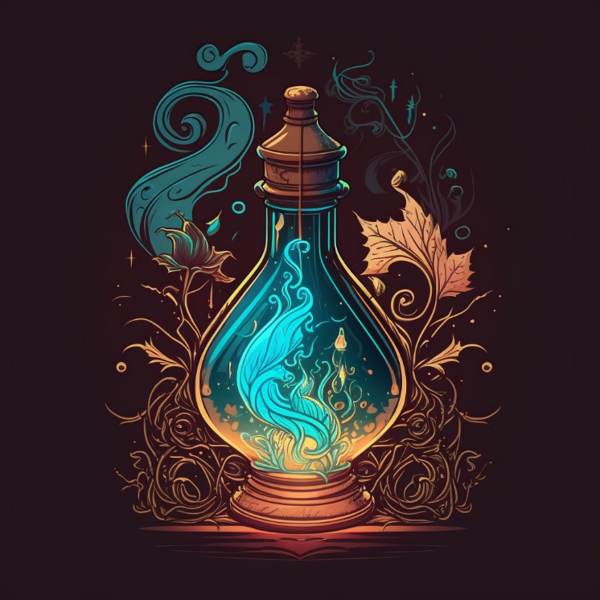
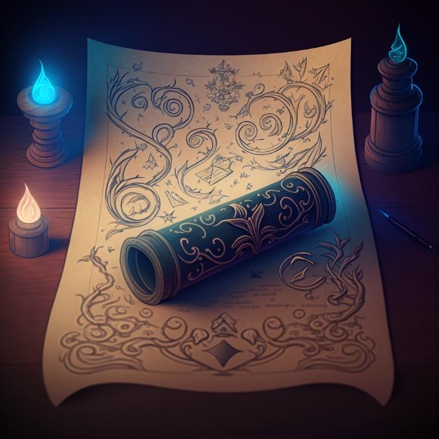
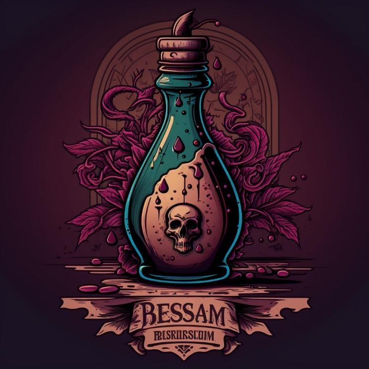
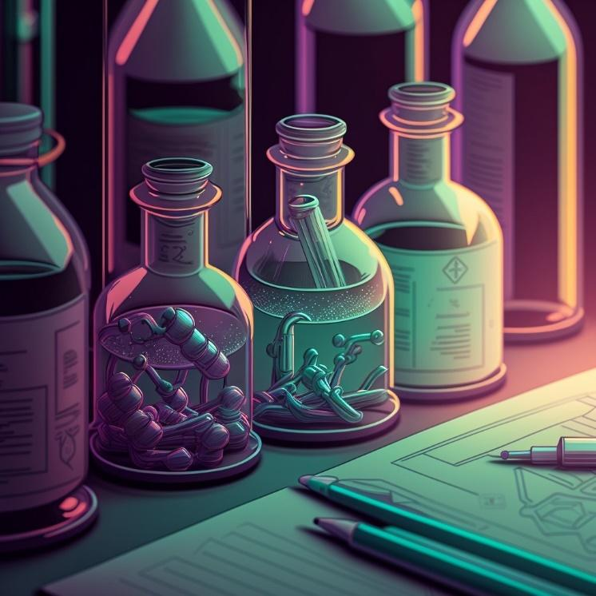
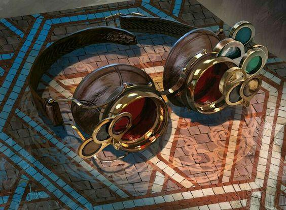

## Les Consommables

Voici la liste des consommables qui peuvent être créés ou achetés par les aventuriers. Notons que les paragraphes ci-dessous ne font qu’expliquer les différents types d’objets et leur usage/effets de façon globale, des tableaux contenant des exemples précis des objets pouvant être achetés sont disponibles en fin de document.

### Les Potions

Les potions sont des breuvages distillés via l’usage de la magie et contenant des sorts.

**Nature.** Magie.

**Création.** Test combiné de Modus (Groupe Arcane) et Magie (Groupe Artisanat) et Domaine (Groupe Magie).

**Usage.** Se consomme.

**Effet de la qualité.** Augmente le niveau de l’effet (qui est donc de 0 + Qualité).

**Description.** Consommer la potion permet d’en déclencher les effets. Il existe cependant plusieurs catégories de potion : - Elixir : Effets immédiats positifs (école : restauration). - Infusion : Effets immédiats négatifs (école : destruction). - Breuvage : Effets d’enchantement positif (école : bénédiction). - Philtre : Effets d’enchantement négatif (école : malédiction). - Essence : Effet d’enchantement neutre (école : Conjuration). Les potions contiennent des sorts simples constitués d’un unique mot d’effet, il existe ainsi autant de potions différentes que de mots ! Mais il y a évidemment certains classiques (tel que l’élixir de vie soignant la vitalité) plus répandus que d’autres. Toutes les potions faisant effet sur une cible génèrent automatiquement 2 de corruption (temporaire, nettoyé lors d’un repos), cela s’ajoute aux effets négatifs que peuvent avoir les effets du mot de pouvoir contenu dans la potion. Il ne peut y avoir plus d’une potion de même nature (enchantement positif ou négatif) active à la fois, la dernière ou plus puissante est conservée et l’autre est ignorée/cesse, de plus les effets d’enchantements ou maléfices ne peuvent être maintenus, la décharge est donc automatique et inéluctable. Qu’elle soit utilisée au contact ou à distance sur un tiers la potion nécessite un test adapté, respectivement de combat sans arme ou de jet, pour toucher sa cible. Comme un individu peu, s’il le souhaite, baisser sa défense passive, les potions bénéfiques peuvent toujours être appliquées. Les potions ne peuvent pas être critiques. Notes : Le niveau des effets contenus dans la potion est équivalent à sa qualité. Notons qu’en comparaison d’un sort la potion ne bénéficie pas du modificateur d’attribut d’un quelconque lanceur de sort ni d’un focalisateur (généralement utilisé pour lancer un sort de même type). Notes : Une potion peut se briser si le personnage qui la transporte subit une chute ou autre événement du genre. Un test de solidité difficulté 10 est alors nécessaire.

**Encombrement.** ½ (par potions)

**Prix de base – Elixir.** 14 🪙

**Prix de base – Infusion.** 12 🪙

**Prix de base – Breuvage.** 20 🪙

**Prix de base – Philtre.** 18 🪙

**Prix de base – Essence.** 16 🪙

|  | Q0 | Q1 | Q2 | Q3 | Q4 | Q5 |
| --- | --- | --- | --- | --- | --- | --- |
| Elixir | 14 | 28 | 42 | 70 | 112 | 168 |
| Infusion | 12 | 24 | 36 | 60 | 96 | 144 |
| Breuvage | 20 | 40 | 60 | 100 | 160 | 240 |
| Philtre | 18 | 36 | 54 | 90 | 144 | 216 |
| Essence | 16 | 32 | 48 | 80 | 128 | 192 |

### Les Concoctions

Les concoctions sont le fruit d’une alchimie à mi-chemin entre la magie et l’herboristerie, puisant dans les propriétés spéciales de substances issues de créatures ou de plantes.

**Nature.** Magie.

**Création.** Test de travail des substances (Groupe Artisanat).

**Usage.** Se consomme.

**Effet de la qualité.** Augmente le niveau de l’effet (qui est donc de 0 + Qualité).

**Description.** Les concoctions fonctionnent un peu comme des potions et ne tirent pas leurs propriétés d’une magie infusée mais de propriété, parfois magique/surnaturelle, de substances organiques ou non. Une concoction a pour contre effet de générer 2 de corruption (temporaire, nettoyé lors d’un repos) par prise. Il ne peut y avoir plus de 2 concoctions actives à la fois sans quoi le personnage voit son état empiré d’un cran : il devient épuisé, ou KO si déjà épuisé. Notes : Les concoctions se font à partir de reste de monstres et autres substances rares, aussi il s’agit là de consommables puissants mais nécessairement plus difficile à obtenir/créer qu’une simple potion en termes d’accès aux ressources nécessaires (mais c’est plus simple en termes de tests cependant puisqu’une seule compétence est utilisée). Notes : Une concoction peut se briser si le personnage qui la transporte subit une chute ou autre événement du genre. Un test de solidité difficulté 10 est alors nécessaire.

**Encombrement.** ½ (par concoctions)

**Prix de base.** 10 🪙

| Q0 | Q1 | Q2 | Q3 | Q4 | Q5 |
| --- | --- | --- | --- | --- | --- |
| 10 🪙 | 20 🪙 | 30 🪙 | 50 🪙 | 80 🪙 | 120 🪙 |

### Les Parchemins

Les parchemins permettent aux mages de lancer des sorts qu’ils ne connaissent pas ou d'accroître la puissance de ceux qu’ils connaissent.

**Nature.** Magie.

**Création.** Test combiné de Erudis (Groupe Arcane) et Écriture (Groupe Érudition) et Domaine (Groupe Magie).

**Usage (utilisation).** Arme focale (Arcanes) ou Domaine/Ecole (Magie).

**Effet de la qualité.** Augmente le niveau maximum du sort (qui est donc de 0 + Qualité).

**Description.** Un parchemin peut être utilisé (et consommé) pour lancer le sort inscrit dessus (au niveau où il est inscrit ou inférieur, mais pas plus haut). Le personnage peut soit : - Effectuer un test d’Arme focale (Groupe Arcane). - Effectuer un test du domaine ou de l’école associé au sort inscrit (Groupe Magie) afin de bénéficier d’être avantagé à son test. Cet avantage s’applique aussi au jet si le personnage connaît le sort. Si le sort est lancé à un niveau inférieur à celui qui est inscrit, alors l’utilisateur reçoit un bonus de +2 à ses tests par niveaux manquants.

**Encombrement.** ½ (par parchemins)

**Prix de base – Effet immédiat positif.** 14 🪙

**Prix de base – Effets immédiats négatifs.** 12 🪙

**Prix de base – Effets d’enchantement positif.** 20 🪙

**Prix de base – Effets d’enchantement négatif.** 18 🪙

**Prix de base – Effet d’enchantement neutre.** 16 🪙

**Prix de base – Effet d’enchantement d’invocation.** 24 🪙

**Prix de base – Effet autres.** 22 🪙

|  | Q0 | Q1 | Q2 | Q3 | Q4 | Q5 |
| --- | --- | --- | --- | --- | --- | --- |
| Imm P | 14 | 28 | 42 | 70 | 112 | 168 |
| Imm N | 12 | 24 | 36 | 60 | 96 | 144 |
| Ench P | 20 | 40 | 60 | 100 | 160 | 240 |
| Ench N | 18 | 36 | 54 | 90 | 144 | 216 |
| Ench | 16 | 32 | 48 | 80 | 128 | 192 |
| Invoc | 24 | 48 | 72 | 120 | 192 | 288 |
| Autre | 22 | 44 | 66 | 110 | 176 | 264 |

### Les Onguents

Les onguents sont des préparations médicinales à base de plantes.

**Nature.** Antique.

**Création.** Test de travail des herbes (Groupe Artisanat).

**Usage (application).** Premiers soins (Guérison).

**Effet de la qualité.** Augmente la catégorie de l’effet (qui est donc de 0 + Qualité).

**Description.** Il existe des onguents de différentes sortes mais généralement ces derniers augmentent une récupération à venir. Les onguents nécessitent un temps d’application qui exclut un usage lors des confrontations.

**Encombrement.** ½ (par onguents)

**Prix de base – Récup Condition.** 4 🪙

**Prix de base – Récup PV.** 6 🪙

**Prix de base – Récup PS.** 6 🪙

**Prix de base – Récup PC.** 8 🪙

**Prix de base – Récup lésion.** 10 🪙

**Prix de base – Récup PM.** 12 🪙

**Prix de base – Récup PK.** 14 🪙

|  | Q0 | Q1 | Q2 | Q3 | Q4 | Q5 |
| --- | --- | --- | --- | --- | --- | --- |
| C | 4 | 8 | 12 | 20 | 32 | 48 |
| PV | 6 | 8 | 12 | 20 | 32 | 48 |
| PS | 6 | 8 | 12 | 20 | 32 | 48 |
| PC | 8 | 16 | 24 | 40 | 64 | 96 |
| PM | 10 | 20 | 30 | 50 | 80 | 120 |
| PK | 12 | 24 | 36 | 60 | 96 | 144 |

### Les Infusions

Les infusions (thé, etc) ont un effet discret mais positif sur le moral et cela peut prendre des formes très diverses.

**Nature.** Antique.

**Création.** Test de travail des herbes (Groupe Artisanat).

**Usage (préparation).** Cuisine (Métier) (DD 10+Qualité).

**Effet de la qualité.** Directement lié à la valeur des effets produits, voir descriptions pour chaque types.

**Description.** Les infusions doivent être préparées et consommées pour faire effet après le prochain repos. Généralement elles augmentent le maximum d’une ressource d’un moment égale à la qualité, mais les effets peuvent varier.

**Encombrement.** 1/8 (par dose)

**Prix de base.** 4 🪙 Note : Déprécié, il y a une autre règle pour ce type de boisson.

| Q0 | Q1 | Q2 | Q3 | Q4 | Q5 |
| --- | --- | --- | --- | --- | --- |
| 6 🪙 | 12 🪙 | 18 🪙 | 30 🪙 | 48 🪙 | 72 🪙 |

### Les Poisons

Les poisons sont des substances, souvent distillées à partir de venins et autres toxines, qui ont pour but d’affaiblir ou tuer une créature intoxiquée.

**Nature.** Antique.

**Création.** Test de travail des poisons (Artisanat).

**Usage (application).** Test de travail du poison (DEX) ou bricolage.

**Effet de la qualité.** Augmente la catégorie du poison (qui est de 0 + qualité).

**Description.** Un poison peut être utilisé (et consommé) de deux façons différentes : - En induisant une arme (nécessairement tranchante ou perforante) afin d’inoculer ce dernier par lésion, la condition associée est appliquée lorsqu’une cible est blessée par l’arme, c’est-à-dire qu’elle subit la perte d’au moins un point de vitalité, et qu’elle rate son test de sauvegarde (robustesse). Pour appliquer le poison sur une arme, un test de travail du poison (DEX) ou bricolage est nécessaire contre une difficulté d’évaluation (5) et l’arme est alors dotée de 1 charge par marge de réussite et dure le temps d’une scène. En cas d’échec la dose est perdue. En cas d’échec critique, le personnage subit lui-même les effets du poison. - En faisant directement absorber une dose à la cible (de force ou par astuce) qui est alors désavantagée à son test de sauvegarde. Dans les deux cas les charges de la condition associée au poison dépendent d’un jet basé sur la catégorie de celui-ci (pas besoin de relancer le jet d’une attaque qui aurait inoculé le poison, il faut utiliser le jet de l’attaque et ajouter des dés si nécessaire), plus le poison est difficile à manipuler/appliquer etc et plus il est efficace. La difficulté associée à la condition est liée à l’expertise physique du personnage mais la qualité du poison est appliquée.

**Encombrement.** ½ (par doses)

**Prix de base – Poison de rupture.** 6 🪙

**Prix de base – Réduction (importante) d’un attribut.** 9 🪙

**Prix de base – Réduction (moyenne) de 2 attributs.** 10 🪙

**Prix de base – Réduction (faible) de 3 attributs.** 7 🪙

**Prix de base – Réduction (importante) d’un attribut secondaire.** 5 🪙

**Prix de base – Poison létale.** 12 🪙

|  | Q0 | Q1 | Q2 | Q3 | Q4 | Q5 |
| --- | --- | --- | --- | --- | --- | --- |
| Att Sec | 5 | 10 | 15 | 25 | 40 | 60 |
| Rupture | 6 | 12 | 18 | 30 | 48 | 72 |
| 3 Att | 7 | 14 | 21 | 35 | 56 | 84 |
| 1 Att | 9 | 18 | 27 | 45 | 72 | 108 |
| 2 Att | 10 | 20 | 30 | 50 | 80 | 120 |
| Létale | 12 | 24 | 36 | 60 | 96 | 144 |

### Les Huiles

Les huiles sont des substances allergènes dont les armes peuvent être enduites afin d'accroître leurs efficacités face à un type de créature donné.

**Nature.** Antique.

**Création.** Test de travail des huiles (Artisanat).

**Usage (application).** Test de travail du huiles (DEX) ou bricolage.

**Effet de la qualité.** Directement lié à la valeur des effets produits (voir ci-dessous).

**Description.** Une huile peut être utilisée (et consommé) en l’appliquant sur une arme. Pour appliquer l’huile sur une arme, un test de travail des huiles (DEX) ou bricolage est nécessaire, difficulté 5, sur un succès l’arme est dotée de 1 charge par marge de réussite et dure le temps d’une scène. En cas d’échec la dose est perdue. Lorsque l’arme ainsi induite d’huile blesse une cible, c’est-à-dire qu’elle subit la perte d’au moins un point de vitalité, et qu’elle correspond au type de cible associé à l’huile en question alors les dégâts d’attrition sont augmentés de 2 par qualité de l’huile. Dans tous les cas, chaque fois que l’huile fait effet, une charge est perdue. Les effets durent au mieux jusqu’à la fin d’une scène.

**Encombrement.** ½ (par doses)

**Prix de base.** 5 🪙

| Q0 | Q1 | Q2 | Q3 | Q4 | Q5 |
| --- | --- | --- | --- | --- | --- |
| 5 🪙 | 10 🪙 | 15 🪙 | 25 🪙 | 40 🪙 | 60 🪙 |

### Les Munitions (antiques)

Les munitions antiques représentent les flèches et les traits utilisés donc dans le cadre d'armes de traits.

**Nature.** Antique.

**Création.** Test de travail du bois (Artisanat).

**Usage.** Via une arme de trait.

**Effet de la qualité.** Directement lié à la valeur des effets produits, voir ci-dessous.

**Effets.** Les flèches sont nécessaires pour tirer à l’aide d’une arme de trait, mais il est possible de faire usage de munitions spéciales pour s’adapter à une situation ou à une cible particulière. La qualité d’une flèche s’ajoute à celle de l’arme lors d’un tir. Une flèche peut être récupérée, si la logique le permet, après un tir en réussissant un test de recyclage de difficulté 15. Une munition peux faire l’objet d’améliorations.

**Encombrement.** ¼ (par munitions)

**Prix de base.** 1 🪙

| Q0 | Q1 | Q2 | Q3 | Q4 | Q5 |
| --- | --- | --- | --- | --- | --- |
| 1 🪙 | 2 🪙 | 3 🪙 | 5 🪙 | 8 🪙 | 12 🪙 |

### Les Munitions (science)

Ces munitions représentent l’ensemble des catégories de balles existantes.

**Nature.** Science.

**Création.** Test de travail des armes à feu (Groupe Artisanat).

**Usage.** Via une arme à feu.

**Effet de la qualité.** Directement lié à la valeur des effets produits, voir ci-dessous.

**Effets.** Les balles sont nécessaires pour tirer à l’aide d’une arme à feu, il est par ailleurs obligatoire de respecter la catégorie de l’arme à feu en question en faisant usage de balles de la même catégorie, mais il est possible de faire usage de munitions spéciales pour s’adapter à une situation ou à une cible particulière. La qualité d’une munition s’ajoute à celle de l’arme lors d’un tir. Une munition peut faire l’objet d’améliorations.

**Encombrement.** 1/8 (par munitions) catégorie 2, 1/4 (par munitions) catégorie 3, 1/2 (par munitions) catégorie 4.

**Prix de base.** 1 🪙 pour les armes à feu de catégorie 1

**Prix de base.** 1.5 🪙 pour les armes à feu de catégorie 2

**Prix de base.** 2 🪙 pour les armes à feu de catégorie 3

**Prix de base.** 2.5 🪙 pour les armes à feu de catégorie 4

**Prix de base.** 3 🪙 pour les armes à feu de catégorie 5 Les munitions de fusils ont un prix ajusté de 0.5 à la hausse

| Q0 | Q1 | Q2 | Q3 | Q4 | Q5 |
| --- | --- | --- | --- | --- | --- |
| 1 🪙 | 2 🪙 | 3 🪙 | 5 🪙 | 8 🪙 | 12 🪙 |
| 1.5 🪙 | 3 🪙 | 4.5 🪙 | 7.5 🪙 | 12 🪙 | 18 🪙 |
| 2 🪙 | 4 🪙 | 6 🪙 | 10 🪙 | 16 🪙 | 24 🪙 |
| 2.5 🪙 | 5 🪙 | 7.5 🪙 | 12.5 🪙 | 20 🪙 | 30 🪙 |
| 3 🪙 | 6 🪙 | 9 🪙 | 15 🪙 | 24 🪙 | 36 🪙 |
| 3.5 🪙 | 7 🪙 | 10.5 🪙 | 17.5 🪙 | 27.5 🪙 | 42 🪙 |

### Les Pièges

Les pièges doivent être placés au préalable.

**Nature.** Antique.

**Création.** Test de travail des pièges (Artisanat).

**Usage (pose).** Test de piégeage (Chasse). Faire usage de pièges est une activité sujette aux techniques.

**Effet de la qualité.** Directement lié à la valeur des effets produits, voir ci-dessous.

**Effets.** Les pièges est composé d’un déclencheur et d’un partie opérative, bien que dans certains cas les deux peuvent être réunis en un seul mécanisme. Il existe des pièges simples, dits rapides (il est possible d’en faire usage en combat), et des pièges complexes, dits lents (il n’est pas possible d’en faire usage en combat). Lorsqu’un individu passe dans la zone occupée par le déclencheur alors la partie opérative se met en action et les effets du piège sont appliqués. Mettre en place et armer un piège requiert un test de piégeage (affectée par la qualité et la catégorie du piège, pour lequel on peut être entraîné comme on l’est pour un outil) contre une difficulté d’évaluation (5). Le degré de réussite obtenu, le cas échéant, permet d'augmenter la difficulté associée au piège ainsi posé. La difficulté associée aux tests actifs (par exemple désamorçage) visant le piège est équivalente à celle des objets à savoir 10 + 2 x Qualité + Degré de réussite de la pose. La difficulté associée aux tests de sauvegarde imposés par le piège (par exemple réflexes) est équivalente à celle de l’expertise physique (10 + modificateur de dextérité) + Degré de réussite de la pose. Une fois armé si une cible passe dans son champ d’activation alors le piège s’active : Un nouveau test de piégeage est réalisé afin de déterminer si ce dernier dépasse la défense d’agilité/dextérité/force (selon le type de piège) ou de perception de la cible (selon que la partie opérative est distante). Si la cible est touchée alors elle subit les dégâts relatifs à la catégorie du piège. Ici encore la qualité du piège ou sa catégorie (et l'entraînement) est prise en considération dans le test. Un piège peut être camouflé à l’aide de la compétence de camouflage (affectée par la qualité et la catégorie du piège) mais cela requiert évidemment du temps. La difficulté pour percevoir le piège est équivalente au résultat du test de camouflage. Un piège qui n’a pas été perçu profite des mêmes avantages que si la cible était attaquée sans connaître l’origine de l’attaque (elle a donc des pénalités de défenses ET ne profite pas de son endurance). Les attaques provoquées par un piège sont « déclenchés » et sont donc affectés par la règle idoine. Un piège peut être récupéré après activation en réussissant un test de recyclage de difficulté 10 + 2 x nombre d’utilisation réalisées au-delà de la première. Poser un piège « rapide » ou le camoufler durant une confrontation est une Action Complexe. Poser un piège « lent » ou le camoufler durant une confrontation est impossible. Un piège peut recevoir des améliorations d’armes antiques, le coût de base étant divisé par 4.

**Encombrement.** ½ (par pièges) par catégorie

**Prix de base.** 4 🪙 puis 4 🪙 (pièges rapides) ou 2 🪙 (pièges lents) par catégorie

| Catégorie | Q0 | Q1 | Q2 | Q3 | Q4 | Q5 |
| --- | --- | --- | --- | --- | --- | --- |
| 1 - Rapide | 8 | 16 | 24 | 40 | 64 | 96 |
| 2 - Rapide | 12 | 24 | 36 | 60 | 96 | 144 |
| 3 - Rapide | 16 | 32 | 48 | 80 | 128 | 192 |
| 3 - Lent | 10 | 20 | 30 | 50 | 80 | 120 |
| 4 - Lent | 12 | 24 | 36 | 60 | 96 | 144 |
| 5 - Lent | 14 | 28 | 42 | 70 | 112 | 168 |
| 6 - Lent | 16 | 32 | 48 | 80 | 128 | 192 |

### Les Drogues

Les drogues sont des substances développées via des procédés chimiques et pouvant procurer des améliorations notables, mais cela se fait toujours au prix de contraintes et d’une possible addiction.

**Nature.** Science.

**Création.** Test combiné de travail biologique (Artisanat) et Toxicologie (Science Biologique).

**Usage (consommation).** Premiers soins (Soins) (pas obligatoire mais mieux afin de réduire le risque d’accoutumance).

**Effet de la qualité.** Augmente le risque d’accoutumance, augmente les effets positifs ET négatifs, voir les descriptions.

**Effets.** Boost un à plusieurs attributs tout en réduisant un à plusieurs autres attributs. L’effet dure pour une scène entière. A la fin de la scène en question un ou des tests de sauvegarde adapté(s) (selon que l’accoutumance soit physique et/ou mentale) sont requis contre une difficulté de 10 + Qualité de la drogue, et ce pour chaque drogue prise. Si une sauvegarde rate alors le personnage subit une lésion de même type équivalant à la marge d’échec x5, ou fait progresser une lésion précédente de la marge d’échec x2 à la place. Ces lésions profitent des récupérations le cas échéant mais ignorent toutes les formes de protections issus d’armures ou autre, de plus après chaque repos le personnage doit réaliser un nouveau test de sauvegarde et en subir les nouvelles conséquences. Pour chaque journée passée sans consommer la drogue à l’origine de la lésion, le personnage reçoit un avantage à son test de sauvegarde. Bref, les drogues peuvent être puissantes, mais sont extrêmement dangereuses.

**Encombrement.** ½ (par doses)

**Prix de base.** 9 🪙

| Q0 | Q1 | Q2 | Q3 | Q4 | Q5 |
| --- | --- | --- | --- | --- | --- |
| 9 🪙 | 18 🪙 | 27 🪙 | 45 🪙 | 72 🪙 | 108 🪙 |

### Les Injections

Sérums hautement concentrés conçus pour stimuler artificiellement le métabolisme, les injections forcent le corps à accélérer un processus naturel, qu’il s’agisse de récupération ou de régénération.

**Nature.** Science.

**Création.** Test combiné de travail biologique (Artisanat) et Pharmacie (Science Biologique).

**Usage (consommation).** Premiers soins (Soins) (pas obligatoire mais mieux).

**Effet de la qualité.** Affecte le potentiel maximum de l’effet.

**Effets.** Active la récupération d’une ressource spécifique (cad que ça applique un regain équivalant à la récupération, mais pour chaque produit cela vise une ressource, lésion ou condition spécifique) avec un maximum équivalant à 2 par niveau de qualité. Génère 2 de fatigue à la consommation, cette fatigue est augmentée de 2 à chaque reprise lors d’un même jour.

**Encombrement.** ½ (par doses)

**Prix de base.** 6 🪙

| Q0 | Q1 | Q2 | Q3 | Q4 | Q5 |
| --- | --- | --- | --- | --- | --- |
| 5 🪙 | 10 🪙 | 15 🪙 | 25 🪙 | 40 🪙 | 60 🪙 |

### Les Boosters

Conçus pour fournir un sursaut d’énergie immédiat, les boosters stimulent le corps ou l’esprit.

**Nature.** Science.

**Création.** Test combiné de travail biologique (Artisanat) et Pharmacie (Science Biologique).

**Usage (consommation).** Premiers soins (Soins) (pas obligatoire mais mieux).

**Effet de la qualité.** Directement lié à la catégorie des effets (0 + qualité).

**Effets.** Génère des ressources temporaires, parmi lesquelles initiative, l’endurance, adrénaline, rage ou garde (et leurs équivalents mentaux). Cela fonctionne comme l’action qui permet ce type de regain, mais ici le degré de réussite est basé sur la qualité à la place, on peut l’appliquer à un autre individu, cela prend des actions différentes (une action simple si déjà placée dans un emplacement à usage rapide), etc… Génère 2 de fatigue à la consommation, cette fatigue est augmentée de 2 à chaque reprise lors d’une même scène.

**Encombrement.** ½ (par doses)

**Prix de base.** 5 🪙 ou 10 🪙 (initiative)

| Catégorie | Q0 | Q1 | Q2 | Q3 | Q4 | Q5 |
| --- | --- | --- | --- | --- | --- | --- |
| Initiative | 14 | 28 | 42 | 70 | 112 | 168 |
| Autre | 7 | 14 | 21 | 35 | 56 | 84 |

### Les Vaccins

Ces injections préventives renforcent temporairement l’organisme contre une menace spécifique, qu’elle soit environnementale ou hostile. En adaptant la réponse immunitaire ou physiologique, ils offrent une meilleure résistance aux agressions extérieures, allant des conditions climatiques extrêmes aux attaques élémentaires.

**Nature.** Science.

**Création.** Test combiné de travail biologique (Artisanat) et Pharmacie (Science Biologique).

**Usage (consommation).** Premiers soins (Soins) (pas obligatoire mais mieux).

**Effet de la qualité.** Directement lié à la catégorie des effets (0 + qualité).

**Effets.** Augmente de façon temporaire la résistance à certaines choses en offrant un bonus équivalant à la qualité aux tests de sauvegarde dans une situation au sens large (par exemple un vaccin contre la chaleur couvre aussi bien les intempéries que les attaques à base de feu). Techniquement il s’agit d’une condition bénéfique temporaire avec une décharge de 5. La qualité impacte donc à la fois la durée de l’effet et sa puissance.

**Encombrement.** ½ (par doses)

**Prix de base.** 30 🪙

| Q0 | Q1 | Q2 | Q3 | Q4 | Q5 |
| --- | --- | --- | --- | --- | --- |
| 30 🪙 | 60 🪙 | 90 🪙 | 150 🪙 | 240 🪙 | 360 🪙 |

### Les Médicaments

Conçus pour accélérer la guérison et renforcer l’organisme face à une condition ou une maladie spécifique, ces traitements permettent d’améliorer la récupération, même en l’absence des conditions optimales de repos.

**Nature.** Science.

**Création.** Test combiné de travail biologique (Artisanat) et Pharmacie (Science Biologique).

**Usage (consommation).** Premiers soins (Soins) (pas obligatoire mais mieux).

**Effets.** Permet d’augmenter la récupération associée à un type de conditions (ou maladie) lors d’un repos. Cette partie augmentée est appliquée même si les conditions pour une récupération de la condition ne sont pas remplies lors du repos. De plus, après la prise augmente d’autant les sauvegardes contre ce type de conditions pour le jour en cours et le suivant. Les bonus sont équivalents à la qualité. Notons que les prix ci-dessous sont basés sur des maladies communes ou rares, mais pas sur des maladies extrêmement rares, auquel cas le MJ est le seul à pouvoir juger si un prix peut être proposé ou si un tel médicament brille par son absence (et donc probablement rattaché à une intrigue).

**Encombrement.** ½ (par doses)

**Prix de base.** 10 🪙 (conditions) ou 7 🪙 (maladie commune) ou 17 🪙 (maladie rare)

| Catégorie | Q0 | Q1 | Q2 | Q3 | Q4 | Q5 |
| --- | --- | --- | --- | --- | --- | --- |
| Condition | 10 | 20 | 30 | 50 | 80 | 120 |
| Maladie C | 7 | 14 | 21 | 35 | 56 | 84 |
| Maladie R | 22 | 44 | 66 | 110 | 176 | 264 |

### Les Substances Chimiques

Formulées pour des usages variés, ces substances chimiques possèdent des propriétés spécifiques allant de la dissolution de matériaux à la génération de fumées ou de réactions catalytiques. Qu’elles soient corrosives, combustibles ou réactives, elles sont utilisées dans des contextes aussi bien artisanaux que tactiques. Leur nature et leur efficacité dépendent de leur composition, rendant chaque dose adaptée à un usage précis.

**Nature.** Science.

**Création.** Test combiné de travail organique (Artisanat) et Chimie (Science Organique).

**Usage.** n/a.

**Effets.** Permet la création de substance chimiques aux propriétés variées (dissoudre les matières, générés des fumées etc)

**Encombrement.** ½ (par doses)

**Prix de base.** selon les produits.

| Q0 | Q1 | Q2 | Q3 | Q4 | Q5 |
| --- | --- | --- | --- | --- | --- |
| - | - | - | - | - | - |

### Les Explosifs

Conçus pour la destruction et le contrôle tactique, les explosifs se déclinent en plusieurs formes selon leur mode d’utilisation.

**Nature.** Science.

**Création.** Test combiné de travail organique (Artisanat) et Pyrotechnie (Science Organique).

**Usage.** Test de piégeage (pour les bombes lentes à poser) ou Test de jet (pour les bombes rapides à lancer). Faire usage d’explosifs est une activité sujette aux techniques.

**Effets.** Permet la création de bombes. On distingue trois formes : De jet à lancer, simple à fixer rapidement dites rapides, complexes à fixer lentement dites lentes. Les bombes simples et complexes fonctionnent comme des pièges avec la particularité d’avoir un rayon d’action en zone en plus du reste. Le fait d’être un effet de zone déclenché de surcroît implique un avantage aux tests de réflexes que ces deux particularités conditionnent. Les bombes à jeter sont considérées comme des armes de jet à usage unique, c’est la compétence de jet qui est utilisée et non piégeage dans ce cas, elles sont donc plus pratiques mais sont coûteuses. Dans tous les cas une bombe ne sert qu’une fois et ne saurait être récupérée (comme peuvent l’être des pièges).

**Encombrement.** ½ (par unités) par catégorie

**Prix de base.** Voir ci-dessous.

| Catégorie | Q0 | Q1 | Q2 | Q3 | Q4 | Q5 |
| --- | --- | --- | --- | --- | --- | --- |
| 1 - Rapide | 6 | 12 | 18 | 30 | 48 | 72 |
| 2 – Rapide | 9 | 18 | 27 | 45 | 72 | 108 |
| 3 - Rapide | 12 | 24 | 36 | 60 | 96 | 144 |
| 3 - Lent | 5 | 10 | 15 | 25 | 40 | 60 |
| 4 - Lent | 7 | 14 | 21 | 35 | 56 | 84 |
| 5 - Lent | 9 | 18 | 27 | 45 | 72 | 108 |
| 1 - Jet | 10 | 20 | 30 | 50 | 80 | 120 |
| 2 – Jet | 14 | 28 | 42 | 70 | 112 | 168 |
| 3 – Jet | 18 | 36 | 54 | 90 | 144 | 216 |

### Les Kits

Ensembles d’outils spécialisés conçus pour faciliter des tâches précises.

**Nature.** Antique.

**Création.** Test combiné de travail du métal ou du bois selon le type de kit.

**Usage.** n/a.

**Effets.** Permet d’octroyer un avantage à un test de compétence associé, cet avantage n’est effectif que si la difficulté visée est égale ou inférieure à 5 + Qualité x 5. Dans tous les cas, le kit est considéré comme un outil et sa qualité est appliquée au test. Le kit est consommé à l’usage.

**Encombrement.** 1 (par kits)

**Prix de base.** 4 🪙

| Q0 | Q1 | Q2 | Q3 | Q4 | Q5 |
| --- | --- | --- | --- | --- | --- |
| 5 🪙 | 10 🪙 | 15 🪙 | 25 🪙 | 40 🪙 | 60 🪙 |

### Les Auto-Kits

Dispositifs mécatroniques autonomes, les auto-kits sont conçus pour exécuter des tâches de manière indépendante, en utilisant des paramètres préconfigurés.

**Nature.** Science.

**Création.** Test combiné de travail mécatronique (Artisanat) et Micromécatronique (Science Mécatroniques).

**Usage.** n/a.

**Effets.** Permet de réaliser un test à la place de l’utilisateur avec un modificateur d’attribut et de compétence équivalent à la qualité (soit +10 si qualité 5 par exemple). L’utilisateur peut, s’il dispose d’outils adaptés (à savoir des lunettes steams), ajouter « aider » le kit dans sa tâche en réalisant un test adapté (Groupe Steam, Compétence Percevoir (LOG)). Le kit est consommé à l’usage.

**Encombrement.** 2 (par kits)

**Prix de base.** 12 🪙 par charges (5 maximum)

| Q0 | Q1 | Q2 | Q3 | Q4 | Q5 |
| --- | --- | --- | --- | --- | --- |
| 12 🪙 | 24 🪙 | 36 🪙 | 60 🪙 | 96 🪙 | 144 🪙 |

