# Détails de l’Extension

## Généralités

L’extension de la magie est prévue pour le système de jeu Terre Natale. Voici les notions et systèmes ajoutés dans le cadre de son usage.

## Les Traditions de Magies

Les traditions représentent la méthode employée pour faire appel au mana. De cette méthode découle la façon dont le drain s'applique et par extension les défenses naturelles pouvant lui être apposées.

### Tradition Académique

Attribut de tradition : INT. Domaines associés à la tradition : Air, Arcane, Eau, Feu, Foudre, Glace, Magie, Mort, Savoir, Terre, Vide, Vision. Ecoles associée à la tradition : Destruction, Abjuration, Évocation, Altération. Philosophie : C’est la voie de la raison et de la méthode, celle qui considère la magie comme une science exacte. Les mages académiques analysent, calculent et modélisent le mana comme une équation du monde. Pour eux, tout phénomène magique obéit à une logique mesurable : comprendre, c’est dominer. Leur art repose sur la rigueur, les formules, la structure — autant d’outils qui garantissent la maîtrise d’un pouvoir qu’ils refusent de laisser au hasard. L’arithmétique et la géométrie sont leurs incantations ; la théorie, leur foi. C'est donc la plus répandue parmi les mages.

### Tradition Shamanique

Attribut de tradition : SAG. Domaines associés à la tradition : Guerre, Air, Corps, Eau, Esprit, Faune, Flore, Loi, Lumière, Nature, Sacre, Terre, Vie. Ecoles associée à la tradition : Restauration, Divination, Malédiction, Bénédiction. Philosophie : La magie n’y est ni étudiée ni conquise, mais écoutée. Les shamans perçoivent le mana comme un souffle vivant qui circule dans toutes choses : une respiration du monde à laquelle il faut se joindre, non la forcer. Leur pratique mêle intuition, empathie et respect des cycles naturels. Chaque sort est une offrande, une négociation ou une harmonisation entre la volonté du mage et celle des esprits. Là où l’académicien dissèque la magie, le shaman l’invite à danser avec lui. C'est la plus répandue parmi les acolytes.

### Tradition Hermétique

Attribut de tradition : VOL. Domaines associés à la tradition : Guerre, Acier, Faune, Feu, Flore, Foudre, Glace, Impie, Magie, Nature, Sacre, Vide, Vie. Ecoles associée à la tradition : Destruction, Invocation, Altération, Conjuration. Philosophie : L'hermétisme ne prie ni ne raisonne : il affirme. Pour lui, la magie est le prolongement de la Volonté — une force intérieure capable d’imposer sa propre loi à la réalité. Chaque symbole, chaque verbe prononcé est une déclaration d’existence : que cela soit, car je le décide. Ces mages ne cherchent pas à comprendre la magie, mais à se comprendre eux-mêmes, persuadés que la maîtrise du monde passe d’abord par la maîtrise de soi. Là où d’autres canalisent le mana, l’hermétique le façonne à son image. C'est la plus répandue parmi les initiés.

### Tradition Profane

Attribut de tradition : RUS. Domaines associés à la tradition : Acier, Arcane, Chaos, Charme, Illusion, Impie, Mental, Mort, Ombre, Toxique, Vision. Ecoles associée à la tradition : Divination, Invocation, Malédiction, Conjuration.

Philosophie : La tradition profane refuse les dogmes et les interdits. Ses pratiquants traitent la magie comme une matière brute à manipuler, disséquer, transmuter — ni bonne, ni mauvaise, simplement utile. Pragmatique avant tout, le profane expérimente, adapte, recycle les forces du monde sans se soucier des conventions. Qu’il puise son pouvoir dans la chair, l’esprit ou les flux élémentaires, il cherche avant tout le résultat. Sa magie est celle des pactes, des échanges et des compromis : un art de la transaction avec les lois de la nature. C'est la plus répandue parmi les adeptes.

### Tradition Artistique

Attribut de tradition : CHA. Domaines associés à la tradition : Chaos, Charme, Corps, Esprit, Illusion, Loi, Lumière, Mental, Ombre, Savoir, Toxique. Ecoles associée à la tradition : Restauration, Évocation, Abjuration, Bénédiction.

Philosophie : Chez les bardes et les esthètes, la magie est émotion avant d’être discipline. Elle s’exprime à travers la beauté, la vibration et la mise en scène du monde. Chaque incantation est un acte de création, un poème adressé à la réalité pour la convaincre de changer. Là où les autres traditions manipulent ou calculent, l’artiste charme et inspire : il fait résonner le mana comme une corde sensible. Pour lui, la puissance ne réside pas dans le contrôle, mais dans la justesse du geste et la sincérité du sentiment. C'est la plus répandue parmi les artistes.

## Les Domaines de Magie

Les domaines de magie sont une classification des sorts basés sur la nature de ces derniers. Ainsi un domaine de magie est constitué de sort de plusieurs écoles. La magie peut être étudiée sous couvert de domaines : Le lanceur de sort dispose de sorts hétéroclites pouvant remplir de nombreuses fonctions.

On distingue différentes formes de domaines selon leurs origines et les forces qu’ils manipulent : - Les Domaines d'Énergies manipulent les forces énergétiques tels que le Feu, le Froid et l'Électricité. - Les Domaines Matériels manipulent les éléments tels que la Terre, l’Air et l’Eau. - Les Domaines Naturels manipulent des concepts tels que la Nature, la Faune et la Flore. - Les Domaines Physiques manipulent des concepts tels que le Corps, l’Acier, la Guerre. - Les Domaines Psychiques manipulent des concepts tels que l’Esprit, le Mental et le Charme. - Les Domaines des Vertus manipulent la Vie, le Sacre, la Lumière ou encore la Loi. - Les Domaines des Anathèmes manipulent la Mort, l’Impie, les Ombres ou encore le Chaos. - Les Domaines des Notions manipulent des concepts aux contoures plus vague tels que le Vide, les Illusions, les Visions, les Arcanes, le Charme, le Mental, le Savoir.

Il existe également d’autres formes de catégorisations basées des dualités : - Les Domaines Primordiaux sont incarnés par la Lumière et l’Ombre. - Les Domaines Fondamentaux sont incarnés par la Loi et le Chaos. - Les Domaines Origines sont incarnés par le Sacré et l’Impie. - Les Domaines des Cycles sont incarnés par la Vie et la Mort.

Notons que toutes ces formes de classification n’ont aucun impact sur les mécanismes qui régissent ces domaines, ni fondamentalement ni au niveau des règles.

## Les Écoles de Magie

Les écoles de magie sont une classification des sorts basés sur la fonction de ces derniers. Ainsi une même école de magie est constituée de sort de plusieurs domaines (élémentaires, fondamentaux ou primordiaux). La magie peut être étudiée sous couvert d’écoles : Le lanceur de sort se spécialise donc dans une fonction dans laquelle il s’offre un plus large panel de possibilités.

On distingue ainsi plusieurs grandes écoles de magies :

Destruction

Détruire ce qui est matériel ou immatériel, vivant ou non. Opposée à : Restauration

- Dégâts directs ou progressifs (feu, glace, acide, force brute, etc.)
- Dissolution d’énergie, d’objets ou d’enchantements
- Démolition de structures
- Sorts de flétrissement ou d’annihilation

### Restauration

Rétablir l’intégrité physique ou mentale des êtres vivants. Opposée à : Destruction

- Soins de blessures, maladies, empoisonnements
- Régénération ou purification
- Annulation d’altérations affectant des êtres vivants
- Reconstitution de l’équilibre vital

### Abjuration

Annuler, stopper ou se protéger contre des effets hostiles. Opposée à : n/a

- Contresorts, dissipation, interruption
- Boucliers magiques, barrières, immunités
- Suppression de magie dans une zone
- Runes de protection ou de rejet

### Divination

Percevoir, découvrir, révéler ce qui est caché ou inconnu. Opposée à : n/a

- Lecture des pensées, visions à distance, détection magique
- Prédictions, augures, accès à des savoirs oubliés
- Analyse d’objets, d’êtres ou de lieux
- Clairvoyance, clairsentience, précognition

### Invocation

Appeler des entités autonomes à soi pour obtenir leur aide. Opposée à : n/a

- Invocation de familiers, esprits, créatures ou entités
- Contrats ou pactes d’appel
- Portails, transpositions d’êtres
- Sorts d’appel conditionnel ou réactif

### Évocation

Agir directement sur la réalité de façon ponctuelle. Opposée à : n/a

- Télékinésie, lévitation, propulsion, manipulation d’objets
- Création temporaire de matière ou d’éléments
- Génération de sons, lumières, odeurs, impulsions
- Activation ou manipulation de mécanismes
- Sorts d’effet immédiat, sans enchantement

### Malédiction

Appliquer des enchantements maintenus nuisibles. Opposée à : Bénédiction

- Enchantements affaiblissants, gênants, négatifs
- Zones de maléfices, auras handicapantes
- Marquages magiques, infections d’origine magique
- Malchances, peurs, handicaps persistants

### Bénédiction

Appliquer des enchantements maintenus bénéfiques. Opposée à : Malédiction

- Renforcement physique ou mental
- Auras protectrices ou motivantes
- Avantages en compétences ou en défense
- Amplification des capacités naturelles

### Conjuration

Conjurer la magie pure pour créer des formes utiles via des enchantements. Opposée à : Altération

- Création d’armes, murs, structures magiques temporaires
- Zones magiques (silence, obscurité, anti-magie)
- Enchantements utilitaires, sans but offensif ou défensif direct
- Créations maintenues par la volonté du mage

### Altération

Modifier l’état ou la structure des objets, de la matière ou de la magie elle-même. Opposée à : Conjuration

- Transformation de matériaux ou d’objets
- Réparation, détérioration ou amélioration d’objets
- Effets conditionnels (étourdissement, confusion, immobilisation…)
- Changements d’apparence, d’état physique ou mental
- Soins structurels aux objets, modifications durables.

## Les Différents Sorts

Les sorts peuvent générer et véhiculer des effets. Lorsqu’il ne s’agit pas de causer des dommages il peut s’agir de soigner, appliquer des enchantements ou causer directement des conditions, ainsi que tout un tas d’autres possibilités.

Il y a les sorts éphémères, dont les effets se produisent immédiatement (exemple : dégâts, soins, conditions, etc). Il y a les sorts permanents, dont les effets se produisent sur le temps (exemple : enchantements).

Les enchantements peuvent être des bénédictions (si positives) ou des malédictions (si négatives). Ce sont des effets permanents édifiés par magie. Un enchantement peut également n’être ni l’un ni l’autre, on dit qu’il est neutre. Si l’enchantement vise une zone plutôt qu’un individu on parle alors d’un enchantement de zone (ou zone de magie). L’invocation est un enchantement permettant l’apparition d’objets ou de créatures pour le compte du lanceur de sort. Lorsque l’enchantement en question prend fin, l'objet ou la créature n’est plus.

## L’Usage de la Magie

Pour faire usage de la magie un personnage doit satisfaire deux conditions : Pratiquer une tradition ET connaitre le sort qu’il souhaite lancer.

La pratique d’une tradition est matérialisée par la somme que forme l’avantage débloquant ladite tradition, le groupe du même nom au niveau 1 minimum et la compétence concerné par le sort au niveau 1 minimum.

Connaitre un sort nécessite simplement de l’avoir « acquis », au même titre que l’on acquière les manœuvres et autres formes de savoirs. L’acquisition est donc, à ce titre, limité par la mémoire comme pour le reste.

### Réunion de Mana

Le personnage peut procéder à une réunion de mana. Ce n’est pas une obligation mais cette réunion permet d’attirer à soi le Mana résiduel entourant le personnage : Ce Mana sera utilisé en priorité lorsqu’il sera question de drain. On parle de Mana temporaire.

Le Mana temporaire peut être dépensé à la place du mana du personnage, mais il ne peut être dépensé pour payer le drain minimum d’un sort.

La réunion de mana est une action complexe qui fait l’objet d’un test d’évaluation effectué à partir d’Arcane + Focus + modificateur de sagesse. En cas de réussite (difficulté de base, soit 10) on détermine le mana mis à disposition via un jet (catégorie 0 + degré de réussite). Plusieurs réunions de mana ne s'accumulent pas celui-ci mais permet de profiter du plus élevé des résultats.

Notons que réunir du mana est une action qui requiert et consomme 2 PS.

### Lancement d’un Sort

Le processus englobant le lancement d’un sort est son incantation. L’incantation est un processus complexe qu’il est nécessaire de bien disséquer pour en comprendre les rouages.

#### Choix du Sort

Tout d’abord le personnage doit procéder au choix de son sort. Le sort définit, comme on s’en doute, les effets qui seront produits si l’incantation arrive à terme avec succès. Cela implique donc que le choix du sort ne peut être modifié en cours de route. Le sort est associé à une difficulté du sort.

Pour pouvoir choisir un sort le personnage doit l’avoir « acquis ». Cette acquisition se fait sous couvert d’un niveau d’apprentissage (et prend de la place en mémoire). Voir la création des sorts et l'apprentissage des sorts.

#### Choix du Niveau d’Incantation

Ensuite le personnage doit déterminer le niveau d’incantation. Ce choix est important car il détermine d’une part le drain du sort et le niveau du sort qui résulteront du sort.

- Le Niveau d’incantation ne peut dépasser : [Niveau de Groupe + Niveau de Compétence associé au sort] /2, arrondis inférieur.
- Le Niveau d’incantation ne peux dépasser le niveau d’apprentissage du sort.

La difficulté associée au test d’incantation est basée sur la difficulté de l’incantation.

- Difficulté d’incantation = Difficulté du Sort + Niveau d’incantation x2.

La difficulté associée aux tests d’arcane (focus, modus, etc) concernant un sort est basée sur le niveau d’incantation, ce qui fait qu’une augmentation de difficulté du sort lié à certains mots clés n’affectent pas la difficulté qu’on peut avoir à contrer le sort etc…

- Difficulté Arcanique = 10 + Niveau d’Incantation x2.

Le drain du sort est strictement identique à la difficulté de l’incantation. Certains mots peuvent inclure une augmentation du drain, dans ce cas il faut évidemment l’ajouter.

- Drain du sort = Difficulté d’incantation + Drain additionnels.
- Drain minimum du sort = Niveau du sort + 3.

Si des effets permettent la réduction du drain minimum alors elle n’affecte que la partie associée au niveau du sort, rien (sauf précisions explicites dans les règles) ne permet de réduire le drain minimum de base de 3.

!!! info "Rappel"
    Lancer un sort nécessite d’avoir accès d’une manière ou d’une autre aux mots qui le constituent.

    L’accès à une école de magie permet de faire usage de tous les mots inclus dans la liste d’une école et ces derniers peuvent faire usage de n’importe quelles clés, même si ces dernières renvoient à des notions présentes dans les domaines de magie.

    L’accès à un domaine de magie permet de faire usage de tous les mots d’écoles si utilisé conjointement avec une clé qui renvoie aux notions présentes dans le domaine en question. De plus cet accès permet l’usage de tous les mots spécifiques au domaine. Les mots spécifiques à un domaine ne sont pas accessibles avec un accès aux écoles, c’est leur chasse gardée.

    Évidemment un personnage peut créer, apprendre et surtout faire usage de sort qui mélange des écoles/domaines tant qu’il a l’accès pour ces derniers, mais il utilise toujours le groupe + compétence le plus bas le cas échéant !

    La magie conventionnelle ne mélange pas les écoles ou les domaines. La magie exotique mélange les écoles ou les domaines.

#### Drain de Mana

Le personnage subit, avant même d’effectuer son test d’incantation, un drain de mana équivalant au drain du sort. Ainsi que le sort soit lancé avec succès ou non le drain de mana s’applique.

Le drain de mana est détaillé en détails plus loin.

#### Test d’Incantation

Le personnage doit ensuite se soumettre à un test d’incantation. Ce test repose sur le groupe et la compétence associés au sort en question. Dans tous les cas l’attribut sollicité pour le test sera la Magie.

Le résultat du test définit quelle sera la limite du niveau du sort effectivement lancé en bout de course.

Trois cas de figure se présentent alors. - Si le résultat du test est égal ou supérieur à la difficulté d’incantation, le sort peut être lancé à un niveau égal à celui de l’incantation (voir plus bas mais pas plus haut, notons que le drain a déjà eu lieu donc ce dernier ne changera pas si le sort est lancé à plus bas niveau). - Si le résultat du test est inférieur à la difficulté d’incantation mais supérieur à la difficulté du sort alors le sort est lancé au niveau permis par le score du test. Le personnage subit une brûlure de mana équivalente aux niveaux qui n’ont pas pu être atteints PAR le niveau de l’incantation. Par exemple, si le test permet de lancer un sort de niveau 2 maximum mais que le niveau d’incantation visé était 3, alors je subis une brulure équivalant au niveau 1. - Si le résultat du test est inférieur à la difficulté d’incantation ET à la difficulté du sort alors le sort est un échec. Le personnage subit alors une brûlure de mana équivalant au drain de mana.

La brûlure de mana est détaillée plus loin.

!!! info "Rappel"
    Un sort de niveau 0 est dit « Oraison » de son domaine, c’est-à-dire la base de la base. L’effet n’est pas négligeable si le mage est muni d’une focalisateur notable, car ce dernier octroie au sort une puissance non négligeable.

#### Effets d’un Sort

Une fois que le sort est lancé il est bien entendu question de ses effets, qui dépendent de sa nature.

Le test d’incantation se confronte toujours à la défense passive de ses cibles. La défense passive dépends de la nature du sort, même si par défaut et en l’absence de mention il s’agira de la défense passive de Magie (très faible pour un non mage). Généralement, dans le cas des sorts de dégâts par exemples, défense passive est alors basées sur l’élément déployée (feu, froid, électricité, etc) et l’attribut qui lui est associé. Si la défense passive est vaincue alors le sort affecte la cible, sinon non.

Parfois le niveau du sort lui-même définit une partie des effets du sort, mais ce n’est pas la majorité des cas. Par exemple les invocations ont des attributs définit directement par le niveau du sort (et la magnitude sert de charge dans laquelle l’invocation peux puiser pour accroitre son efficacité).

Parfois la forme ou les effets d’un sort induisent des tests de sauvegarde. La difficulté des sauvegardes est toujours basée sur l’expertise magique, soit 10 + modificateur de l’attribution de tradition du mage. Le résultat de la sauvegarde altère la magnitude du sort sur la cible, comme c’est le cas dans les règles de base.

#### Quelques Contraintes

Il y a quelques contraintes à respecter concernant l’usage des sorts et la pratique des incantations.

Tout d’abord pratiquer la magie nécessite de canaliser du mana afin de mettre celui-ci en œuvre. Ceci n’est ni aisé ni sans danger si on ne fait pas usage d’un focalisateur. Ces outils typiques des mages, que d’aucuns qualifiés d’armes, peuvent prendre des formes très variées : Bâtons, Sceptres, Grimoire, etc…

!!! note "Note"
    Un test d’incantation est désavantagé si l’on ne fait pas usage d’un focalisateur. De plus, le drain des sorts est également subi en dégâts temporaires. Par ailleurs la pénalité d’usages issus de la catégorie du focalisateur s’applique évidemment aux tests d’incantations réalisés avec. En contrepartie cependant les sorts reçoivent un avantage réel à la présence du focalisateur qui constitue la base du jet permettant de quantifier la puissance/magnitude. Enfin les focalisateurs ont généralement d’autres avantages qui dépendent de leur nature.

Ensuite pratiquer la magie nécessite des composantes dites gestuelles et vocales. Cela sous entends que le mage doit « parler » et « bouger » pendant une incantation et que cela peut soit le trahir s’il est vu/entendu soit l’empêcher de lancer son sort s’il n’est pas en mesure de le faire (attaché/bâillonné).

#### La Durée des sorts

Un sort permanent génère (très souvent) des enchantements et ces derniers sont matérialisés par une charge. C’est cette charge qui fait office de compteur et qui fixe la durée d’un sort. La charge d’un enchantement est équivalant à la magnitude/puissance du sort. Chaque début de tour la charge d’un enchantement est réduite d’un montant que l’on appel décharge.

- La décharge d’un enchantement est égale à 10.

Un lanceur de sort peut, au moment où un sort permanent est lancé, décidé de « maintenir un enchantement ». Dans ce cas il prend le relais concernant la durée : C’est lui qui va alimenter la durée de l’effet afin de le maintenir ! La charge ne diminue pas tant qu’un enchantement est maintenu. Lorsque le lanceur de sort le décide, il peut relâcher le maintien d’un enchantement. Celui-ci ne prend pas fin immédiatement : La charge (restante) prend alors le relais.

#### Maintenir un enchantement

Lorsqu’un sort crée un enchantement ce dernier peut être maintenu, ce qui requiert de lui allouer une partie de sa concentration. Maintenir un enchantement permet d’en prévenir la décharge. Chaque enchantement maintenus impose une pénalité de 1 aux tests de magie ou d’arcanes. Notons qu’un maximum de « modificateur de Volonté + compétence de focus » enchantements peuvent être maintenus en même temps.

Lorsqu’un mage perd le contrôle d’un de ses enchantements il en perd aussi le maintiens. Le mage ne peux maintenir que les enchantements qu’il contrôle. Une telle perte de contrôle peux survenir si le mage est déconcentré : Tout événement pouvant déconcentrer le mage déclenche un test de sauvegarde de détermination. La difficulté dépends de la situation et surtout de la personne à l’origine de la perturbation (10 à défaut ; sinon expertise liée à l’action qui perturbe le mage). Il est possible de retrouver la maitrise de ses enchantements (un par un) après coups en réalisant un test de focalisation du sort (compétence Focus) (sans quoi la décharge s’appliquer à nouveau).

Un lanceur de sort ne peux avoir à son service qu’une quantité limitée d’invocations. Le personnage peux avoir à son service un maximum cumulé de niveau de sort équivalant à : Groupe + Compétence + modificateur de Charisme (le plus élevé le cas échéant).

#### L’Empilement des Effets

Une même cible ne peut pas faire l’objet d’une infinie d’enchantement. Il se trouve qu’il y a une limite fixée par le niveau de compétence du mage qui lance le sort. Sorts « positifs » et « négatifs » tiennent des comptes différents.

Par exemple : Si une cible a déjà un effet en cours alors seul un mage avec une compétence niveau 2 ou 3 peux lui en ajouter un autre.

### Autour de la Magie

Lancer un sort a des conséquences multiples qui ne se résume pas qu’aux effets du sort ou à aux drains et brûlures auquel s’expose le mage. En effet faire usage du mana laisse des traces qui peuvent être détectée, identifiée et analysée par une tierce personne.

#### La Trace

Chaque fois qu’un sort est lancé une trace est laissée à l’endroit même où s’est arrivé. Cette trace contient toutes les informations utiles à qui sait les déchiffrer : Identité du mage, sort lancés, etc… Si on ne peut apprendre le nom d’un mage de cette manière on peut tout de même apercevoir sa marque et l’identifier de cette manière dans d’autres circonstances. La marque d’un mage ne transparait que si celui-ci fait usage de sa magie, elle n’est pas visiblement autrement.

!!! note "Note"
    - Il est possible de voir la marque laissée par la trace avec un test de Focus (difficulté de base 5, niveau de localisation = degré de réussite). - Il est possible d’identifier les informations laissées par la trace avec un test d’Erudis (difficulté de base 5, niveau de détails = degré de réussite). - Il est possible d’altérer ou effacer les informations laissées par la trace avec un test d’Aldus (alors opposé au test de Focus/Erudis adverse).

#### Le Mana

Un lanceur de sort est un aimant à Mana. Ce dernier gravite autour de lui en permanence et est donc visible par ceux qui en ont la faculté.

!!! note "Note"
    - Il est possible de voir le Mana des autres avec un test de Focus. - Il est possible de camoufler son Mana avec un test d’Aldus (alors opposé au test de focus adverse).

## Le Drain de Mana

Le drain de mana est le phénomène durant lequel le Mana attaché ou gravitant autour du personnage est canalisé pour permettre une incantation. Le mana en question le personnage se consume sous l’effet du drain.

Le drain de mana survient donc avant qu’un test d’incantation ne soit effectué. C’est, de facto, le mana ainsi drainé qui va permettre l’incantation.

Le drain est dérivé de la difficulté d’incantation. Le drain est réduit par la résistance au drain. Celle-ci est équivalente au modificateur de l’attribut de tradition. Le drain est ensuite soustrait au Mana du personnage. Si un drain amène le Mana du personnage à 0 l’incantation peut tout de même avoir lieu mais dans ce cas la différence est imputée sous forme de brûlure de mana (supplémentaire le cas échéant).

Rien de dramatique n’arrive si le Mana tombe à 0. Mais il est alors évidemment très difficile (voir dangereux) de faire usage de la magie.

Si le personnage a réuni du mana temporaire au préalable le drain (restant après réduction lié à la tradition) peut être réduit. Le drain ne peux descendre ainsi en deçà du drain minimum du sort, qui est dérivé de son niveau (voir la formule ci-dessus).

## La Brûlure de Mana

La brûlure de mana est le phénomène par lequel le mana drainé lors d’une incantation brûle le lanceur de sort. Puisque ce drain s’effectue par une injonction à la fois mentale et physique, la brûlure se manifeste simultanément sur ces deux plans.

On distingue deux formes de brûlure de mana : la petite brûlure de mana, équivalente au drain minimum du sort, et la grande brûlure de mana, équivalente au drain total du sort.

Une petite brûlure de mana survient lorsque le personnage rate l’incantation d’un sort ou lorsqu’il lance un sort sans utiliser de focalisateur. Une grande brûlure de mana survient lorsque ces deux conditions sont cumulées.

Lors d’une brûlure de mana, le personnage subit des dégâts mortels équivalents à la valeur de la brûlure. Ces dégâts sont appliqués directement à la Vitalité et à la Spiritualité et ignorent toute forme de résistance (autre qu’une résistance spécifique à la brûlure de mana), d’absorption ou de réduction.

Si le lanceur de sort ne dispose pas de suffisamment de mana pour payer le coût du sort, il peut tout de même lancer l’incantation. Le mana manquant est alors compensé par une brûlure de mana, dont la valeur est équivalente à une brûlure minimum augmentée du coût de mana non payé.

Même si les effets de la brûlure de mana doivent entraîner la perte de connaissance ou la mort du personnage, le sort est toujours lancé et prend effet pendant la brûlure.

## La Magie lors d’une Confrontation

Le lancement des sorts lors d’une confrontation est sujet à plusieurs points de règles.

### L’Action d’Incantation

Le fait de formuler une incantation est une action étendue qui est constituée de 1 actions complexes + 1 action libre. Les choix concernant le sort et le niveau d’incantation sont réalisés lors de la première action. C’est également à ce moment-là que le drain est subit. Les tests et la résolution du sort ont lieu lorsque lors de la dernière action. C’est également à ce moment-là qu’une brûlure peut être subite (le cas échéant).

Il est possible d’être habitué au lancement des sorts afin de ne plus avoir besoin de l’action libre, il existe aussi des manœuvres pour lancer ses sorts plus rapidement.

### L’incantation est risquée

L’action d’incantation n’est pas sécurisée. Tout adversaire ayant le lanceur de sort dans sa zone de menace peut porter sur lui une action d’opportunité.

### Perturbation de l’Incantation

Une incantation peut être perturbée et perdue.

Subir une attaque ou tout autre action brutale/gênante peut entraîner la perturbation de l’incantation. Il convient donc dans ces situations d’effectuer un test de concentration contre une difficulté fixée par le résultat de l’action provoquant la perturbation.

Effectuer un déplacement peut entraîner la perturbation de l’incantation. Il convient donc dans ces situations d’effectuer un test de concentration contre la difficulté fixée par le niveau d’incantation. Dans le cas où le test de concentration est un échec, le sort est perdu. Il faut alors tout reprendre à 0. Toutes les actions dépensées dans l’incantation l’ont été pour rien.

## Les Sorts

Les sorts sont le moyen employé par un lanceur de sorts pour faire appel à la magie. Un sort exprime le souhait du mage au travers de mots de pouvoir que le mana se charge ensuite d’interpréter (si on peut dire).

### Les Mots Arcaniques

Un sort est constitué de mots arcaniques. Un mot arcanique n’est en fait pas un seul et unique mot mais un ensemble de syllabes aux consonances étranges. Un mot s’exprime de 3 façons : - Par son équivalent simple en langage simple. - Par son équivalent en langage ancien. - Par son équivalent incantatoire, qui est une litanie plus ou moins longue dont la prononciation peut prendre 5x plus de temps que dans les autres langages.

Ces mots sont utilisés pour définir la forme et les effets d’un sort. Les mots de pouvoir donnent corps au sort en lui donnant ses effets, c’est-à-dire en définissant ce qu’il va produire ou réaliser. Les mots de forme définissent comment le sort se propage du lanceur jusqu’à une cible. Les mots d’ancrage définissent comment le sort se diffuse une fois la cible atteinte. Les mots de structure peuvent être utilisés pour définir un comportement structurel atypique pour le sort. Les mots clés confèrent à d’autres mots des informations importantes. Ces mots ne rendent pas un sort plus difficile à invoquer. Les mots de liaison octroient des propriétés supplémentaires au sort et à ses autres mots. On parle de liaison car ils ne font rien seuls. Enfin les mots supérieurs sont peu nombreux et modifient les sorts pour les rendre bien plus exigeants à lancer mais également bien plus puissant ou versatiles. Une oraison ne peut être associée à de tels mots.

Chaque domaine et chaque école de sorts peuvent faire appels à des mots de magie différents : C’est ce qui constitue leurs identités ! Cela dit certains mots peuvent très bien se retrouver dans différents domaines ou écoles, cependant d’autres sont bel et bien uniques.

Enfin les mots arcaniques sont généralement associés à un modificateur de difficulté et/ou à un modificateur de drain (c’est le cas des autres).

- Difficulté du Sort = Difficulté de Base + somme des Difficultés Supplémentaires.
- Drain du Sort = Difficulté de Base + somme des Drains Supplémentaires

#### Des noms selon la tradition

Selon les traditions, ces mots peuvent avoir des noms différents. Ceci n’affecte pas le jeu et sa structure mais renseigne mieux sur la philosophie de chaque traditions.

## Tradition Académique

Pour l’académicien, la magie est un langage scientifique ; chaque mot possède une valeur logique. Les mots de forme deviennent des vecteurs, les mots de pouvoir des principes, les mots d’ancrage des cibles, et les mots de structure des schèmes soigneusement modélisés. Les mots-clés sont appelés substrats, c’est-à-dire la nature énergétique de la formule, tandis que les mots de liaison sont des paramètres ajustés pour optimiser la stabilité. Enfin, les mots supérieurs sont traités comme des axiomes, rares et périlleux. Tout dans ce dialecte reflète une vision analytique : comprendre les lois du mana, c’est les maîtriser.

## Tradition Shamanique

Chez les shamans, la magie est une respiration du monde à laquelle il faut s’accorder. Les mots de forme sont appelés souffles, les mots de pouvoir deviennent des volontés offertes ou demandées aux esprits, et les mots d’ancrage prennent le nom de présences, car la cible est un être ou un lieu avec lequel on entre en relation. Les mots de structure sont des trames tissées entre les plans, les mots-clés des essences qui guident l’harmonie du sort, et les mots de liaison des marques : des pactes, bénédictions ou interdits. Les mots supérieurs sont perçus comme des totems : des forces anciennes qu’on n'éveille qu’avec respect. Le dialecte shamanique reflète la symbiose plutôt que le contrôle.

## Tradition Hermétique

L’hermétique voit la magie comme projection de la Volonté pure. Les mots de forme deviennent des symboles, les mots de pouvoir des verbes qui affirment une réalité, et les mots d’ancrage des réceptacles, supports choisis pour accueillir cette volonté. Les mots de structure sont appelés sceaux, véritables lois imposées au monde ; les mots-clés, quintessences, traces de la substance fondamentale manipulée ; et les mots de liaison, contrats qui équilibrent ou fixent les conditions de la transformation. Les mots supérieurs sont ici des édits, expressions ultimes de maîtrise. Ce dialecte exprime une philosophie d’affirmation et de discipline intérieure.

## Tradition Profane

La tradition profane traite la magie comme une ressource pratique, malléable, ni sacrée ni rationnelle. Les mots de forme sont des prises, des façons de saisir ou rediriger un flux ; les mots de pouvoir, des arts, gestes concrets pour obtenir un effet ; et les mots d’ancrage, des sujets, simples supports de l’action magique. Les mots de structure deviennent des cercles, outils de stabilisation ou d’amplification improvisés ; les mots-clés, des substances — tout ce dont la magie peut se nourrir ou se servir ; les mots de liaison, des pactes, arrangements pratiques avec la réalité ou l’énergie employée. Les mots supérieurs sont vus comme des traités, des compromis risqués mais puissants. Ce dialecte exprime un rapport décomplexé, expérimental et utilitaire au mana.

## Tradition Artistique

Pour la tradition artistique, la magie est une esthétique : elle se chante, s’interprète, se ressent. Les mots de forme deviennent des rythmes, les mots de pouvoir, des mélodies qui expriment l’intention, et les mots d’ancrage, un public — l’âme ou l’objet que l’on touche. Les mots de structure prennent le nom de compositions, agencements poétiques du sort ; les mots-clés, des tonalités, couleurs émotionnelles ou élémentaires ; et les mots de liaison, des accords qui harmonisent ou dissonent volontairement. Quant aux mots supérieurs, ce sont des opus, œuvres complètes à la puissance rare. Ce dialecte traduit une magie vécue comme art vivant, émotionnel et intuitif.

#### Structure & Limitations

Un sort doit contenir: - Un mot de pouvoir. - Un mot de forme. - Un mot d’ancrage. - Un ou des mots clés si d’autres mots l’exigent.

Un sort peut contenir: - Un mot de structure. - Un ou des mots de liaison. - Un mot supérieur.

### Les Propriétés d’un Sort

Un sort dispose de propriétés qui le définissent. Ces caractéristiques sont cruciales et omniprésentes dans les règles qui encadrent l’usage de la magie.

La complexité est équivalente aux nombres de mots qui composent le sort. C’est une caractéristique purement indicative. Les sorts composés de moins de 3 mots sont des sorts simples. Les sorts composés d’au moins de 6 mots sont des sorts complexes. Un personnage ne peut pas lancer de sorts dont la complexité dépasse la somme de la compétence + du groupe associé au sort.

L’alignement du sort peut être négatif, positif ou neutre. Un sort négatif cherche à nuit la ou les cibles. Un sort positif cherche à rendre service aux cibles. Un sort neutre n’est ni négatif, ni positif. Ce sont des sorts qui ciblent rarement une personne (mais peut tout de même leur nuire ou profiter indirectement). L’alignement du sort est généralement définit par son premier mot.

La difficulté du sort définit l’ajustement appliqué à la difficulté de base afin d’obtenir la difficulté de l’incantation, celle contre laquelle est jouée le test d’incantation.

Le drain définit une majoration du drain du sort. Le drain de base est de 0, c’est-à-dire qu’il n’agit qu’il n’y a pas de majoration sur un sort normal.

La portée définit la distance à laquelle le sort va pouvoir agir. La portée de base est de 0, c’est-à-dire qu’il faut toucher une cible de ses mains pour l’affecter. On parle du point de contact s’il faut toucher la cible. On parle de point d’impact si le sort peut parcourir une distance afin de toucher la cible.

La zone définie sur combien de distance le sort va faire effet à partir du point de contact ou d’impact. Dès lors que la valeur de zone est supérieure à 0 le sort peut affecter plusieurs cibles (si l’effet le permet). La zone de base est de 0, c’est-à-dire qu’il n’agit que sur le point précis de l’impact.

L’élément d’un sort désigne la matière ou l’énergie qui l’anime ou le forme. Lorsque cette information n’est pas renseignée alors il s’agit d’énergie pure dite arcane.

### La Puissance d’un Sort

Un sort dispose d’une certaine puissance lors de son lancement. Cette dernière permet généralement de fixer des informations clés tel que les dégâts infligés, les soins prodigués, la quantité de matière affectée, les valeurs de distances, les charges d’un enchantement, etc… en fait la plupart des effets sont quantifié en fonction de la puissance du sort !

La puissance des sorts est toujours calculée à partir d’un jet dont la catégorie est équivalant à celui du niveau du sort. On ajoute ensuite le modificateur qui dépends de la nature du sort (et non la Magie elle-même, c’est un des rares cas où l’attribut utilisé pour le test n’est pas retenus pour le calcul de son jet). De plus on ajoute la catégorie du focalisateur par niveau du sort lancé.

De nombreux éléments extérieurs (tel que les améliorations de focalisateurs) peuvent altérer la puissance des sorts lancés par le lanceur de sort.

!!! note "Note"
    Magnitude du sort = (2 + Niveau du sort) x D6 + modificateurs d’attribut (selon type de sort) + Catégorie du focalisateur x Niveau du sort.

    La puissance du sort peut être :

    - Limitée : Les D6 sont limités à 4.
    - Très Limitée : Les D6 sont limités à 3.
    - Assurée : Les D6 ne peuvent faire moins de 3.
    - Très Assurée : Les D6 ne peuvent faire moins de 4.
    - Majoré : La catégorie est ajoutée une fois de plus au jet. Ainsi chaque catégorie ajoute D6+2 au lieu de D6+1.
    - Très Majoré : D6+3 à la place.
    - Minoré : La catégorie est retranchée une fois de plus au jet. Ainsi chaque catégorie ajoute D6 au lieu de D6+1.
    - Très Minoré : D6-1 à la place.

#### La Puissance d’un Effet (Magnitude)

Les sorts peuvent produire des effets de différentes natures. Tous les effets d’un sort partagent sa Puissance du Sort (ou Magnitude). Cependant chaque effet est ensuite affecté par un modificateur supplémentaire qui dépend de leur nature et des attributs du lanceur de sort. Chaque attribut de l’esprit modifie la puissance des effets de natures différentes.

L’intelligence affecte la puissance des sorts « pratiques » (ceux basés sur des notions métriques, etc) et des enchantements « neutres ». Un effet qui n’est pas associé à un des attributs ci-dessus est par défaut associé à l’intelligence à la place. La sagesse affecte la puissance des sorts d’enchantement et conditions « positifs ». La ruse affecte la puissance des sorts d’enchantement et conditions « négatifs ». La volonté augmente la puissance des sorts qui provoquent des attaques ou des soins. Une modification de ressources ou de charges (quel que soit le mot associé, tel que perte ou réduction, etc) est également basée sur cet attribut. Le charisme augmente la puissance des sorts « d’invocations ».

### Les Cibles d’un Sort

Un sort peut affecter différentes sortes et formes de cibles. Ce qui définit qui et quoi peut être affecté par un sort est définit par : - Les effets du sort. - La logique (en cas de litige le MJ tranche).

Une cible peut être : Une personne, un objet, un lieu. Un lieu est un environnement qui est limité en superficie par la zone d’effet du sort.

Une cible « personne » peut également être : Un allié, un ennemi, soi-même. Concernant les cibles définis comme allié ou ennemi c’est à l’appréciation du lanceur de sort.

### Le temps d’incantation d’un Sort

En dehors d’une situation de confrontation le temps d’incantation d’un sort est négligeable. Mais durant une confrontation ce dernier est crucial car un adversaire peut tirer partie d’une incantation suffisamment longue pour tenter de déstabiliser le lanceur de sort.

En terme de jeu, lorsqu’un sort est lancé, ce dernier ne prend effet que lorsque le temps d’incantation du sort est passé en terme de rang de tour de jeu. Entre temps si le lanceur de sort fait l’objet d’une action (attaque, tactique, ou autre action qui peut être jugée comme déstabilisante par le MJ), il doit réussir un test de détermination (contre l’expertise associée au type d’action qui cherche à l’interrompre) ou le sort est perdu.

Temps d’incantation d’un Sort = 6 + 2 x Niveau du sort - mDEX.

Notons que le temps d’incantation d’un sort est donc le double de son drain minimum (mais un changement du drain minimum n’affecte pas le temps d’incantation, cette remarque est uniquement à des fins mnémotechniques)

Point de règle : Entre la dernière passe d’un round et la première passe du round suivant le temps passé est de 0.

### L’Attaque Magique

Un sort peut être une attaque magique lorsqu’il s’agit d’effet produisant des dégâts ou des effets tactiques (déplacements forcés, etc). Dans de tel cas le test du sort est opposé à la défense passive de la cible (défense passive de la magie par défaut) et le sort n’a pas d’effet sur la cible si c’est un échec (sauf pour le cas des sorts à effets de zone, puisque la moitié des effets sont conditionnés par un la défense passive et une autre moitié par une sauvegarde appropriée, l’opposition à défaut dans le cas de la magie).

Par exemple les sorts infligeant des dégâts d’énergies doivent toucher leurs cibles en passant la défense passive associée à l’énergie employée… Lorsqu’une telle défense n’est pas définie celle-ci est alors basée sur la magie.

Une attaque magique peut être défendue par la cible via une défense appropriée. Une attaque magique produisant des dégâts peut être défendue via une esquive, un blocage, une parade ; là où une attaque magique produisant des effets tactiques peut être défendue via une défense tactique.

!!! note "Note"
    Une attaque de zone est sujette à la règle des actions de zone, sous-entendu les cibles peuvent réaliser un test de réflexes (vs difficulté du sort) pour ignorer la moitié des effets du sort, de plus si le test d’attaque ne passe pas la défense passive alors seulement la moitié des effets est ignoré, par l’ensemble.

    Il est important de faire la distinction entre un sort qui vise une cible, un sort qui vise une zone et un sort qui vise une cible puis réalise un effet de zone (dans le dernier cas la cible peut ne pas être touchée mais l’effet de zone lui peux encore l’affecter elle ou des cibles à portée).

De la même manière un sort infligeant une condition négative ou une malédiction (enchantement négatif) doit affecter sa cible en passant la sauvegarde associée à l’effet (voir la sauvegarde contre les sorts).

!!! note "Note"
    Si un sort doit infliger des dégâts de plusieurs éléments, chaque élément est résolu indépendamment contre sa propre défense passive. Les dégâts de chaque élément n'ont lieu que si le test dépasse la défense passive qui lui est associée. Si les dégâts sont produits, les résistances et absorptions propres à chaque énergie s'appliquent séparément avant que les dégâts ne soient combinés.

    Si plusieurs éléments partagent la même défense passive, l'élément principal (celui qui inflige le plus de dégâts) est résolu en premier contre cette défense. Chaque élément supplémentaire ciblant cette même défense est alors opposé à cette défense +5. Cette règle est identique à celle des règles de base pour les attaques combinées.

    Comme il est déjà mentionné dans les règles de base, les dégâts des énergies peuvent être associés à des événements ou des conditions, dans de tels cas le test de l’action doit toujours dépasser la défense passive associée à l’énergie, sans quoi ces dégâts n’ont pas lieu. De même, l’action pouvant initier de tels dégâts peut ne pas réussir mais les dégâts d’énergie sont appliqués car le test a bel et bien dépassé la défense passive associée à celle-ci !

Il existe bien plus de forme d’énergie via la magie que sans. Voici sur quels attributs basés les défenses passives en fonction de l’énergie.

!!! note "Note"
    Dans le cas où ni une défense passive ni une sauvegarde passive est déterminée pour contrer un sort et qu’aucune règle ne fixe celle-ci au préalable, alors il est nécessaire de se référer à la sauvegarde d’opposition (magique).

| Forme | Défense passive | Type | Sous type |
| --- | --- | --- | --- |
| Feu | FOR | Energie |  |
| Froid | DEX | Energie |  |
| Foudre | AGI | Energie |  |
| Terre | FOR | Matière |  |
| Air | AGI | Matière |  |
| Eau | DEX | Matière |  |
| Illusion | * | Mental |  |
| Psychique | VOL | Mental |  |
| Arcane | MAG | Magie |  |
| Poison | CON | Nature |  |
| Acide | AGI | Nature |  |
| Nature | SAG | Nature |  |
| Bois | PER | Nature |  |
| Vide | EQU | Magie |  |
| Physique | * | Physique |  |
| Loi | VOL | Divin | Origine |
| Chaos | CHN | Occulte | Origine |
| Vie | CON | Divin | Cycle |
| Mort | CON | Occulte | Cycle |
| Lumière | PER | Divin | Primordial |
| Ombre | PER | Occulte | Primordial |
| Sacré | SAG | Divin | Origine |
| Impie | RUS | Occulte | Origine |

#### La Défense contre les Sorts

Si un sort passe la défense passive, la cible peut tout de même réaliser une défense active appropriée (au prix d’une action rapide comme d’habitude) comme elle ferait pour une attaque normale.

#### La Sauvegarde contre les Sorts

Un sort négatif qui cherche à nuire à une cible via des conditions ou enchantements devra affecter celle-ci en passant sa sauvegarde. Certains effets qui n’ont rien à voir avec des conditions ou des enchantements peuvent quérir l’usage d’une sauvegarde, mais c’est une exception qui est alors mentionnée dans le paragraphe de l’effet.

Les sorts infligeant des conditions physiques doivent affecter leurs cibles en passant la sauvegarde physique, dite Robustesse.

Les sorts infligeant des conditions mentales doivent affecter leurs cibles en passant la sauvegarde mentale, dite Détermination.

Les sorts infligeant des enchantements doivent affecter leurs cibles en passant la sauvegarde magique, dite Opposition. Cette dernière est généralement assez base pour les non mages.

Généralement quand un sort requière un test de sa cible alors la difficulté associée à l’expertise magique du lanceur de sort.

### La Portée d’un Sort

Sans mots spécifiques la portée est d’un sort est de 0 et il est nécessaire de toucher sa cible. En cas de portée supérieure à 0 la distance qui peut séparer le lanceur de sort de sa cible est équivalente à la portée.

Lorsqu’un sort doit créer une évocation ou une invocation celle-ci apparait à une distance maximale équivalente à la portée du sort.

### Les Bonus d’un Sort

Un sort peut disposer de bonus qui encadre ses effets et son usage. Ces bonus ne sont pas cruciaux et constituent plus des points de règles afférents à l’usage de la magie.

Voici une liste non exhaustive :

L’expertise des sorts est un modificateur qui augmente l’expertise magique des sorts, rendant les sauvegardes plus difficile à réussir.

La maitrise des sorts est un modificateur qui augmente la difficulté des défenses actives et sauvegarde actives d’une cible.

La puissance des sorts est un modificateur à sa puissance, tout simplement. Parfois on parle de puissance des dégâts, des soins, des conditions, etc… il s’agit alors d’une puissance de sort qui n’affecte que ce type d’effets, pas les autres.

### La Résistance et Absorption à la Magie

Un personnage peut disposer d’une résistance ou d’une absorption à la magie. Dans un tel cas, on applique simplement ces dernières dans le seul cas où des dégâts sont infligés via un sort.

La résistance à la magie réduit également la charge des enchantements et conditions négatives subies via la magie.

### La Résistance et Absorption aux Énergies

Lorsqu’un personnage dispose d’une résistance ou absorption à une énergie donnée, tel qu’une résistance au feu par exemple, celle-ci s’applique dans les cas où des dégâts sont causés par cette énergie.

La résistance aux énergies réduit également la charge des enchantements et conditions négatives subies via cette forme d’énergie (magique ou non).

### La Criticité d’un Sort

Un sort peut être critique comme pour tout le reste. Dans ce cas, comme souvent, le jet du sort est basé sur la valeur maximale des dés.

La criticité d’un sort est déterminée en comparant le résultat du test d’incantation à deux seuils :

1. la difficulté d’incantation du sort, et
2. la défense passive de la cible, le cas échéant.

Un sort est critique contre une cible donnée si le test d’incantation dépasse de 10 points ou plus (marge critique par défaut) la plus élevée de ces deux valeurs. Un même sort peut donc être critique pour certaines cibles et non critique pour d’autres.

Pour qu’un sort puisse produire des effets critiques, le lanceur doit également accepter de dépenser 1 PS par point de drain minimal du sort.. Si ces conditions sont remplies, toutes les cibles qui dépassent le seuil critique reçoivent le sort en version critique, sans coût supplémentaire par cible.

Le niveau du sort permet d’influencer sur la puissance du sort, aussi appelée magnitude. La magnitude est le résultat d’un jet (catégorie = niveau du sort). C’est cette puissance qui permet de fixer la valeur des effets contenus dans le sort.

### La Difficulté Arcanique d’un Sort

Un sort est associé à une difficulté dite arcanique. Cette difficulté est utilisée si une action arcanique est tentée contre le sort en question. La difficulté arcanique est équivalant à 10 + niveau du sort x 2.

### La Difficulté des Effets d’un Sort

Un sort est associé à une difficulté de ses effets. Cette difficulté est utilisée si une action (non arcanique) est tentée pour contrer ou interagir avec les effets du sorts. Généralement les effets d’un sort précise lorsqu’un test de compétence a du sens et à moins qu’une autre difficulté soit détaillée c’est la difficulté des effets qui sera utilisée. La difficulté des effets est équivalant à 10 + Puissance du Sort / 2.

### L’Expertise Magique

Un sort est associé à une difficulté de sauvegardes. Cette difficulté est utilisée si une sauvegarde est prévu dans les effets d’un sort. La difficulté des sauvegardes est basée sur l’expertise magique du mage + niveau du sort. L’expertise magique d’un mage est de 10 + modificateur d’attribut de tradition.

### La Pluridisciplinarité d’un Sort

Un sort peut contenir des mots d’effets de nature similaire provenant de différents domaines (ex : dégâts de feu et dégâts de froid). Dans ce genre de situation la difficulté du sort est réduite de 2, cependant il est important de noter que le personnage doit alors effectuer un test combiné de ces deux domaines de magie (c’est-à-dire utiliser le modificateur de compétence le plus bas).

Un mage expérimenté qui mélange les domaines en tire grand profit, l’originalité étant de mise.

Si un sort contient plusieurs formes d’attaque ces dernières sont traitées indépendamment (l’une peux toucher et l’autre non, les tests d’attaques focales étant différents), ainsi la cible doit réaliser plusieurs défenses actives si elle souhaite se défendre d’un tel sort, doit réaliser différents tests de sauvegarde si jamais le sort contient plusieurs mots infligeant des conditions ou maléfices, etc…

## Les Effets d’un Sort

Les sorts produisent des effets qui sont généralement bien décrits par les mots de pouvoir. Il y a quelques cas génériques que nous aborderons ici afin de clarifier certains usages.

La plupart des effets sont dépendants de la puissance du sort et peuvent être « limités », « assurés », etc… Ce qui peut changer drastiquement entre ces différents effets c’est plutôt la façon dont ils vont se transmettre ou fonctionner ensuite.

Notons qu’un sort disposant de plusieurs mots d’effet voit sa difficulté augmentée de 4 par mots en plus du premier.

### Les effets de Dégâts

Certains sorts peuvent provoquer des dégâts.

Lorsqu’un sort provoque des dégâts ces derniers sont basés sur la puissance du sort + le modificateur de Volonté.

De tels effets déclenchent une attaque magique : Celle-ci doit toucher la cible pour faire effet (en passant sa défense passive).

### Les effets de Soins

Certains sorts peuvent provoquer des soins.

Lorsqu’un sort provoque des soins ces derniers sont basés sur la puissance du sort + le modificateur de Volonté.

Lorsqu’un sort doit générer des soins, le lanceur de sort n’a pas à toucher sa cible si celle-ci est consentante. Dans le cas contraire il est nécessaire de considérer cela comme une attaque magique.

!!! note "Note"
    Morts vivants et autres créatures peuvent être blessés ou affectés par des sorts pourtant considérés comme positifs !

### Les effets d’Enchantements

Certains sorts peuvent provoquer des enchantements.

Lorsqu’un sort provoque un ou des enchantements ce ou ces derniers ont une charge initiale et actuelle basée sur la puissance du sort + le modificateur d’un attribut (sagesse si positif, ruse si négatif, intelligence si neutre).

La charge actuelle mesure la durée restante de l’enchantement (si non maintenu) et la charge initiale mesure assez souvent la puissance des effets. Si l’enchantement n’est pas maintenu il subit une décharge de 5 + le niveau du sort à chaque début de tour. Si cela amène les charges à 0 alors l’enchantement prend fin.

Lorsqu’un sort contient plusieurs enchantements, chacun est indépendant les uns des autres. La fin des uns ne provoque pas la fin des autres et il est nécessaire de maintenir chaque enchantement indépendamment si nécessaire.

Un enchantement actif sur une cible génère toujours 2 points de corruption. Lorsque l’enchantement n’est plus cette corruption est également dissipée. Cela vaut pour les enchantements positifs ET négatifs.

Maintenir un enchantement au-delà d’une scène nécessite un test de détermination dont la difficulté est de 10 + 2 par scène qui ont pris fin jusqu’ici au-delà de la première + 2 par enchantements à maintenir au-delà du premier. Par exemple un enchantement peux être maintenu jusqu’à la scène suivant un combat si un test de détermination face est réussis face à une difficulté de 10. Puis à la fin de la scène suivante la difficulté sera de 12. Cette difficulté passerait à 12 et 14 si il y avait deux enchantements à maintenir de la sorte. Chaque enchantements maintenus a sa propre difficulté.

#### Les Enchantements Positifs

De tel effet ne requière pas d’affecter la cible si elle est consentante. Dans le cas inverse il faut recourir à une attaque magique.

#### Les Enchantements Négatifs

De tels effets déclenchent une attaque magique : Celle-ci doit affecter la cible pour faire effet (en passant sa sauvegarde d’Opposition).

### Les effets de Conditions

Certains sorts peuvent provoquer des conditions.

Lorsqu’un sort provoque une ou des conditions ces dernières ont toujours une charge basée sur la puissance du sort + le modificateur d’un attribut (sagesse si positif, ruse si négatif, intelligence si neutre).

#### Les Conditions Positifs

De tel effet ne requière pas d’affecter la cible si elle est consentante. Dans le cas inverse il faut recourir à une attaque magique.

#### Les Conditions Négatifs

De tels effets déclenchent une attaque magique : Celle-ci doit affecter la cible pour faire effet (en passant sa sauvegarde passive).

La sauvegarde passive opposée aux conditions est basée sur l’attribut de la Constitution (on parle de Robustesse) si la condition est physique. La sauvegarde passive opposée aux conditions est basée sur l’attribut de la Volonté (on parle de Détermination) si la condition est mentale. Certaine condition sont mentale ET physique, auquel cas il faut pouvoir passer les deux sauvegardes en question pour affecter la cible. Certaine condition sont mentale OU physique, auquel cas il suffit de passer l’une ou l’autre des sauvegardes pour affecter la cible.

### Les effets Pratiques

Certains sorts peuvent provoquer des effets pratiques mesurés d’une façon ou d’une autre, parfois en distance ou en portée. Ces sorts-là peuvent donc se référer à des valeurs atypiques, tel que métriques.

Lorsqu’un sort provoque des effets pratiques ces derniers sont basés sur la puissance du sort + le modificateur d’Intelligence.

### Les effets de Compétence

Certains sorts peuvent permettre l’usage ponctuel de compétences dans des conditions et situations qui leurs sont propres. On parle d’un test de compétence « émulé » par magie.

Le test d’une compétence émulée se fait en remplaçant : - L’attribut de compétence par l’attribut de magie du lanceur de sort. Le modificateur de magie ne peut dépasser le niveau du sort. - Le total groupe + compétence par la Puissance du Sort / 5. Le modificateur en question ne peut dépasser le niveau du sort.

L’émulation de compétence ne profite cependant pas des différentes règles de singularités, de l’appel à la chance, etc…

## Les Eléments

Les éléments sont ls formes que peuvent prendre les dégâts. Chaque élément est unique et dispose de forces et faiblesses, s’oppose à des défenses différentes.

Un élément fort contre quelque chose inflige 50% de dégâts supplémentaire contre les cibles qui correspondent. Inversement un élément faible n’infligera que 50% de ses dégâts aux cibles correspondant à cette faiblesse. Un élément inefficace contre quelque chose n’inflige pas de dégâts aux cibles correspondant.

Un élément est lui-même inefficace face à lui-même, sauf indications contraires.

### Forces & faiblesses

La correspondance d’une cible à un élément est nécessairement permissive. Voici des guidelines pour vous aider à percevoir ces nuances.

Une cible constituée de feu ou une cible enflammée ou immolée sont deux cibles associées à l’élément du feu.

Une cible constituée de glace ou une cible emprisonné dans la glace sont deux cibles associées à l’élément du froid.

Une cible constituée d’électricité ou une cible fonctionnant à l’aide d’une telle source d’énergie sont deux cibles associées à l’élément de l’électricité.

Une cible constituée de terre ou une cible recouverte de boue sont deux cibles associées à l’élément de la terre. Notons que les cibles rampantes ou mise au sol, qui ne se tiennent pas de debout ou qui ne volent pas donc, sont aussi considérée comme associé à cet élément.

Une cible constituée d’eau ou une cible trempée sont deux cibles associées à l’élément de l’eau. Notons que les cibles immergées sont aussi considérées comme associé à cet élément.

Une cible constituée d’air ou tout autre forme de gaz sont associées à l’élément de l’air. Notons que les cibles volantes, qui ne touche donc pas le sol, sont aussi considérée comme associé à cet élément.

### Liste des éléments

Voici la liste des éléments :

#### Feu

| 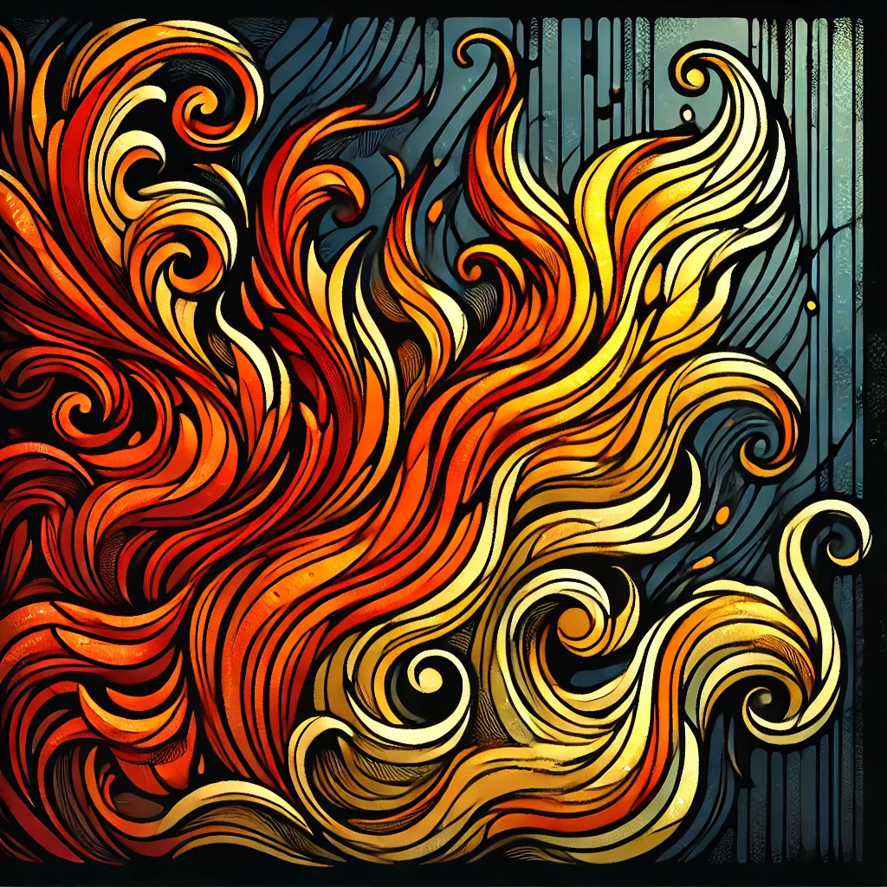 | ⟰ Fort contre le froid ⟰ Fort contre le bois ⟰ Fort contre le cuir (*) ⟱ Faible contre l’eau ⟱ Faible contre la terre ⟱ Faible contre le métal (*) |
| --- | --- |
| Domaine : 🔥 Feu Type : Énergie | Défense : FOR Forme : Intangible |
| Déchaîne des flammes brûlantes qui carbonisent la chair, enflamment les objets inflammables et provoquent des explosions en embrasant l’air. ➤ Particulièrement efficace contre : Le froid, qu’il fait fondre en eau ; le bois, qui s’embrase instantanément ; et le cuir des créatures, qui brûle facilement sous une chaleur intense. ➤ Moins efficace contre : L’eau, qui l’éteint et disperse la chaleur ; la terre, qui absorbe les flammes sans dommage ; et le métal, qui conduit la chaleur mais ne brûle pas. |
| ➤ Notes : Une cible constituée de feu ou une cible enflammée ou immolée sont deux cibles associées à l’élément du feu. |

#### Froid

| 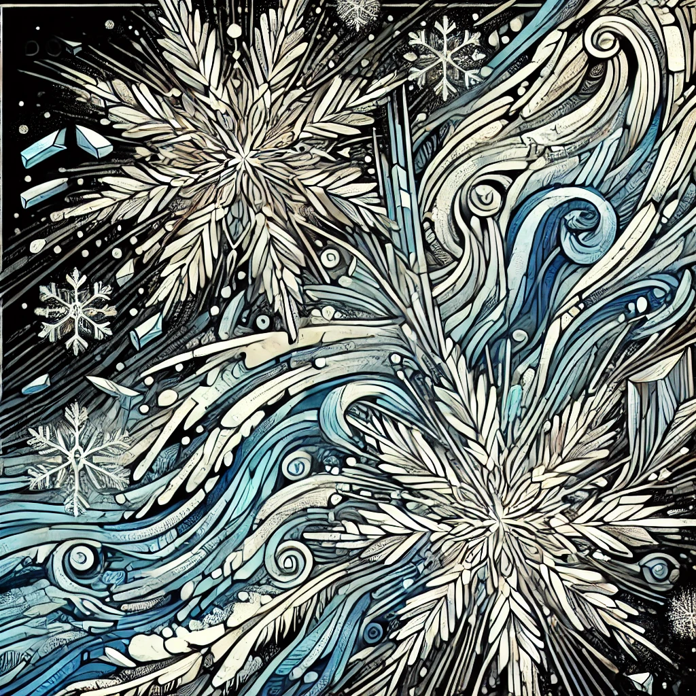 | ⟰ Fort contre l’eau ⟰ Fort contre le bois ⟰ Fort contre le tissu (*) ⟱ Faible contre le feu ⟱ Faible contre la terre ⟱ Faible contre le cuir (*) |
| --- | --- |
| Domaine : ❄️ Glace Type : Énergie | Défense : DEX Forme : Intangible |
| Gèle la chair et les liquides, durcit les matériaux et fragilise les structures par le gel. ➤ Particulièrement efficace contre : L’eau, qui devient solide et perd sa fluidité ; le bois, qui devient cassant et vulnérable ; et les tissus, qui se figent sous l’effet du gel. ➤ Moins efficace contre : Le feu, qui fait fondre la glace et neutralise son effet ; la terre, qui ne réagit pas au froid de manière significative ; et le cuir, qui conserve mieux la chaleur et reste souple. |
| ➤ Notes : Une cible constituée de glace ou une cible emprisonné dans la glace sont deux cibles associées à l’élément du froid. |

#### Electricité

| 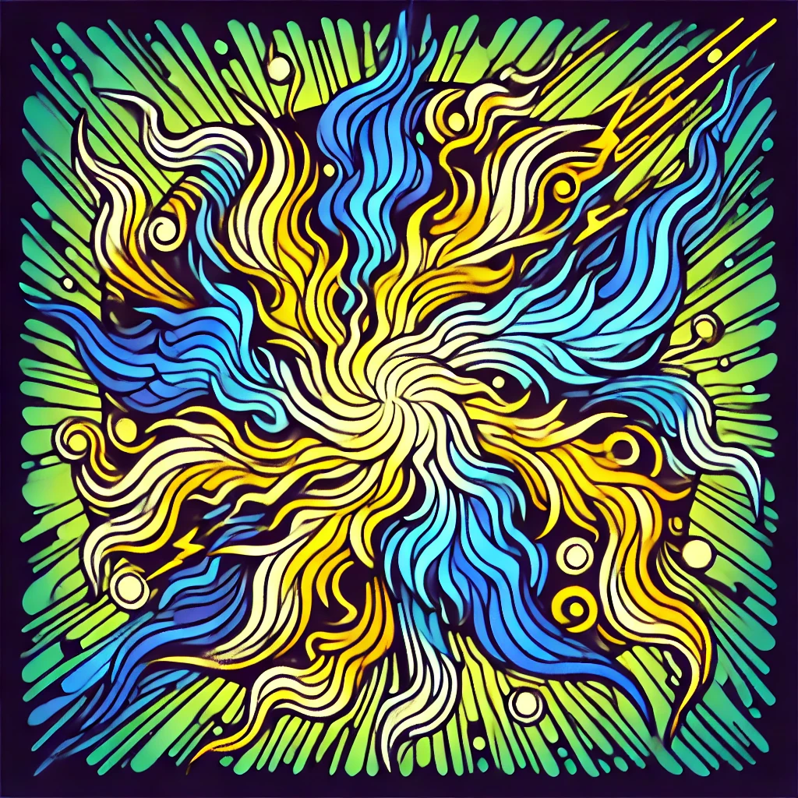 | ⟰ Fort contre le métal (*) ⟰ Fort contre l’eau ⟰ Fort contre l’air ⟱ Faible contre la terre ⟱ Faible contre le bois ⟱ Faible contre le tissu (*) |
| --- | --- |
| Domaine : ⚡ Foudre Type : Énergie | Défense : AGI Forme : Intangible |
| Propage des arcs foudroyants qui brûlent, paralysent et court-circuitent les structures organiques et mécaniques. ➤ Particulièrement efficace contre : L’air, qui conduit l’électricité plus loin ; l’eau, qui amplifie les décharges et les répand rapidement ; et le métal, qui agit comme un parfait conducteur. ➤ Moins efficace contre : Le bois, qui agit comme un isolant naturel ; la terre, qui absorbe l’électricité sans la propager efficacement ; et les tissus, qui limitent la conduction des décharges. |
| ➤ Notes : Une cible constituée d’électricité ou une cible fonctionnant à l’aide d’une telle source d’énergie sont deux cibles associées à l’élément de l’électricité. |

#### Terre

| 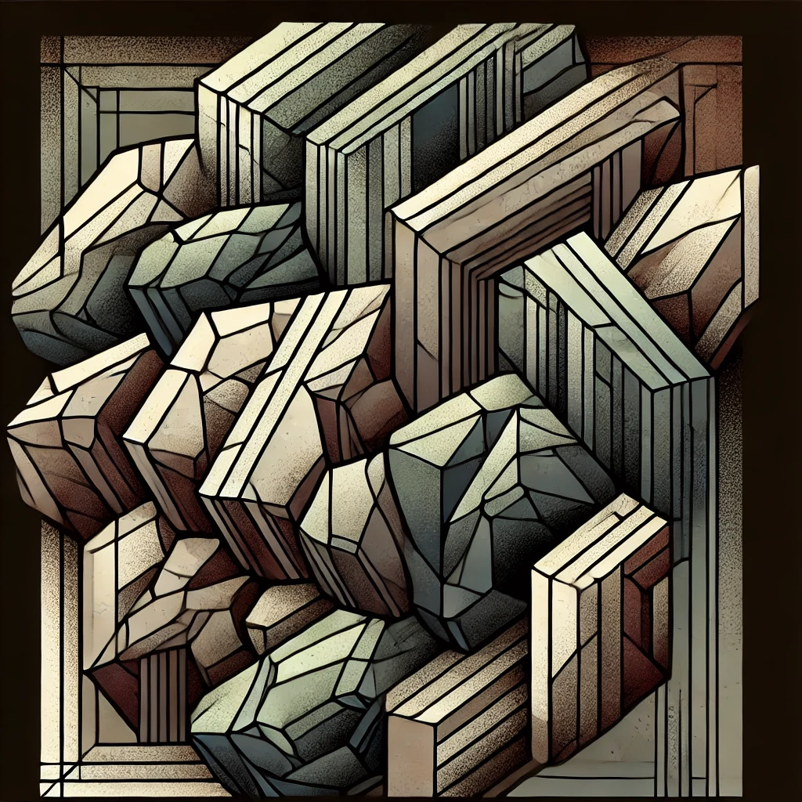 | ⟰ Fort contre l’électricité ⟰ Fort contre les cibles au sol ⟱ Faible contre l’air |
| --- | --- |
| Domaine : 🪨 Terre Type : Matière | Défense : FOR Forme : Tangible |
| Écrase, enterre et fracasse à l’aide de roches lourdes et de masses compactes. ➤ Particulièrement efficace contre : L’électricité, qui se dissipe immédiatement en elle ; les autres matières solides, qui se retrouvent écrasées par sa force brute ; et les cibles au sol, qui ne peuvent y échapper. ➤ Moins efficace contre : L’air, qui est insaisissable et ne peut être écrasé ; et les cibles en hauteur, qui échappent aux attaques terrestres. |
| ➤ Notes : Une cible constituée de terre ou une cible recouverte de boue sont deux cibles associées à l’élément de la terre. Notons que les cibles au sol correspondent aussi bien au créatures rampantes qu’au créatures au sol (à la suite d’un renversement ou autre). |

#### Eau

| 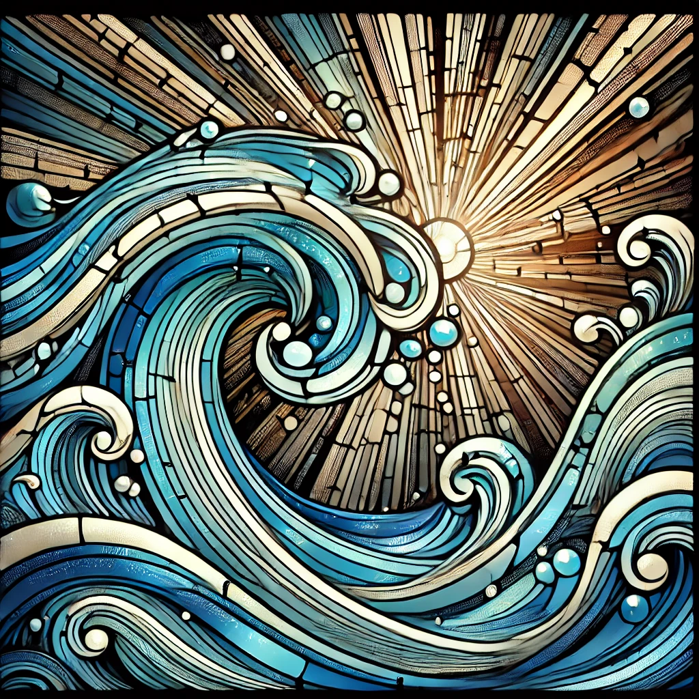 | ⟰ Fort contre le feu ⟰ Fort contre l’acide ⟰ Fort contre les cibles immergée ⟱ Faible contre le froid ⟱ Faible contre le bois |
| --- | --- |
| Domaine : 💧 Eau Type : Matière | Défense : DEX Forme : Tangible |
| Submerge, érode et noie, exerçant une pression constante et pénétrant les défenses. ➤ Particulièrement efficace contre : Le feu, qu’elle éteint et neutralise complètement ; les substances acides, qu’elle dilue ; et les cibles immergées, qu’elle piège et noie. ➤ Moins efficace contre : Le froid, qui la fige et la bloque ; et le bois, qui l’absorbe sans en subir de grands dommages. |
| ➤ Notes : Une cible constituée d’eau ou une cible trempée sont deux cibles associées à l’élément de l’eau. |

#### Air

| 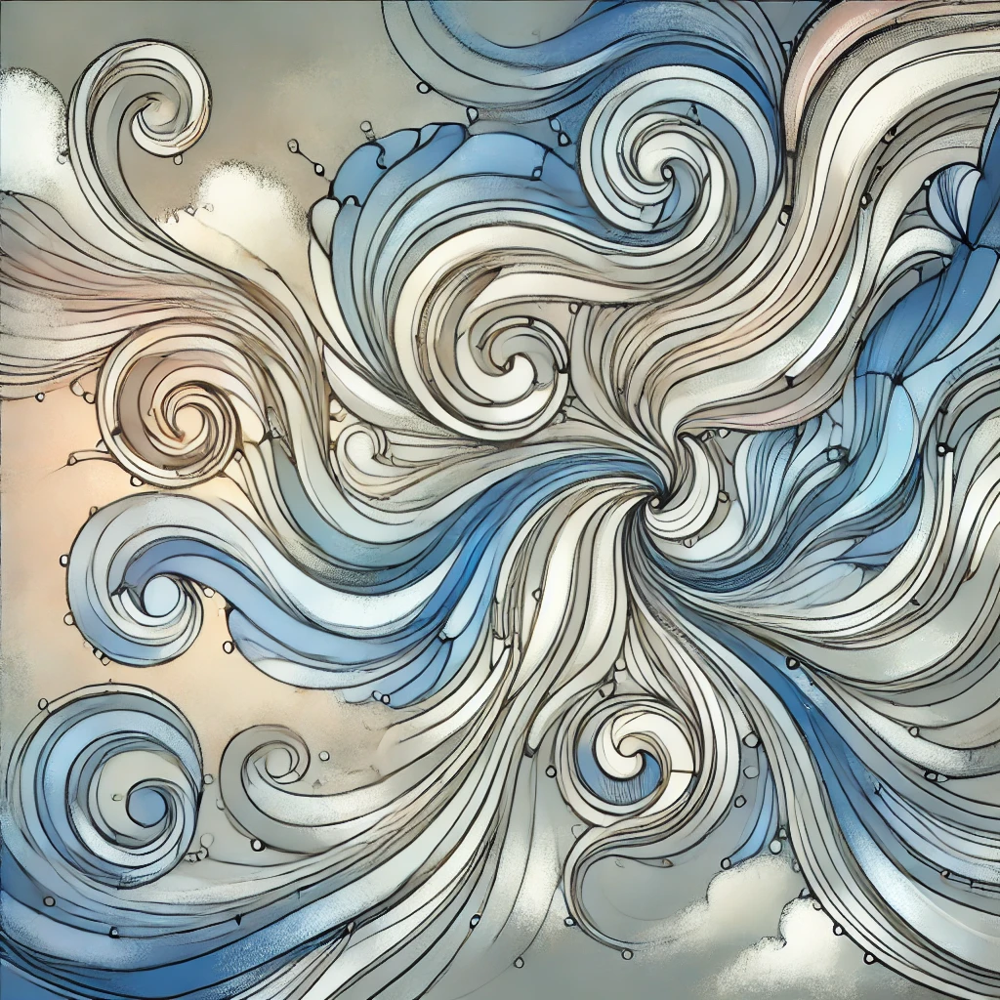 | ⟰ Fort contre le feu ⟰ Fort contre l’électricité ⟰ Fort contre les cibles en l’air ⟱ Faible contre le bois ⟱ Faible contre la terre |
| --- | --- |
| Domaine : 🌪️ Air Type : Matière | Défense : AGI Forme : Tangible |
| Frappe en bourrasques tranchantes, projette les ennemis et perturbe les attaques ennemies. ➤ Particulièrement efficace contre : Le feu, qu’il alimente ou disperse ; l’électricité, qu’il diffuse pour augmenter sa portée ; et les cibles dans les airs, qui sont déséquilibrées et projetées. ➤ Moins efficace contre : La terre, qui reste immobile et ne peut être balayée ; et les cibles enracinées au sol, qui résistent à son effet. |
| ➤ Notes : Une cible constituée d’air ou tout autre forme de gaz sont associées à l’élément de l’air. Notons que les cibles en l’air correspondent aussi bien aux créatures volantes qu’au créature ne touchant plus le sol (à la suite d’un sort ou autre). |

#### Lumière

| 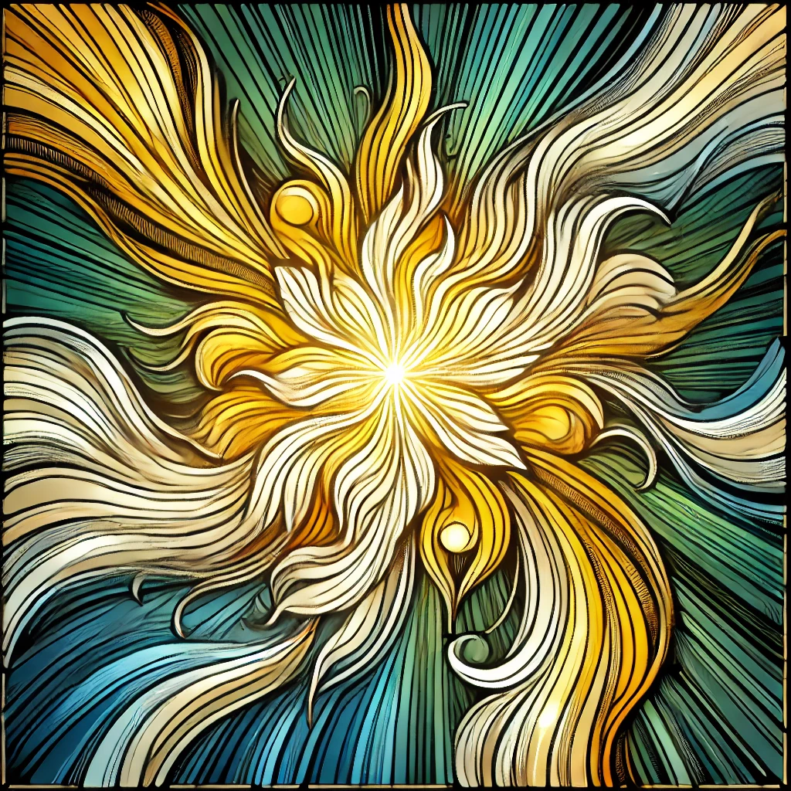 | ⟰ Fort contre les énergies (**) ⟱ Faible contre les matières (**) |
| --- | --- |
| Domaine : ☀️ Lumière Type : Primordial Sous type : Divin | Défense : PER Forme : Intangible |
| Libère une énergie pure qui brûle et dissipe les ténèbres, frappant directement l’essence de la cible. ➤ Particulièrement efficace contre : Les énergies occultes et ombreuses, qu’elle dissipe totalement. ➤ Moins efficace contre : Les éléments matériels, qui ne sont pas affectés par sa nature immatérielle. |
| ➤ Notes : Cet élément est fort contre les énergies soit : feu, froid, électricité. Il est cependant faible contre les matières soit : terre, eau, air. |

#### Ombre

| 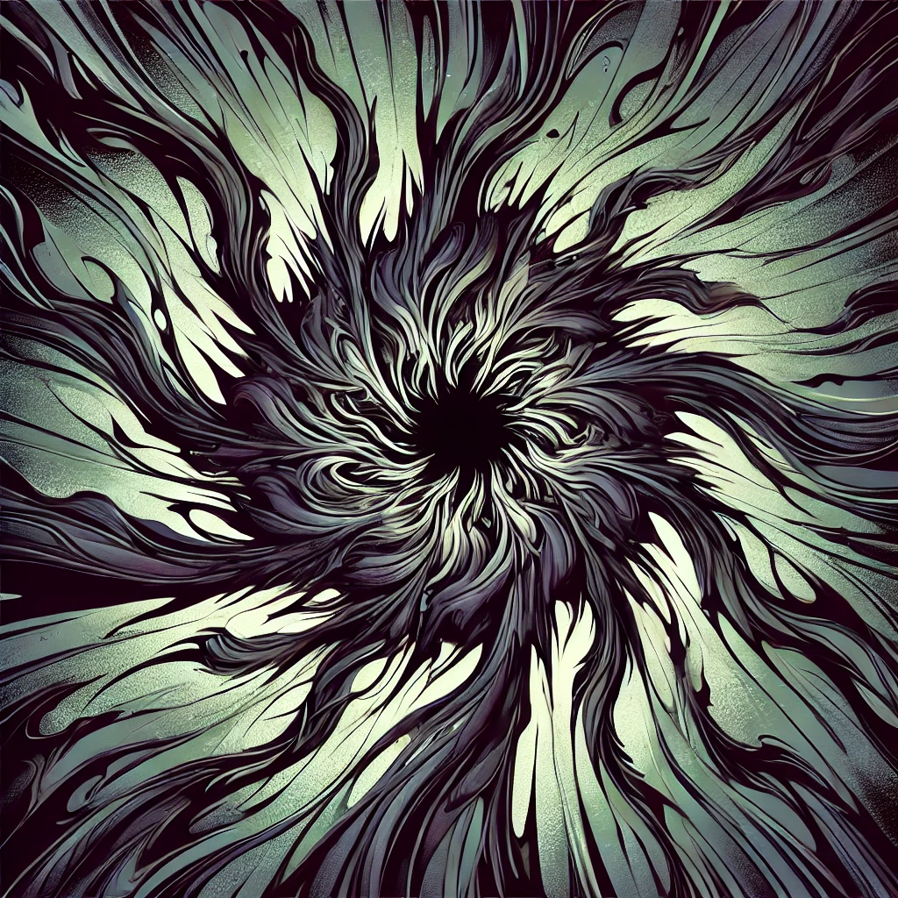 | ⟰ Fort contre les énergies (**) ⟱ Faible contre les matières (**) |
| --- | --- |
| Domaine : 🌑 Ombre Type : Primordial Sous type : Occulte | Défense : PER Forme : Intangible |
| Consume l’énergie et l’essence vitale, absorbant la lumière et drapant ses cibles d’un voile de ténèbres corrosives. ➤ Particulièrement efficace contre : Les énergies lumineuses, qu’elle absorbe et étouffe totalement. ➤ Moins efficace contre : La matière brute, qui résiste à ses effets immatériels et conserve son intégrité. |
| ➤ Notes : Cet élément est fort contre les énergies soit : feu, froid, électricité. Il est cependant faible contre les matières soit : terre, eau, air. |

#### Loi

| 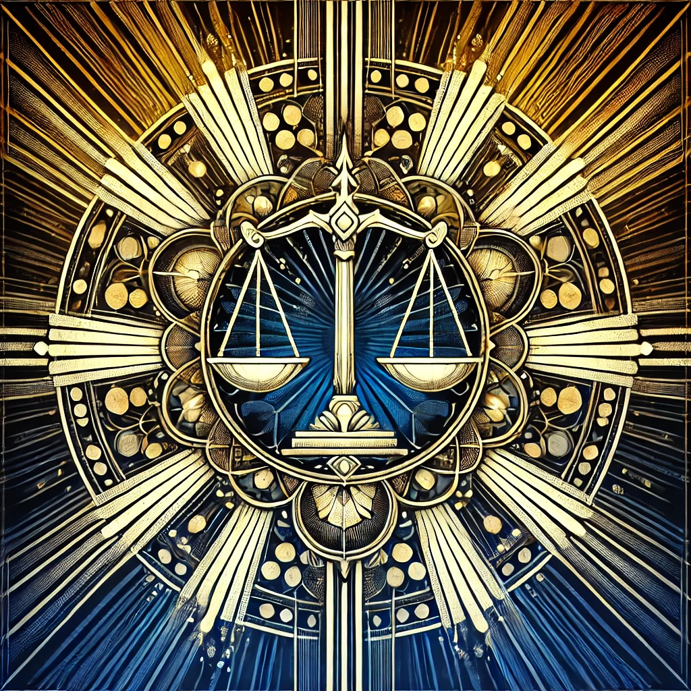 | ⟰ Fort contre le chaos ⟰ Fort contre les cibles chaotiques ⟱ Faible contre rien les illusions ⟱ Faible contre les esprits |
| --- | --- |
| Domaine : ⚖️ Loi Type : Origine Sous type : Divin | Défense : VOL Forme : Intangible |
| Imposant des contraintes absolues, il annule les formes de chaos et d’instabilité. ➤ Particulièrement efficace contre : Les forces chaotiques, qui ne peuvent se manifester sous son ordre strict. ➤ Moins efficace contre : Les illusions et le psychisme, qui échappent aux lois physiques. ➤ Notes : Notons que les cibles chaotiques correspondent à toutes les cibles doté d’un alignement chaotique. Pour ce qui est des esprits, voir l’élément psychique. |

#### Chaos

| 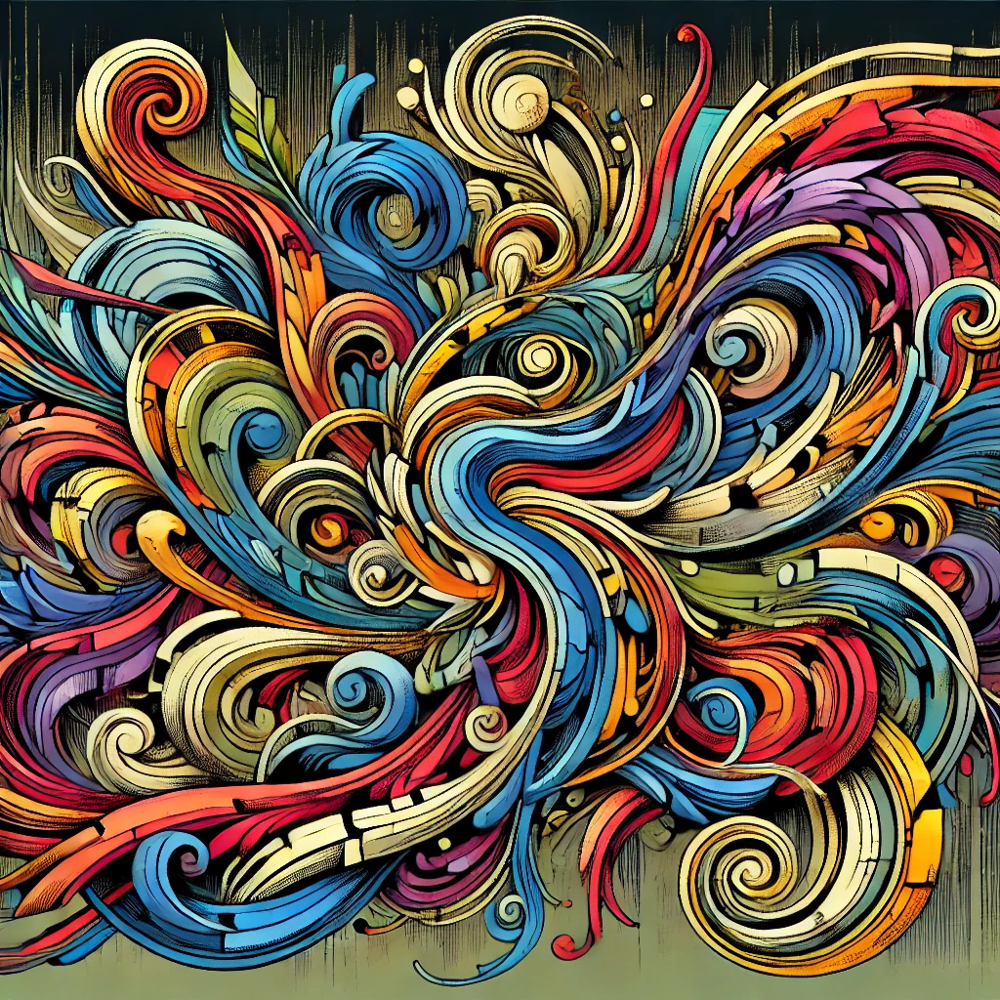 | ⟰ Fort contre la loi ⟰ Fort contre les cibles loyales ⟱ Faible contre les illusions ⟱ Faible contre les esprits |
| --- | --- |
| Domaine : 🌀 Chaos Type : Origine Sous type : Occulte | Défense : VOL Forme : Intangible |
| Un tourbillon de distorsions imprévisibles, qui brise l’ordre et corrompt la structure. ➤ Particulièrement efficace contre : Les forces rigides et organisées, qui ne peuvent y résister. ➤ Moins efficace contre : Les illusions et les capacités psychiques, qui ne dépendent pas des règles du monde matériel. |
| ➤ Notes : Notons que les cibles loyales correspond à toutes les cibles doté d’un alignement loyal. Pour ce qui est des esprits, voir l’élément psychique. |

#### Sacré

| 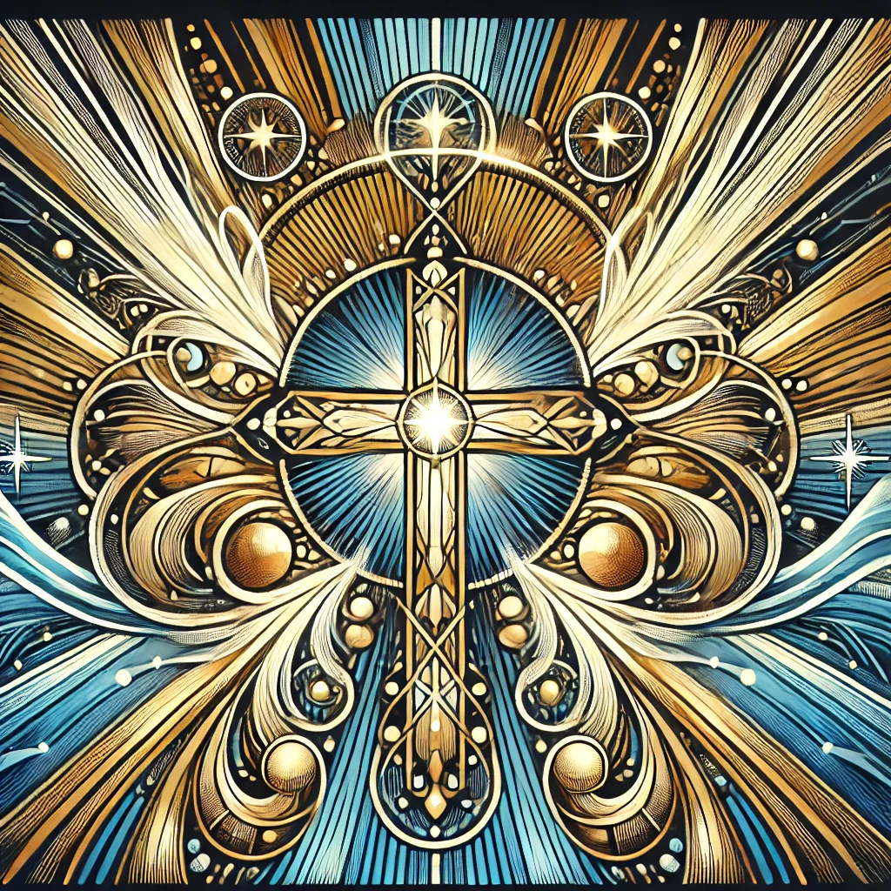 | ⟰ Fort contre les forces occultes ⟱ Faible contre ce qui n’est pas vivant |
| --- | --- |
| Domaine : ✨ Sacre Type : Fondamental Sous type : Divin | Défense : SAG Forme : Intangible |
| Une énergie transcendante qui consume et purifie les entités occultes. ➤ Particulièrement efficace contre : Les forces impies et maléfiques. ➤ Moins efficace contre : Certaines entités non vivantes qui échappent à son influence. |
| ➤ Notes : Cet élément est fort contre les éléments occultes que sont : L’ombre, l’impie, le chaos et la mort. |

#### Impie

| 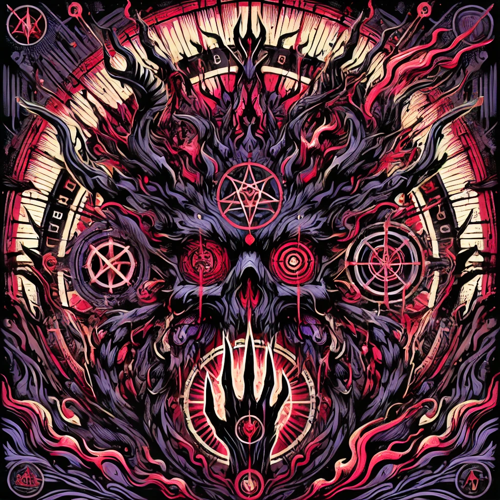 | ⟰ Fort contre les forces divines (**) ⟱ Faible contre ce qui n’est pas vivant |
| --- | --- |
| Domaine : 🩸 Impie Type : Fondamental Sous type : Occulte | Défense : RUS Forme : Intangible |
| Une corruption rampante qui ronge l’essence et pervertit l’ordre naturel. ➤ Particulièrement efficace contre : Les énergies sacrées et divines. ➤ Moins efficace contre : Certaines entités non vivantes qui échappent à son influence. |
| ➤ Notes : Cet élément est fort contre les éléments divins que sont : La lumière, le sacré, la loi et la vie. |

#### Vie

| 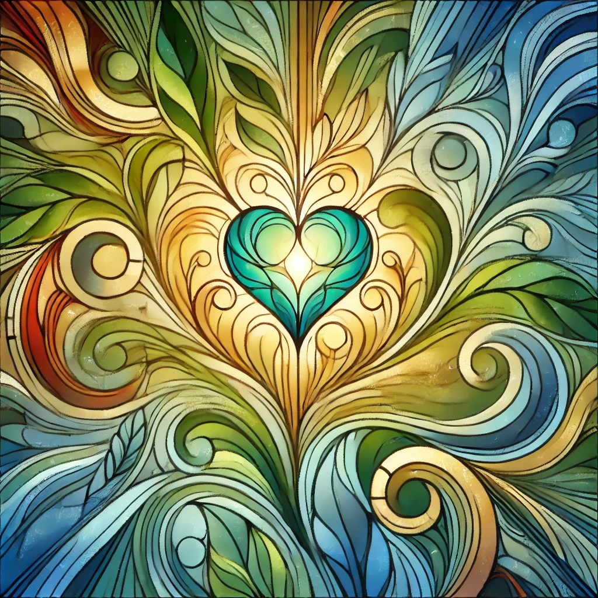 | ⟰ Fort contre la mort ⟱ Inefficace contre tout le reste |
| --- | --- |
| Domaine : ❤️ Vie Type : Cycle Sous type : Divin | Défense : CON Forme : Intangible |
| Un débordement d’énergie vitale qui force la croissance et l’animation. ➤ Particulièrement efficace contre : La mort, qu’elle dissipe totalement. ➤ Moins efficace contre : Tout autre élément, étant une force passive plus qu’une attaque directe. |
| ➤ Notes : Les créatures associées à la mort tous les crépusculaires : Des entités mortes qui « vivent » encore un simulacre d’existence. Finalement la vie n’a pas d’impact (négatif) sur autre chose que ces êtres déviants du cycle de la vie. |

#### Mort

| 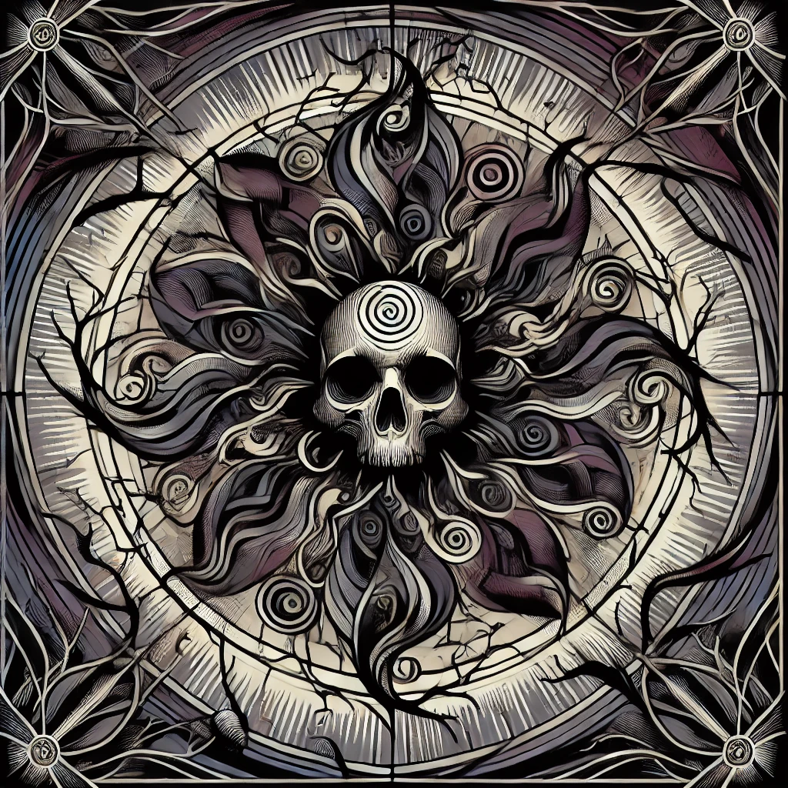 | ⟰ Fort contre les êtres plein de vie ⟱ Faible contre ce qui n’est pas vivant |
| --- | --- |
| Domaine : ☠️ Mort Type : Cycle Sous type : Occulte | Défense : CON Forme : Intangible |
| Un pouvoir de décomposition et d’annihilation de la force vitale. ➤ Particulièrement efficace contre : La vie, qu’il consume. ➤ Moins efficace contre : Tout autre élément, qui n’est pas directement affecté. |
| ➤ Notes : La mort est efficace contre les entités disposant de tout leur capitale santé (PV intactes). |

#### Bois

|  | ⟰ Fort contre les matières ⟱ Faible contre les énergies |
| --- | --- |
| Domaine : 🌿 Flore Type : Nature | Défense : PER Forme : Tangible |
| Perce avec des ronces et des épines, s’accroche et se propage comme une force vivante. ➤ Particulièrement efficace contre : La matière brute, qu’il fissure et envahit progressivement. ➤ Moins efficace contre : Les énergies brutes, comme le feu qui le brûle instantanément. |
| ➤ Notes : Cet élément est faible contre les énergies soit : feu, froid, électricité. Il est cependant fort contre les matières soit : terre, eau, air. |

#### Nature

| 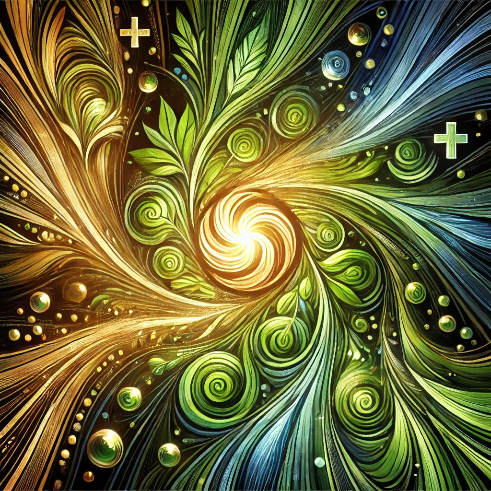 | ⟰ Fort contre la magie ⟱ Faible contre la science |
| --- | --- |
| Domaine : 🪷 Nature Type : Nature | Défense : PER Forme : Intangible |
| Une force primordiale qui s’adapte et évolue, façonnant la vie et l’environnement par des phénomènes organiques incontrôlables. ➤ Particulièrement efficace contre : La magie, qu’elle dissipe en ramenant les choses à leur état brut et naturel, perturbant les enchantements et les manipulations surnaturelles. ➤ Moins efficace contre : La science, qui exploite la nature de manière rationnelle et méthodique, contournant ses principes par des outils et des structures logiques. |
| ➤ Notes : Toutes les créatures invoquées sont associées à la magie, mais pas les créatures dotées de pouvoir ou de magie issus du vaste monde. Ici la science fait référence aux créations technologiques tels que les automates et autres créatures façonnées. |

#### Acide

| 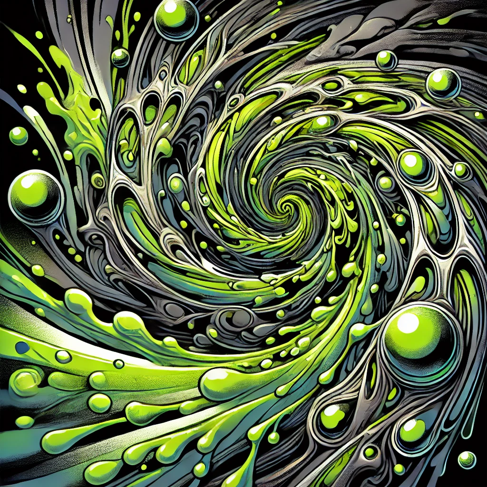 | ⟰ Fort contre le métal (acide) ⟰ Fort contre le bois ⟰ Fort contre la terre ⟱ Faible contre le feu ⟱ Faible contre l’air ⟱ Faible contre l’électricité |
| --- | --- |
| Domaine : ☢️ Poison Type : Nature | Défense : CON Forme : Tangible |
| Ronge et dissout tout ce qu’il touche, affaiblissant les structures solides et organiques. ➤ Particulièrement efficace contre : Le métal, qu’il corrode en profondeur ; le bois, qu’il fait pourrir ; et la terre, qu’il érode lentement. ➤ Moins efficace contre : L’air, qui le disperse ; le feu, qui le vaporise ; et l’électricité, qui altère sa composition chimique. |

#### Psychique

| 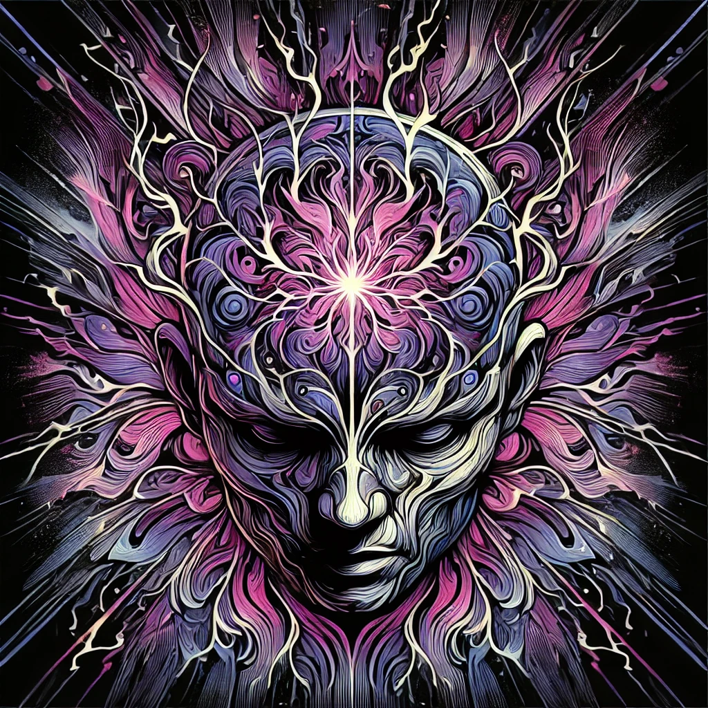 | ⟰ Fort contre les esprits ⟱ Inefficace contre ceux qui n’ont pas d’esprit |
| --- | --- |
| Domaine : 🧩 Mental Type : Psyché | Défense : VOL Forme : Intangible |
| Une force intangible qui infiltre l’esprit, sème la confusion et brise la volonté par des intrusions mentales ou des illusions persuasives. ➤ Particulièrement efficace contre : Les esprits et entités pensantes, dont il peut manipuler les perceptions et les souvenirs. ➤ Moins efficace contre : Les êtres dépourvus d’esprit ou de conscience, insensibles aux attaques psychiques. |
| ➤ Notes : Les esprits ne se caractérisent pas par les êtres désincarnés, évoluant dans le plan idoines. On peut généraliser en englobant toutes les formes de fantômes, spectres et autres manifestations de ce type (à qui il ne reste pour ainsi dire que la psyché). L’absence d’esprit est généralement l’apanage des automates et autres constructions ou manifestations dénués d’intelligence ou libre arbitre. |

#### Arcane

| 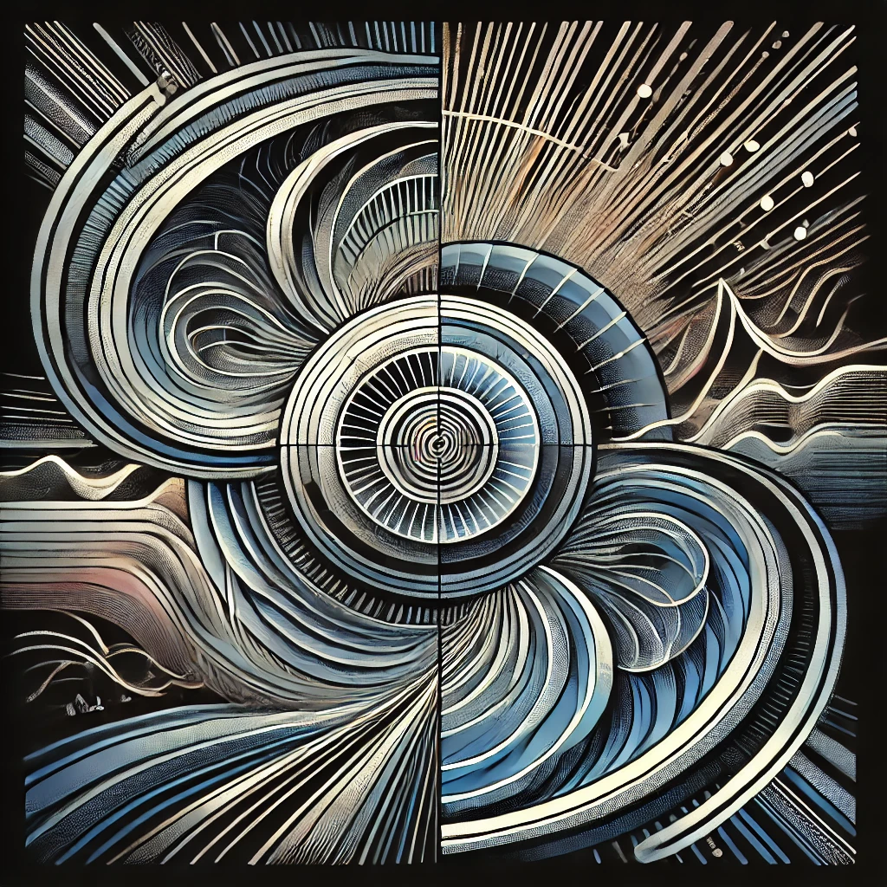 | ⟰ Fort contre la science (*) ⟱ Faible contre la nature (*) |
| --- | --- |
| Domaine : ✡️ Arcane Type : Magie | Défense : MAG Forme : Intangible |
| Une énergie magique pure qui altère la réalité, crée des distorsions et annule les règles naturelles. ➤ Particulièrement efficace contre : La science et les mécanismes logiques, qu’il perturbe et rend obsolètes. ➤ Moins efficace contre : La nature, qui repose sur des principes fondamentaux inaltérables et résiste à sa manipulation. |
| ➤ Notes : Ici la science fait référence aux créations technologiques tels que les automates et autres créatures façonnées. Ici la nature fait référence aux êtres dont l’existence est en phase avec l’ordre naturel de la vie, généralement la faune donc. Cela exclut donc la plupart des monstres ou des créatures dont l’existence est justement rattachée aux manifestations de la magie en ce monde. Cela exclut également les humanoïdes, largement autonomes et détachés du cycle en question. |

#### Illusion

| 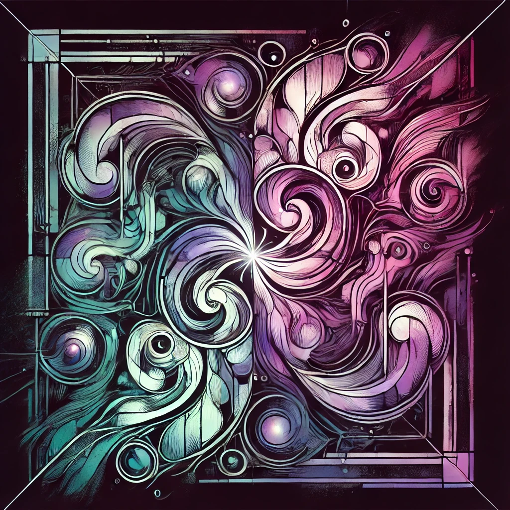 | ⟰ Fort contre ceux qui se ne perçoive l’illusion ⟱ Faible contre ceux qui perce l’illusion |
| --- | --- |
| Domaine : 🎭 Illusion Type : Psyché | Défense : SAG Forme : Intangible |
| Une manipulation de la perception qui trompe les sens et modifie la réalité apparente des cibles. ➤ Particulièrement efficace contre : Ceux qui ne perçoivent pas sa nature et prennent ses effets pour réels. ➤ Moins efficace contre : Ceux qui discernent l’illusion et voient à travers ses artifices. |
| ➤ Notes : Percevoir l’illusion revient à réussir le test d’intuition associé à toutes formes d’illusion (ce qui permet à la cible de savoir que quelque chose ne va pas) puis le test actif d’acuité. Ne pas percevoir l’illusion revient à rater le test d’intuition et ne pas avoir réussi ou tenté le test actif d’acuité. En somme, seuls les cibles ayant réussi le test d’intuition mais n’ayant pas tenté ou ayant raté le test actif d’acuité subissent des dégâts normaux contre cet élément. Notons que les dégâts d’illusion affectent généralement la spiritualité (PS) de la cible. |

#### Tranchant

| 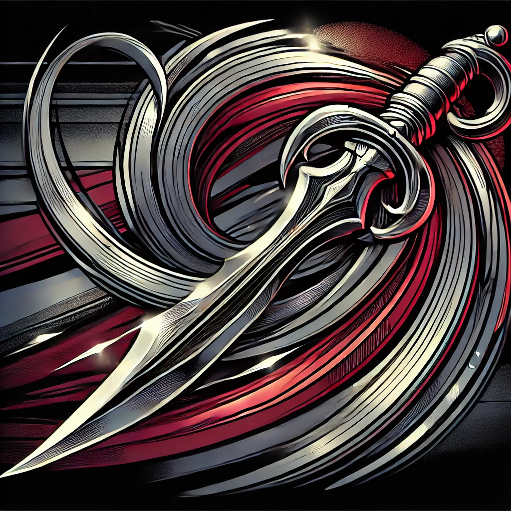 | Pas de force ou faiblesse |
| --- | --- |
| Domaine : ⚔️ Acier Type : Physique | Défense : DEX Forme : Tangible |
| Des lames et arêtes affûtées qui coupent net la chair, les os et les armures avec précision. |

#### Contondant

| 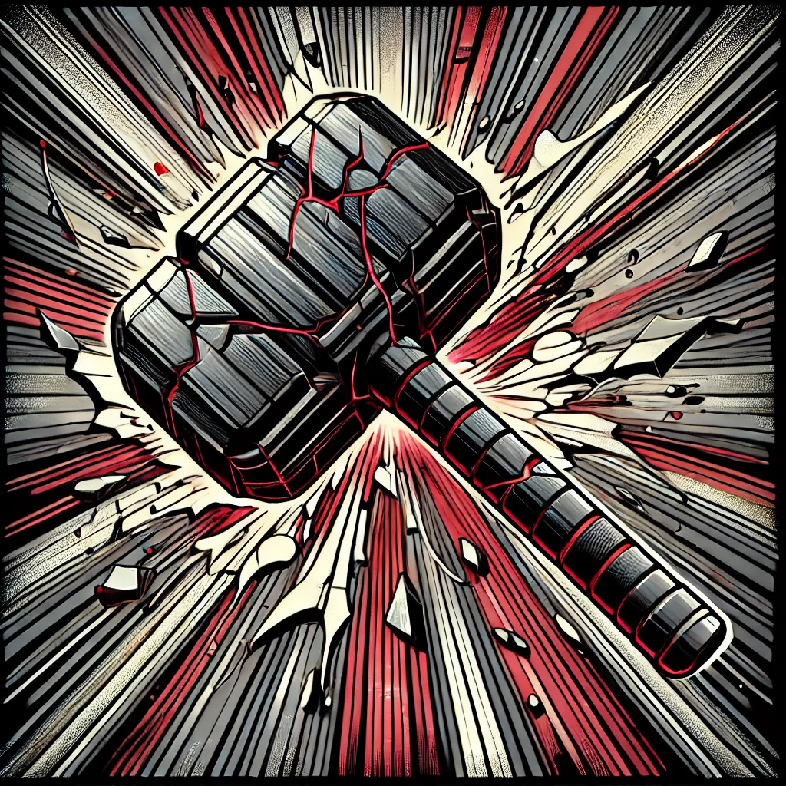 | Pas de force ou faiblesse |
| --- | --- |
| Domaine : ⚔️ Acier Type : Physique | Défense : FOR Forme : Tangible |
| Des frappes lourdes et brutales qui écrasent, fracturent et enfoncent les protections. |

#### Perforant

| 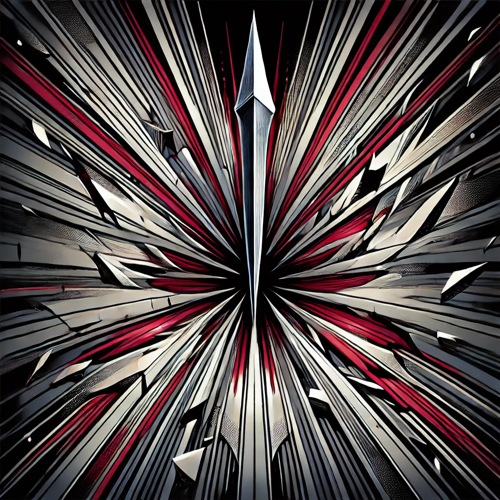 | Pas de force ou faiblesse |
| --- | --- |
| Domaine : ⚔️ Acier Type : Physique | Défense : AGI Forme : Tangible |
| Des projectiles et estocs qui transpercent les défenses en concentrant la force en un point précis. |

#### Vide

| 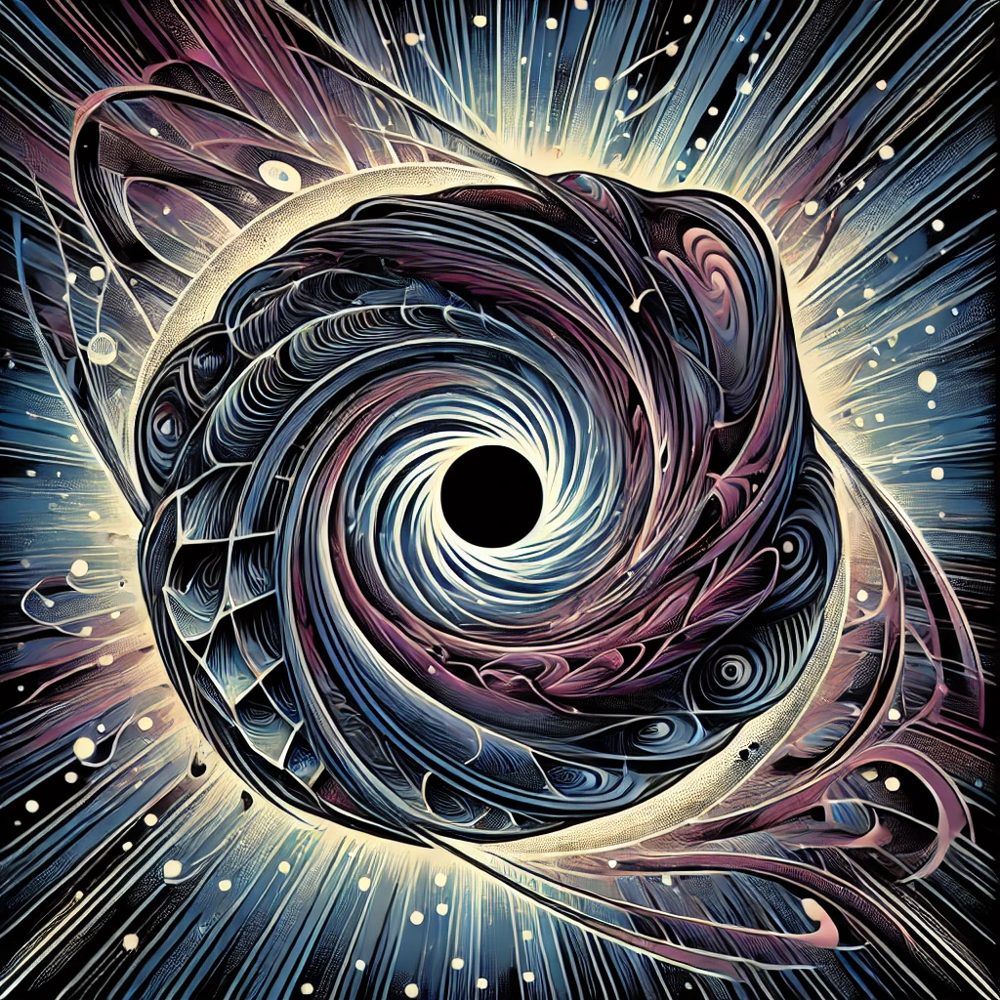 | ⟰ Fort contre les cibles lourdes ⟱ Faible contre les cibles légères |
| --- | --- |
| Domaine : 💢 Vide Type : Magie | Défense : EQU Forme : Intangible |
| Une absence absolue qui crée des zones de néant, où la matière et l’énergie sont aspirées et annihilées. ➤ Particulièrement efficace contre : Les cibles lourdes et massives, qui ont plus de matière à perdre et subissent un effondrement sous leur propre poids. ➤ Moins efficace contre : Les cibles légères et aériennes, qui sont peu affectées par son influence gravitationnelle. |
| ➤ Notes : Une cible lourde se caractérise par une stature supérieure à la taille, et inversement. Cette supériorité se caractérise par une différence de 2 ou plus. Par exemple un individu avec 10 de stature et 12 de taille est considéré comme légère (pour sa taille donc). |

## Les Particularités d’un Sort

Les sorts peuvent présenter des particularités. Ces dernières proviennent de mots spécifiques et peuvent conditionner ou modifier l’usage qui peut être fait du sort ou de la magie elle-même.

### La Surchauffe

Lorsqu’un personnage est sujet à une surchauffe sa magie n’est plus accessible pour une durée donnée, généralement fixée en tours.

### Le Surcoût

Lorsqu’un sort est sujet à un surcoût son drain de mana est simplement supérieur à la difficulté du sort. Cette majoration est équivalente au surcoût.

### La Surcharge

Lorsqu’un sort d’enchantement est sujet à une surcharge sa durée est augmentée par la présence d’une surcharge qui diminue en priorité et qui n'affecte pas la valeur des effets.

## Les Rituels

Un sort peut être lancé suite à un rituel. Dans ce cas, le personnage s’engage dans une activité longue, méthodique et exigeante, visant à obtenir des effets sensiblement améliorés pour le sort à venir. Si l’environnement est instable ou non sécurisé, un test de concentration peut être requis pour lancer ce dernier, puis des tests de sauvegarde de détermination pour chaque gênes.

### Les conditions

- Le personnage doit posséder le groupe de compétence Arcane et disposer d’une tradition magique pour participer à un rituel.
- La compétence Rituel n’est nécessaire que pour celui qui officie en tant que maître du rituel ; les assistants n’en ont pas besoin.
- Des traits liés aux rituels peuvent aider, mais ne sont pas indispensables.
- Le personnage ne peut participer efficacement qu’aux rituels liés à sa tradition magique.

- S’il n’a pas accès à cette tradition (absence de tradition ou tradition différente), il peut tout de même aider mais subit un désavantage à son test d’assistance.

- Le maître du rituel dépense 2 PS.
- Le maître du rituel dépense 1 PO de composants.
- Un outil nommé harmoniseur peut être employé afin d’améliorer la puissance du rituel, mais ce n’est pas obligatoire pour mener le rituel en lui-même.

### La puissance du rituel

La puissance totale d’un rituel dépend de :

1. La puissance de base (dérivée d’une évaluation finale de rituel).
2. Le temps consacré au rituel constitue un paramètre supplémentaire.
3. Les matières premières dépensées au-delà du minimum constituent un paramètre supplémentaire.
4. Le nombre de participants au-delà du maître du rituel constitue un paramètre supplémentaire.
5. La charge spirituelle que le maître applique en plus constitue un paramètre supplémentaire.

Les bonus issus des paramètres supplémentaires sont limités par la puissance de base.

#### La Puissance de Base

À la finalisation du rituel, le maître du rituel doit réaliser un test de difficulté équivalent au sort pour lequel le rituel est réalisé :

- Test via Arcane + Rituel + attribut de tradition.

La puissance de base correspond au jet calculé à partir de la catégorie de l’harmoniseur employé.

Les bonus de puissance de rituel provenant du temps, des ressources ou des assistants ne peuvent pas dépasser cette puissance de base.

#### Le Temps

Durée par défaut : 1 minute.

- 5 minutes au moins : Bonus de puissance +5.

- 2min = +1.

- 30 minutes au moins : Bonus de puissance +10.

- 3min = +1.

- 60 minutes au moins : Bonus de puissance +15.

- 4min = +1.

- 3 heures au moins : Bonus de puissance +20.

- 9 min = +1.

- 6 heures au moins : Bonus de puissance +25.

- ~15min = +1.

- 24 heures au moins : Bonus de puissance +30.

- ~45min =+1.

- 48 heures au moins : Bonus de puissance +35.

- ~90min = +1.

- 1 semaine au moins : Bonus de puissance +40.

- 240min (4h) = +1.

Il est possible d’interpoler entre deux paliers (bonus proportionnel au temps exact), mais pour garder le système clair, les valeurs ci-dessus servent de référence principale, seuls une estimation de gain par temps passé étant proposée.

#### Les Matières Premières

Coût par défaut : 1 PO.

- Chaque 1 PO additionnel ajoute un bonus de puissance de +3.
- Si la matière première est un pion de vis associé au domaine du sort visé alors le bonus est de +4 à la place.

#### Le Nombre de Participants

Rituel de base : 1 seul participant, le maître.

Chaque assistant qui réalise une évaluation de rituel de difficulté 5, chaque DR obtenus offre un bonus de puissance de +4 mais requiert également de dépenser 1 PS par son auteur.

Les assistants doivent remplir les mêmes conditions que tout participant au rituel.

Un personnage qui souhaite “aider” un maître de rituel ne peut participer comme assistant/participant au rituel même, il seconde le maître du rituel à la place et doit dépenser autant de PS qu’il affiche de DR pour l’aide en question.

#### La Charge Spirituel

Coût par défaut : 2 PS.

- Chaque 1 PS additionnel ajoute un bonus de puissance de +3.

#### L’Harmoniseur

Un rituel peut être réalisé via un harmoniseur, un outil crucial servant à canaliser l’énergie du rituel de façon plus efficace. Un harmoniseur n’est pas un focalisateur : il nourrit le rituel, mais ne remplace pas l’élément nécessaire pour lancer le sort lui-même.

Propriétés :

- Chaque harmoniseur est lié à un domaine spécifique et ne permet de préparer que des rituels visant des sorts du domaine en question.
- Sa qualité donne un bonus d’ajustement aux tests du rituel.
- Comme beaucoup d'outils, il peut recevoir des améliorations (élargir le domaine, augmenter les bonus maximum, etc.).
- Un harmoniseur est associé à une catégorie, qui comme pour tout outil, améliore donc le jet mais impose des pénalités d’usages. Une catégorie 0 c’est l’absence d’un harmoniseur.

Exemple : Le Milorë (catégorie 4, qualité 4) est un harmoniseur qui possède 2 améliorations permettant de l’utiliser avec tous les éléments matériels (Eau, Terre, Air) et 2 autres augmentant son bonus maximal de +10. Son jet est de 6D8 + modificateur de tradition.

#### Les Conditions Spéciales

Un rituel d’enchantement peut inclure des conditions spéciales, véritables « faiblesses choisies » qui augmentent fortement sa difficulté Arcanique, le rendant plus difficile — voire impossible — à dissiper.

- Facile : +5 (ex : nécessite une personne d'une race donnée).
- Moyenne : +10 (ex : sacrifice d’un individu).
- Difficile : +15 (ex : un objet unique présent lors du rituel).
- Impossible : +20 (ex : un bijou unique mais théoriquement forgeable).

Ces conditions servent surtout au game design :

- Si dissiper le rituel doit être simple → aucune condition ou une condition facile.
- Si la suppression nécessite une quête → difficile ou impossible.

Si une condition repose sur un objet destructible, sa destruction supprime la condition (et donc son bonus de difficulté).

### Le déroulement

Le déroulement du rituel :

1. Le maître du rituel prépare la mise en place et fixe le nombre exact de participants — qui doit rester stable jusqu’à la fin.
2. Le maître du rituel définit le sort qui fera l’objet du rituel. Un niveau pour le sort doit être défini. La difficulté du sort devient la difficulté du rituel.
3. Le rituel se déroule pendant la durée prévue (10 minutes, 30 minutes, plusieurs heures, etc.).
4. Une fois le rituel prêt, le maître réalise un test de rituel (Arcane + Rituel + attribut de tradition) contre la difficulté du rituel, consommant les matières premières prévues.
5. Un rituel peut être critique.
6. Si le rituel est réussi, une puissance de base est calculée à partir du jet.
7. Les bonus issus du temps, des ressources et des assistants sont appliqués (dans la limite de la puissance de base).
8. Le maître du rituel choisit alors les avantages à appliquer au sort.
9. Le sort peut ensuite être lancé, par le maître du rituel ou par un autre personnage habilité à profiter des effets du rituel / à lancer le sort pour lequel le rituel est préparé.

### Les avantages

Les points de rituel peuvent être utilisés afin d’améliorer le sort lancé :

- Puissance accrue (5 points) : augmente la puissance du sort de 1.
- Assurance (10 points) : le test du sort pourra être tenté à nouveau en cas d’échec.
- Arcanes accrues (5 points) : augmente la difficulté Arcanique du sort de 1.
- Niveau accru (20 points) : augmente le niveau du sort de 1, sans tenir compte des limites habituelles ni du niveau connu du sort.
- Maîtrise accrue (5 points) : augmente la maîtrise du sort de 1, rendant plus difficile toute défense contre ses effets.
- Expertise accrue (10 points) : augmente l’expertise du sort de 1, donc la difficulté des sauvegardes associées.
- Portée accrue (10 points) : augmente la portée du sort ; la portée est multipliée par 2 pour chaque fois où cet effet est activé.
- Zone accrue (10 points) : augmente la zone d’effet ; la zone est multipliée par 2 pour chaque fois où cet effet est activé.
- Décharge décrue (20 points) : ralentit fortement le rythme de décharge de l’enchantement (tours → minutes → heures → jours → mois → années → décennies → siècles).
- Surcharge (1 point) : ajoute 1 point de surcharge au sort. Cette surcharge peut être dépensée à la place d’une charge normale, mais ne peut pas modifier les effets du sort. Maximum le double.

## Création et apprentissage des Sorts

Afin de créer un sort, un personnage doit créer un tractatus qui consigne les détails du sort en question. C’est durant la création de ce document que le mage expérimente et théorise sur le sort.

La création d’un tractatus est une activité similaire à l’artisanat mais ici la compétence d’artisanat est remplacée par la compétence de magie utilisée pour lancer le sort qui doit être créé. Cette pratique est également sujette à l’usage d’outils ou d’ateliers.

Apprendre un sort requiert un emplacement de mémoire. Notons qu’un sort est appris sous couvert d’un niveau maximum auquel il peut être lancé, on parle du niveau d’apprentissage.

### Choix du Sort

Tout d’abord le personnage doit procéder au choix du sort qu’il souhaite élaborer. Ce sort doit être définit concrètement et cela sous entends que tous les paramètres envisageables du sort doivent être choisit : Les mots de pouvoirs qui le constituent mais aussi, le niveau d’apprentissage, soit le niveau maximum auquel le sort pourra être lancé.

Les tests seront basés sur la difficulté de création.

- Difficulté de création = Difficulté du Sort au niveau choisi.

Notons que le tractatus produit pendant la création doit être d’un niveau de qualité égale au niveau maximum choisi. Un tractatus a évidemment un coût qui s’adapte à la qualité, le prix de base étant de 15.

Le sort choisit doit avoir une complexité inférieur à Groupe + Compétence. La complexité est d’un sort est équivalant au nombre de mots qui le compose (clés exclues).

### Procéder à l'Élaboration

Pour réaliser cette étape le personnage doit être à proximité des outils nécessaires : Du matériel d’écriture, des fournitures, etc… (une catégorie 0 sous-entend que le personnage n’a pas d’outils et fait cela quasi de tête). Si on peut permettre à un personnage de travailler une partie de son projet en extérieur, ce ne doit pas être possible pour tout l’ensemble du projet.

La création d’un tractatus se fait comme n’importe quel artisanat, aussi il est nécessaire de se référer aux règles idoines. La création d’un tractatus se fait en un temps court.

Notons que comme pour tout autre artisanat le personnage doit acheter ou se procurer 30% des matières premières requises pour le produit fini afin de réaliser ses prototypes etc…

Notons que la nature du sort, c’est-à-dire l’ensemble de ses mots, doivent correspondre aux limitations mentionnés plus haut (voir « Les mots de pouvoir »).

### L’Apprentissage d’un Sort (avec tractatus)

Afin d’apprendre un sort, un personnage doit faire usage d’un tractatus. Le temps d’apprentissage est le même que le temps nécessaire à la création du tractatus cependant il s’agit d’une activité de lecture associée à l’attribut de la tradition magique. Le sort appris est associé à un niveau maximum égale à celui de la qualité du tractatus. Le personnage peut sciemment souhaiter apprendre le sort à un niveau inférieur à celui du tractatus afin de réduire la difficulté de lecture (qui est donc également basée sur la difficulté du sort au niveau visé). Il y passe alors moins de temps, le temps s’adaptant au niveau visé.

### L’Apprentissage d’un Sort (sans tractatus)

Le personnage peut apprendre un sort sans faire usage d’un tractatus. C’est bien plus difficile car il faut entièrement conceptualiser toute la création du sort sans support écrit et apprendre à partie de cette image mentale. L’activité relève de la méditation et l’attribut associé est celui de la tradition. Le temps d’apprentissage est augmenté (il est moyen au lieu de court) et la difficulté est augmentée de 5.

### Les Mots de Forme

Voici la liste des mots de formes. Certains mots de formes sont spécifiques à un domaine précis et n’apparaissent donc pas dans cette liste.

#### Distance

Description : Le sort peut toucher à distance en se manifestant sous forme d’une sphère énergétique véhiculant la mana. L’aspect, essentiellement les couleurs et effets de lumières, de cette sphère varie en fonction du domaine du sort en question. Difficulté Supplémentaire : +1. Effet : Le ciblage du sort ne se fait plus au contact mais à l’impact, donc à distance. La portée d’un sort devient 5 + modificateur de Perception. Note : Le mot de liaison « long » permet d’accroitre la portée.

### Les Mots de Liaison

Voici la liste des mots de liaison. Certains mots de liaisons sont spécifiques à un domaine précis et n’apparaissent donc pas dans cette liste.

#### Long

Description : La portée du sort est accrue, ce qui permet bien entendu d’affecter des cibles bien plus lointaines. Difficulté Supplémentaire : +1. Condition : Le sort doit avoir une portée supérieure à 0. Effet : La portée du sort est décuplée en fonction du nombre de fois que ce mot est ajouté. 1x : x2. 2x : x5. 3x : x10. 4x : x25. 5x : x50.

### Les Mots de Clé

Voici la liste des mots clés. La plupart de ces mots n’apparaissent que dans un seul domaine puisqu’ils renseignent justement sur l’élément et ce genre de propriétés uniques à ces derniers.

Les mots clés servent à renseigner une information qui servira à orienter les effets d’un effet auquel il est rattaché.

#### « Primordiale »

Clé multiple Effet : Les 9 mots clés primordiaux sont : Lumière et Ombre, Vie et Mort, Loi et Chaos, Corps et Esprit.

| 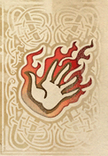 |
| --- |

## L'École de la Destruction

L’école de la Destruction canalise la puissance brute de la magie pour anéantir, blesser et réduire à néant toute chose, qu’elle soit vivante ou inerte.

Les mages de cette école apprennent à manipuler aussi bien les énergies élémentaires que les forces fondamentales de la matière, et à les concentrer en un seul objectif : provoquer la ruine. Qu’il s’agisse de flammes, de froid, d’ondes de choc ou de décharges pures, la Destruction ne fait jamais dans la subtilité – elle impose, brise, consume. Les pratiquants sont des Destructeurs.

## Cône de Glace

Difficulté : 14, Drain : 14 Mot de pouvoir : Destruction (Ruptura (Rupture) / Kinrupt (Kin + rupt)) : Produit un effet d'attaque physique (armure) infligeant [Magnitude] de dégâts physique (PV) basés sur l'élément [clé]. Mot de diffusion : Contact : Portée : Mêlée, Vecteur : Touché, Cible soit possible. Mot de propagation : Cône : Touche une cible, 3 cases de largeur et 2 cases de profondeur derrières elles (AOE spéciale).

## Boule de Feu

Difficulté : 20, Drain : 18 Mot de pouvoir : Destruction (Ruptura (Rupture) / Kinrupt (Kin + rupt)) : Produit un effet d'attaque physique (armure) infligeant [Magnitude] de dégats physique (PV) basés sur l'élément [clé]. Mot de diffusion : Projectile : Portée : Portée magique x2, Vecteur : Vue. Mot de propagation : Unique : Touche une cible unique. Mot de structure : Souffle : Le sort s'applique normalement mais une version diminuée du sort affecte également les cibles adjacentes (en AOE la portée de ce souffle est équivalente à la distance d'AOE). Modificateurs de Magnitude : PWR +0/-2

## Déflagration Psychique

Difficulté : 10, Drain : 14

Mot de pouvoir : Profanation (PoLuo (Souiller) / MunpoLu (Mun + poLu)) : Génère un enchantement négatif qui augmente la valeurs actuel de corruption de [Magnitude/5].

Mot de diffusion : Soi : Portée : Sans, Vecteur : Sans, Cible soi possible.

Mot de propagation : Cercle : Comme carré mais ignore la cible (n'affecte que les cases à proximité donc, utile pour les novas).

Mot de liaison : Large : La zone de propagation du sort est doublée.

## Doigt de Fissure

Difficulté : 12, Drain : 12

Mot de pouvoir : Dématérialisation (Materia (Matière) / Keldemater (Kel + demater)) : Produit un effet qui détruit [Magnitude/5] d'unités solide, [Magnitude] d'unités gazeux ou [Magnitude/2] d'unités liquide, une unité vaux 1 case x 1 case, affecte un élément vulgaire qui dépends de la [clé].

Mot de diffusion : Contact : Portée : Mêlée, Vecteur : Touché, Cible soi possible.

Mot de propagation : Unique : Touche une cible unique.

## Doigt de Désintégration

Difficulté : 12, Drain : 12

Mot de pouvoir : Conflagration (Flagrare (Brûler) / Korflag (Kor + flag)) : Génère un effet qui oblige l'objet à réaliser [Magnitude/5] tests de solidité.

Mot de diffusion : Contact : Portée : Mêlée, Vecteur : Touché, Cible soi possible.

Mot de propagation : Unique : Touche une cible unique.

## Trou de Mémoire

Difficulté : 14, Drain : 14

Mot de pouvoir : Amnésiation (Memoria (Mémoire) / Kinmemo (Kin + memo)) : Génère un effet qui supprime de la mémoire d'une cible un élément (personne, scène, objet ou lieu), le sort a un potenciel de [Magnitude²], le temps auquel remonte la mémoire réduit d'autant le potenciel, chaque minutes nécessite 1 de potenciel, un test de détermination peux être effectué par la cible et si réussie le sort ne fonctionne pas.

Mot de diffusion : Manifestation : Portée : Portée magique x1, Vecteur : Vue, Cible soi possible.

Mot de propagation : Unique : Touche une cible unique.

## Mot de Mort

Difficulté : 18, Drain : 16

Mot de pouvoir : Suppression (Premo (Presser, supprimer) / Barpremo (Bar + premo)) : Génère un effet qui provoque une décharge de [Magnitude] à un enchantement ciblé.

Mot de diffusion : Mot : Portée : Portée magique x3, Vecteur : Voix.

Mot de propagation : Unique : Touche une cible unique.

## Présage Sanglant

Difficulté : 14, Drain : 14

Mot de pouvoir : Corruption (Rumpo (Briser) / Aenrump (Aen + rump)) : Génère un effet qui convertis un maximum de [Magnitude/2] charge d'une condition positive au choix en charge de la condition négative opposée avec le double des charges ainsi converties, la cible peux réaliser un test de sauvegarde appropriée pour ce type de condition (ou opposition si supérieure), variante : Ce mot peux affecter toutes les conditions de la cible avec une difficulté augmentée de 4.

Mot de diffusion : Manifestation : Portée : Portée magique x1, Vecteur : Vue, Cible soi possible.

Mot de propagation : Unique : Touche une cible unique.

## Myriade de Flèches Acide

Difficulté : 16, Drain : 14

Mot de pouvoir : Attrition (Tero (Frotter, user) / Kratrit (Kra + trit)) : Produit un effet d'attaque (ni armure, ni résolution) infligeant [Magnitude] de dégats physique temporaires (PE puis PV) basés sur l'élément [clé].

Mot de diffusion : Projectile : Portée : Portée magique x2, Vecteur : Vue.

Mot de propagation : Unique : Touche une cible unique.

Mot de structure : Pluie : Le sort s'applique au moment où il est lancé puis aux cinq rounds d'après, même cible, la cible doit être un lieu. Modificateurs de Magnitude : PWR -3/-3/-3/-3/-3/-3 (6)

## Oeil du Cyclone

Difficulté : 10, Drain : 14

Mot de pouvoir : Percussion (Percutio (Frapper) / Kortio (Kor + tio)) : Produit un effet d'attaque physique (armure) infligeant [Magnitude] de dégats physique temporaires (PE puis PV) basés sur l'élément [clé], le jet est assuré (minimum des dés 4) et majoré (+1 par dés).

Mot de diffusion : Soi : Portée : Sans, Vecteur : Sans, Cible soi possible.

Mot de propagation : Cercle : Comme carré mais ignore la cible (n'affecte que les cases à proximité donc, utile pour les novas).

Mot de liaison : Large : La zone de propagation du sort est doublée.

## Flèche de Feu

Difficulté : 18, Drain : 16

Mot de pouvoir : Destruction (Ruptura (Rupture) / Kinrupt (Kin + rupt)) : Produit un effet d'attaque physique (armure) infligeant [Magnitude] de dégats physique (PV) basés sur l'élément [clé].

Mot de diffusion : Projectile : Portée : Portée magique x2, Vecteur : Vue.

Mot de propagation : Unique : Touche une cible unique.

Mot de liaison : Long : La distance de diffusion du sort est doublée.

| 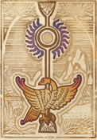 |
| --- |

## L'École de la Restauration

Les mages de la Restauration voient dans la magie un moyen de préserver, soigner et protéger la vie sous toutes ses formes.

Grâce à une maîtrise subtile des flux vitaux, ils réparent chairs et esprits, purifient les corps affligés et restaurent ce qui a été brisé chez les êtres vivants.

Bienveillante par nature, la Restauration compte parmi les écoles les plus respectées du monde magique, et ceux qui la pratiquent sont connus sous le nom de Guérisseurs.

| 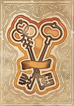 |
| --- |

## L'École de l’Abjuration

L’Abjuration est l’art de dire « non » à la magie, à la violence… ou à toute intrusion indésirable.

Ses pratiquants maîtrisent les sorts de protection, d’interruption et de bannissement. Ils érigent des barrières, neutralisent les enchantements ennemis, imposent des règles ou des limites magiques impossibles à contourner.

Les Abjurateurs excellent à détourner, annuler ou empêcher, transformant la défense en une forme de contrôle absolu.

| 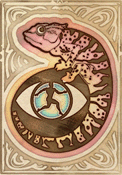 |
| --- |

## L'École de la Divination

La Divination est l’art de voir au-delà du visible, de percevoir ce qui échappe aux sens ordinaires, et d’entrevoir ce qui fut, ce qui est… ou ce qui pourrait être. Les mages de cette école cherchent à comprendre le monde à travers ses secrets : détection d’aura, visions lointaines, intuitions précises, dialogues à distance ou lectures de futurs possibles. Les Devins, comme on les nomme, ne lancent pas seulement des sorts : ils scrutent le tissu même de la réalité à la recherche de vérités cachées.

|  |
| --- |

## L'École des Invocations

L’Invocation permet d’appeler à soi des forces extérieures : créatures, esprits ou entités élémentaires venus prêter main-forte, qu’ils y soient contraints ou qu’ils obéissent de leur plein gré.

Les Invocateurs canalisent leur magie pour ouvrir un lien temporaire avec un autre plan d’existence, faisant apparaître un allié animé par une essence magique.

Ces entités obéissent selon un double principe : elles sont maintenues par un enchantement à charge, et tenues par une notion de services rendus. Lorsque l’un ou l’autre prend fin — l’énergie s’épuise, ou la dette est réglée — l’invocation disparaît et retourne à son plan d’origine.

| 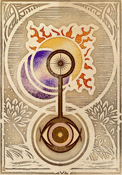 |
| --- |

## L'École des Évocations

L’Évocation consiste à manipuler directement la réalité pour en altérer temporairement les lois, selon la volonté du mage.

Les Évocateurs plient l’espace, la matière ou les phénomènes à leur désir : créer de la matière, déplacer des objets sans les toucher, générer lumière, son ou mouvement, interagir avec les éléments physiques ou forcer des mécanismes.

Contrairement à l’Invocation qui appelle des forces extérieures, l’Évocation agit ici et maintenant, en modifiant brièvement les règles naturelles du monde pour provoquer un effet immédiat.

| 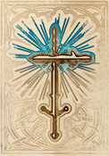 |
| --- |

## L'École des Bénédictions

Les Bénédictions consistent à insuffler une magie bénéfique dans un être ou un objet, par le biais d’enchantements temporaires conférant des effets positifs.

Les sorts de cette école améliorent les capacités, protègent, inspirent ou renforcent – qu’il s’agisse de vivacité accrue, de résistance surnaturelle ou d’un simple coup de chance.

Les mages qui pratiquent cette école sont parfois appelés Enchanteurs.

| 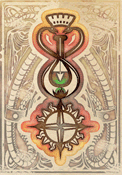 |
| --- |

## L'École des Malédictions

Les Malédictions permettent d’infuser une magie néfaste dans un être ou un objet, sous la forme d’enchantements temporaires destinés à affaiblir, tourmenter ou entraver.

Qu’il s’agisse de douleurs insidieuses, de confusion mentale, de malchances persistantes ou d’érosion des capacités, cette école empoisonne l’équilibre naturel des choses.

Les mages de cette discipline sont souvent appelés Imprécateurs.

| 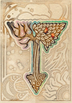 |
| --- |

## L'École des Altérations

L’Altération est l’art de transformer la matière inerte, d’en modifier les propriétés ou de restaurer ce qui a été altéré.

Les Altérateurs plient la structure des objets, façonnent les matériaux, altèrent les états physiques et imposent de nouveaux équilibres à ce qui semblait figé. Réparer un mécanisme, faire rouiller une armure, solidifier un liquide ou courber le métal — tout cela relève de leur magie.

Contrairement à la Conjuration qui crée par l’enchantement, l’Altération agit sur ce qui existe déjà, de façon concrète, durable, et souvent subtile.

| 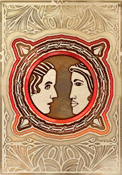 |
| --- |

## L'École de la Conjuration

La Conjuration est l’art de donner forme à la magie pure à travers des enchantements utilitaires et persistants.

Les Conjurateurs ne créent pas à partir de la matière, mais à partir de la volonté : un mur d’énergie, une arme magique, une zone silencieuse ou de lumière contrôlée — tout est façonné par enchantement et maintenu par la concentration du lanceur.

Cette école ne cherche ni à nuire ni à renforcer, mais à créer des outils, des formes ou des conditions propices à la magie elle-même.

## Le Domaine du Feu

Domaine de magie élémentaire (énergie) * description *

Les lanceurs de sort maîtrisant le domaine du feu peuvent lancer des sorts de plusieurs écoles gravitant autour de la notion élémentaire du feu et cela ne représente pas moins de tous les effets pouvant s’associer au mot clé du feu.

Cette discipline est aussi appelée pyromancie.

## Le Domaine du Froid

Domaine de magie élémentaire (énergie) *description*

Les lanceurs de sort maîtrisant le domaine du froid peuvent lancer des sorts de plusieurs écoles gravitant autour de la notion élémentaire du froid et cela ne représente pas moins de tous les effets pouvant s’associer au mot clé du froid.

Cette discipline est aussi appelée cryomancie.

## Le Domaine de la Foudre

Domaine de magie élémentaire (énergie) *description*

Les lanceurs de sort maîtrisant le domaine de la foudre peuvent lancer des sorts de plusieurs écoles gravitant autour de la notion élémentaire de la foudre et cela ne représente pas moins de tous les effets pouvant s’associer au mot clé de la foudre.

Cette discipline est aussi appelée fulguromancie.

## Le Domaine de la Terre

Domaine de magie élémentaire (matière) *description*

Les lanceurs de sort maîtrisant le domaine de la terre peuvent lancer des sorts de plusieurs écoles gravitant autour de la notion élémentaire de la terre et cela ne représente pas moins de tous les effets pouvant s’associer au mot clé de la terre.

Comme la plupart des domaines élémentaire matériel, le domaine de la terre peut associer sa clé principale a énormément de mot d’effet issus des écoles de magie. De fait la liste de mots d’effets et de liaison issus du domaine sont restreints mais ce fait cache une sacré liste de possibilités et combinaisons possibles.

Cette discipline est aussi appelée géomancie ou terramancie.

## Le Domaine de l’Eau

Domaine de magie élémentaire (matière) *description*

Comme la plupart des domaines élémentaire matériel, le domaine de l’eau peut associer sa clé principale a énormément de mot d’effet issus des écoles de magie. De fait la liste de mots d’effets et de liaison issus du domaine sont restreints mais ce fait cache une sacrée liste de possibilités et combinaisons possibles.

Cette discipline est aussi appelée hydromancie.

## Le Domaine de l’Air

Domaine de magie élémentaire (matière) *description*

Comme la plupart des domaines élémentaire matériel, le domaine de l’air peut associer sa clé principale a énormément de mot d’effet issus des écoles de magie. De fait la liste de mots d’effets et de liaison issus du domaine sont restreints mais ce fait cache une sacrée liste de possibilités et combinaisons possibles.

Cette discipline est aussi appelée aéromancie.

## Le Domaine des Arcanes

Domaine de magie élémentaire (magie) *description*

Opposée à la nature.

## Le Domaine de la Nature

Domaine de magie primordiale *description*

Opposée à la magie.

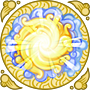

## Le Domaine de la Lumière

Domaine de magie primordiale *description*

?

Cette discipline est aussi appelée luciomancie.

## Le Domaine de l’Ombre

Domaine de magie primordiale *description*

?

Cette discipline est aussi appelée obscuromancie ou umbromancie.

## Le Domaine de la Vie

Domaine de magie primordiale *description*

?

## Le Domaine de la Mort

Domaine de magie primordiale *description*

?

Cette discipline est aussi appelée nécromancie.

## Le Domaine de la Loi

Domaine de magie primordiale *description*

?

## Le Domaine du Chaos

Domaine de magie primordiale *description*

?

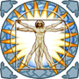

## Le Domaine du Corps

Domaine de magie Royaume des muscles, des os et du sang vibrant, le Corps mortel sculpte effort, douleur et vigueur, ploie, se brise, se régénère, porte les coups du monde et rend chaque geste réel.

Le Corps gouverne tout ce qui est physique : les attributs du corps (FOR, CON, DEX, AGI, PER), la vitalité et l’endurance (PV, PC, PE), la stature, la taille, la charge supportable, ainsi que les conditions et compétences physiques (blessures, efforts, athlétisme, discipline, etc.), et la manière dont le monde matériel marque ou protège la chair.

Les mots liés au Domaine du Corps servent à user, réparer, renforcer ou façonner la chair. Ils peuvent affaiblir ou booster les attributs physiques (FOR, CON, DEX, AGI, PER) via détérioration, affliction ou élévation, altérer la morphologie par la stature et la taille (fragmentation, gigantification, minimisation) ou encore ajuster la charge que le corps peut supporter (renforcement, affaiblissement). Ils manipulent les ressources vitales et physiques – PV, PC, PE et assimilés – en les drainant brutalement (privation, dégénération, ponction), en les restaurant (restauration, récupération, galvanisation) ou en modifiant leur récupération et leur maximum (restitution, fortification, assèchement, appauvrissement). Le Corps est aussi lié aux conditions physiques : blessures, handicaps, états de fatigue ou de gêne peuvent être dissous, neutralisés ou au contraire aggravés et majorés, selon que la magie vise à soigner ou à martyriser le corps. Les compétences corporelles – athlétisme, gymnastique, discipline, mais aussi tout ce qui implique un usage concret du corps – peuvent être portées à l’excellence ou sabotées par perfectionnement, déqualification ou manifestation, permettant parfois d’accomplir une prouesse par la seule force d’un Corps exalté. Enfin, certaines formules protègent la chair contre les agressions du monde (consécration, obstruction, abjurations diverses) ou redistribuent les coups et la dépense de ressources entre invocateur et invocation, faisant du Corps un véritable champ de bataille vivant où se négocient effort, souffrance, puissance et survie.

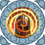

## Le Domaine de l’Esprit

Domaine de magie Royaume des pensées, des masques et des vertiges intérieurs, l'Esprit façonne volonté, mémoire et désir, brise les certitudes, exalte l'ego ou le flétrit d'un simple murmure, invisible, silencieux, implacable, toujours.

L’Esprit gouverne tout ce qui touche à la psyché consciente : attributs mentaux, ego, apparence, sang-froid, ainsi que les ressources et blessures intérieures (PC, PS, états mentaux, conditions psychiques) et les compétences de savoir, de caractère et de maîtrise.

Les mots liés au Domaine de l’Esprit permettent de frapper ou renforcer le mental : ils drainent ou restaurent les ressources intérieures (PC surtout, parfois PS), réduisent ou augmentent les attributs d’Esprit (CHA, VOL, INT, RUS, SAG) et les caractéristiques secondaires comme l’ego, l’apparence, la détermination ou le sang-froid. Ils soignent ou aggravent des conditions mentales (traumas, afflictions psychiques), en dissolvant les malus ou en les majorant, et modulent la récupération ou le maximum des ressources de l’esprit, voire les font se régénérer ou se dégrader tour après tour. Ils bénissent ou maudissent les compétences de l’esprit (artisanat, professions, savoir-faire et savoir-être) en les sublimant ou en les déqualifiant, et ajustent résistances et vulnérabilités aux attaques d’Esprit via consécration, obstruction ou dépréciation. Enfin, ils ouvrent la voie à des liens profonds : partage de perte de ressources avec une invocation, transfert ciblé de PC d’une créature à une autre, ou manifestation d’une expertise « purement mentale » par la magie, permettant au mage de résoudre une action complexe avec la seule force de son esprit.

## Le Domaine Sacré

Domaine de magie fondamentale *description*

?

## Le Domaine de la Faune

Domaine de magie fondamentale *description*

?

## Le Domaine de la Flore

Domaine de magie fondamentale *description*

?

## Le Domaine du Mental

Domaine de magie fondamentale Dans les corridors intérieurs où se gravent les peurs, le Mental veille : c’est la chair des souvenirs, le poids des traumas, la trame des rêves et des obsessions. Il saigne en PS, vacille en fatigue, se brise en cicatrices invisibles. Là se mènent les joutes psychiques, les duels de volonté nue, où une simple idée peut tuer plus sûrement qu’une lame.

Les mots du Mental transforment le psychisme en véritable champ de bataille. Côté Destruction, ils infligent des dégâts mentaux directs (Profanation, Suggestion, Obsession), épuisent PE et PS, posent des traumas (Traumatisation, Scarification, Corruption), dupliquent ou aggravent les lésions mentales (Déperdition), et achèvent les esprits déjà fissurés avec des effets de seuil (Suppression, Exsanguination, Termination). Ils peuvent aussi effacer ou falsifier la mémoire (Amnésiation, Falsification), altérer durablement la manière dont l’esprit se souvient du monde.

Les mots de Restauration et de Bénédiction reconstruisent et optimisent ce terrain intérieur : soins de PS et conversion de ressources en endurance mentale (Restauration, Canalisation), protection contre les traumas (Prévention, Abaissement, Amortissement, Fractionnement), boost des attributs mentaux et des joutes psychiques (Intensification, Consolidation, Optimisation, Spécialisation, Spiritualisation, Calibration). D’autres renforcent les défenses et absorbent les coups (Mitigation, Absorption, Fortification, Récupération, Introspection, Divination, Occultation), ou ajustent précisément l’impact des lésions et des manoeuvres mentales, en réduisant ou en réorientant les pénalités liées aux traumas.

En miroir, la Malédiction fait l’inverse : affaiblir, fissurer, faire dégénérer. Elle réduit la récupération (Assèchement, Appauvrissement, Dégénération), amplifie la gravité des traumas et leurs pénalités (Altération, Désagrégation), fait exploser les dégâts et impacts mentaux ou physiques lorsque la cible est déjà atteinte (Défalcation, Vulnérisation, Inhibition, Intensification, Vulnérisation élémentaire). Elle plombe aussi les joutes et manoeuvres mentales (Débilitation, Affaissement, Désorganisation, Entravation, Minoration), jusqu’à transformer les blessures anciennes en multiplicateurs de souffrance.

Les mots d’Invocation relient PS et autres ressources aux créatures invoquées (Vanvincul, Ressource), partageant pertes et soins entre esprit et serviteur. L’Abjuration offre toute une panoplie de défenses mentales : dévier les attaques psychiques ou tactiques (Déviation), opposer des résistances massives ou contrer les sorts (Obstruction, Protestation, Neutralisation), ériger de véritables boucliers psychiques (Introspection) ou rendre la lecture mentale plus difficile (Occultation). L’Évocation, enfin, gouverne la communication psychique : télépathie, messages mentaux, lien de pensée, intrusion dans les rêves (Connexion, Communication, Retranscription, Onirisation), mais aussi la création de faux souvenirs. La Conjuration décline cette guerre mentale dans des formes concrètes : projectiles et boucliers psychiques (Halo de projectiles, Couronne de boucliers), et Ponction permet de redistribuer PS (ou d’autres ressources) entre cibles.

## Le Domaine des Charmes

Domaine de magie Miroir des cœurs, des regards et des promesses murmurées, le Charme ourdit liens, séductions, peurs et fidélités ; il attise désirs, calme les fureurs, brise les volontés, dérègle les foules, enjôle les esprits, offert, calculé, cruel ou miraculeux, pliant tout théâtre social autour d’un seul sourire, inoubliable et dangereux.

Le Charme ne façonne pas l’intérieur de l’esprit, mais l’interface entre les gens : il touche au prestige, aux émotions visibles, aux réactions sociales, à l’adhésion ou au rejet, et surtout à la manipulation du comportement des autres (influence, contrainte douce ou contrôle brutal).

Là où l’Esprit s’occupe de la psyché et des capacités mentales d’un individu, le Charme gouverne ce que les autres ressentent, perçoivent et acceptent de faire à cause de lui.

Les mots du Charme servent à colorer, tordre ou piloter les relations et les émotions. Ils peuvent saper le moral ou l’exalter, drainer ou booster des ressources liées au panache (audace, prestige, moral), et ajuster la difficulté à convaincre : Inflexion renforce la résistance aux arguments, Suggestion la diminue, tandis que Perfectionnement et Manifestation subliment les compétences sociales (argumentation, manipulation, art, éloquence…). Le Charme joue aussi sur la visibilité sociale : rendre quelqu’un discret, presque transparent dans la foule (Inapparition), ou au contraire tellement marquant qu’il attire tous les regards et les soupçons (Distraction).

Une grande part du domaine concerne les émotions et états affectifs : apaiser (Apaisement, Sédation), exacerber ou imposer peur, terreur, rage, regret (Intimidation, Effroi, Rageance, Culpabilisation), jusqu’à la confusion, la folie ou le sommeil magique (Aberration, Aliénation, Léthargie). Induction permet d’implanter une émotion précise, Empathisation de lire celles des autres.

Au cœur du Charme se trouve surtout la modulation du lien et du contrôle : fascination, tentation, suggestion d’objectifs, mais aussi charme magique, loyauté artificielle, rébellion dirigée, retournement d’alliances (Domination, Rébellion, Révolution). Certaines formules dictent littéralement le comportement : forcer une cible à attaquer quelqu’un, l’ignorer, l’aider, accomplir une action précise sur-le-champ, interdire un type d’action (Provocation, Intimidation, Adoration, Subordination, Entrave, Marionnettisation, Domination de conjuration). Duperie, elle, manipule directement la vérité et le mensonge.

Enfin, quelques mots d’Abjuration font du Charme un outil de contrôle du tempo : annuler une action si la cible est déjà entamée (Annulation), retourner une action contre son auteur (Rétroaction), rendre plus difficile toute action dirigée contre le lanceur (Dissuasion), ou protéger par des résistances via l’Opposition élémentaire classique (Consécration / Obstruction / Protestation / Neutralisation).

## Le Domaine de la Magie

Domaine de magie fondamentale *description*

?

## Le Domaine Toxique

Domaine de magie fondamentale *description*

?

## Le Domaine des Visions

Domaine de magie fondamentale *description*

?

## Le Domaine des Illusions

Domaine de magie fondamentale Les illusionnistes se servent de la magie pour créer des images trompeuses, des chimères et des faux-semblants destinés à dérouter et à duper leurs ennemis.

Les illusions sont le cœur de ce domaine. Un sort provoquant une illusion peut être percé à jour si un individu doute de la nature de sa vision ou de ce qu’il perçoit au travers de ses sens. Un tel doute permet alors de tenter de « percer à jour une illusion » en action simple, offrant au personnage un test du sens de son choix afin de tenter de dépasser la difficulté associée à l’enchantement. Les illusions (clones, etc) invoquées sont privées de conscience : Le lanceur de sort doit lui donner un ordre mental à chaque fois qu’une tâche doit être accomplie. Cependant les illusions sont capables de copier parfaitement l’attitude de la cible dont elles sont originaires. Tous les sorts de ce domaine sont considérés comme des illusions.

Tous les dégâts permanents produits par les sorts d’illusion impacte le mental, jamais la vitalité (causant des traumas au lieu de blessures). Les illusions requièrent un test de détermination échoué pour affecter les cibles, sans quoi ces dernières se rendent compte du subterfuge.

## Le Domaine Impie

Domaine de magie fondamentale *description*

?

## Le Domaine du Vide

Domaine de magie fondamentale *description*

? gravité et champs de force, portails, temps

## Le Domaine du Savoir

Domaine de magie fondamentale *description*

?

## Le Domaine de la Guerre

Domaine de magie fondamentale *description*

? note dans le domaine de la guerre on peut, en élément, choisir corps à corps, distance… ce qui permet donc de faire des protections anti CAC ou dist, des bonus de dégâts CAC ou dist, etc

## Le Domaine de l’Acier

Domaine de magie fondamentale *description*

?

## Liste des Manœuvres Incantatoires

De la même manière qu’il est possible de réaliser des actions de combat ou de joute sous couvert de manœuvre afin d’étendre les possibilités offertes, les incantations peuvent faire l’objet de manœuvres incantatoires.

!!! info "Rappel"
    Ce chapitre traite des manœuvres, une règle spécifique ajoutée par l’extension des confrontations. Ignorez donc celui-ci si vous ne jouez pas avec celles-ci.

La liste des manœuvres incantatoires relève l'ensemble des possibilités offertes via le principe des manœuvres (voir le sujet dans l’extension des confrontations pour plus de détails sur le sujet).

### Les Manœuvres empruntées

Les manœuvres incantatoires peuvent emprunter le principe et le fonctionnement des manœuvres générales. De plus, elles peuvent emprunter quelques manœuvres techniques et une majorité des manœuvres de création. Dans tous les cas la manœuvre est dite « incantation » et ne s’applique alors qu’aux incantations.

La logique prévaut en matière de ce qui est possible ou non mais voici une liste non exhaustive : - Incantation Soudaine (générale). - Incantation à la Hâte (générale). - Incantation Travaillée (générale). - Incantation à la Volée (générale). - Incantation à Rebours (générale). - Incantation Discrète (générale). - Incantation Silencieuse (générale). - Incantation Prudente (générale). - Incantation Exubérante (générale). - Incantation Risquée (générale). - Incantation Assurée (technique). - Incantation Lente (technique). - Façonnage Parcimonieux (création). - Façonnage Méticuleuse (création). - Façonnage Maitrisée (création). - Façonnage Rapide (création). - Façonnage Durable (création). - Façonnage Appliquée (création). - Façonnage Patiente (création). - Façonnage Ephémère (création). - Façonnage Contrôlée (création).

Les incantations générales ont généralement un fonctionnement intuitif qui se transpose fort bien des manœuvres d’origines aux incantations. L’efficacité, dans le cadre d’un sort, concerne la puissance du sort.

Les incantations issues des manœuvres techniques ne présentent pas non plus de grande difficulté de réinterprétation (en plus de n’être que deux).

La catégorie façonnage est issus des manœuvres de créations quant à elles sont un peu particulières car il ne s’agit pas de créer des objets mais de façonner la magie ! D’une part elles ne s’appliquent donc qu’aux rituels, elles doivent donc être cumulées à « l’incantation en rituel ». De plus, lorsqu'il est fait mention de requis matériel il s’agira de ceux qui sont nécessaires lors des rituels. Lorsqu’il s’agit de solidité, il s'agira en réalité de la difficulté associée à tout ce qui peut nuire un enchantement contenu dans le rituel. Enfin lorsqu’il s’agit de temps requis il s’agira en réalité du temps nécessaire à la réalisation d’un rituel.

### Les Manœuvres originales

Certaines manœuvres incantatoires sont totalement originales et jouent grandement sur les propriétés même de la magie.

#### Incantation en Rituel

Pénalités : Moyenne (-2) Description : L’incantation qui conclut un rituel profite plus encore de ce dernier. Effet : L’incantation profite d’un bonus de rituel de 1 points. Normalement à ce stade le rituel a déjà été réalisé et décidé, ainsi le lanceur de sort choisit lui-même où ces points additionnels sont attribués. Restrictions : Cette manœuvre s’applique aux incantations concluant un rituel. Conditions : n/a. Modularité : Augmenter les pénalités de 2 (maximum 6) permet d’augmenter le bonus de 1 supplémentaire.

#### Incantation Concentrée

Pénalités : Faibles (-2) Description : Le personnage réalise son incantation en mettant une attention toute particulière pour ne pas être déconcentré. Effet : Si le personnage doit réaliser une test de concentration ayant un rapport avec l’incantation (par exemple si il essuie une attaque d’opportunité, mais pas que), alors son test profite d’un bonus équivalant aux pénalités ainsi appliqué à l’incantation. Restrictions : Cette manœuvre s’applique aux incantations. Conditions : n/a. Modularité : Augmenter les pénalités de 1 (maximum 6) permet d’augmenter le bonus de 1 supplémentaire.

#### Incantation Contrôlée

Pénalités : Faibles (-2) Description : Le personnage réalise son incantation en cherchant à atténuer le drain. Effet : L’incantation réalisée voit son drain réduit de 2. Attention car cela n’affecte pas le drain minimum d’un sort. Restrictions : Cette manœuvre s’applique aux incantations. Conditions : n/a. Modularité : Augmenter les pénalités de 1 (maximum 6) permet de réduire le drain de 1 supplémentaire.

#### Incantation de Combat

Pénalités : Faibles (-2) Description : Le personnage réalise son incantation afin de favoriser la précision du sort d’attaque qui en résulte. Effet : L’incantation produira un sort pour lequel le lanceur de sort recevra un bonus de +2 afin de toucher sa cible (contre la défense passive ou active). Restrictions : Cette manœuvre s’applique aux incantations. Conditions : n/a. Modularité : Augmenter les pénalités de 1 (maximum 6) permet d’augmenter le bonus de 1 supplémentaire.

#### Incantation Arcanique

Pénalités : Faibles (-2) Description : Le personnage réalise son incantation en cherchant à atténuer le drain. Effet : L’incantation produira un sort dont le niveau arcanique (qui fixe la difficulté à atteindre pour le contrer) du sort recevra un bonus de +2. Restrictions : Cette manœuvre s’applique aux incantations. Conditions : n/a. Modularité : Augmenter les pénalités de 1 (maximum 6) permet d’augmenter le bonus de 1 supplémentaire.

#### Incantation Planifiée

Pénalités : n/a. Description : Le personnage réalise son incantation avec soin. Effet : L’incantation réalisée réduit les pénalités issues des manœuvres incantatoires de 2 pour chaque action simple que le personnage réalise en plus. La réduction de pénalité ne peut pas engendrer de bonus au test si supérieur à la pénalité totale des manœuvre incantatoires, l’excédent étant perdu. Restrictions : Cette manœuvre s’applique aux incantations. Conditions : Cette manœuvre n’est réalisable que durant une situation de confrontation. Modularité : Augmenter les actions simples permet de décroitre les pénalités issues des manœuvres incantatoires, un maximum de 3 actions peuvent être ainsi « dépensées » en plus.

#### Incantation Amplifiée

Pénalités : Faibles (-2) Description : Le personnage réalise son incantation en cherchant à agrandir la portée de celui-ci. Effet : L’incantation produira un sort dont la portée est augmentée de 50%. Restrictions : Cette manœuvre s’applique aux incantations. Conditions : n/a. Modularité : Augmenter les pénalités de 1 (maximum 6) permet d’augmenter le bonus de 25% supplémentaire.

#### Incantation Etendue

Pénalités : Faibles (-2) Description : Le personnage réalise son incantation en cherchant à étendre la zone d’effet de celui-ci. Effet : L’incantation produira un sort dont la zone est augmentée de 50%. Restrictions : Cette manœuvre s’applique aux incantations. Conditions : n/a. Modularité : Augmenter les pénalités de 1 (maximum 6) permet d’augmenter le bonus de 25% supplémentaire.

#### Incantation Chargée

Pénalités : Faibles (-2) Description : Le personnage réalise son incantation en cherchant à allonger la durée des effets. Effet : L’incantation produira un sort qui recevra une surcharge équivalant au niveau du sort par point de pénalité. Une surcharge génère des charges qui sont consommées avant les charges normales d’un enchantement mais qui n’affectent pas la charge maximale. Restrictions : Cette manœuvre s’applique aux incantations. Conditions : n/a. Modularité : Augmenter les pénalités de 1 (maximum 6) permet d’augmenter le bonus de surcharge d’autant que le niveau du sort.

#### Incantation Risquée

Bonus d’Usage : Faibles (+1) Description : Le personnage réalise son incantation en provoquant sciemment une surchauffe. Effet : L’incantation produira un sort qui impose une surchauffe de 1 + 1 par bonus d’usage. La surchauffe rend la magie impossible pour une durée fixée en tour. Restrictions : Cette manœuvre s’applique aux incantations. Conditions : Cette manœuvre n’est réalisable que durant une situation de confrontation (initiative). Modularité : Augmenter le bonus de 1 se fait en contrepartie d’une surchauffe accrue (voir effet).

#### Incantation Désinvolte

Bonus d’Usage : Faibles (+1) Description : Le personnage réalise son incantation en provoquant sciemment un surcout. Effet : L’incantation produira un sort associé d’un surcout équivalant à 2 x le bonus d’usage reçu. Un surcout augmente le drain du sort. Restrictions : Cette manœuvre s’applique aux incantations. Conditions : n/a. Modularité : Augmenter le bonus de 1 se fait en contrepartie d’un surcout accru (voir effet).

#### Incantation / Rituel à Plusieurs

Pénalités : Faibles (-2) Description : Le personnage et un (ou des) allié(s) réalisent une incantation en s’aidant mutuellement. Effet : Le meilleur test de l’ensemble des lanceurs de sort est retenu. Ce dernier reçoit un bonus équivalant au degré de réussite du second test le plus élevé. Le sort est lancé avec un bonus de puissance de sort équivalant à 3x le nombre de participants en plus du premier. Le drain du sort est subit par l’ensemble des participants. Certains peuvent y résister, d’autres pas, selon leur propre test. Le niveau du sort doit être fixé en fonction du lanceur de sort le plus doué. Restrictions : Cette manœuvre s’applique aux incantations ou aux rituels. Conditions : n/a. Modularité : Augmenter les pénalités de 1 (maximum 6) permet d’inclure une personne de plus à l’incantation.

#### Incantation Rapide

Pénalités : Faibles (-2) Description : Le personnage réalise son incantation en un instant, lui permettant de réagir sur le champ aux actions de la partie adverse. Effet : L’incantation requière une action rapide à la place d’une action simple. Restrictions : Cette manœuvre s’applique aux incantations. Conditions : Cette manœuvre n’est réalisable que pour une base « sortilège ». Modularité : Il est possible d’augmenter les pénalités de 1 afin de réduire le cout en initiative de l’action rapide en question de 1.

## Liste des Styles Incantatoires

Comme pour tout ce qui est de l’ordre des confrontations il existe des styles et donc des écoles pour l’usage de la magie. Il s’agira généralement de se spécialiser dans une école, un domaine ou un focalisateur mais pas quelques styles ne sortent de l’ordinaire en proposant un peu plus que cela.

!!! info "Rappel"
    Ce chapitre traite des styles, une règle spécifique ajoutée par l’extension des confrontations. Ignorez donc celui-ci si vous ne jouez pas avec celles-ci.

La liste des styles incantatoires relève l'ensemble des possibilités offertes via le principe des styles (voir le sujet dans l’extension des confrontations pour plus de détails sur le sujet).

### Corpus « Focalisateur » de Magie

Voici la liste des corpus basés sur l’usage de focalisateur associés à l’usage de la magie.

#### Puissance du Bâton

Requis : Usage d’un focalisateur de type « bâton ». Effet : L’utilisateur profite d’un bonus de puissance de sort de +2/3/4.

#### Suprématie du Bâton

Requis : Usage d’un focalisateur de type « bâton ». Effet : L’utilisateur profite d’un bonus de maîtrise avec ses sorts de +1/2/3.

#### Gestion du Sceptre

Requis : Usage d’un focalisateur de type « bâton ». Effet : L’utilisateur profite d’un bonus d’adresse et de criticité au lancement de ses sorts de +1/2/3.

#### Gérance du Sceptre

Requis : Usage d’un focalisateur de type « sceptre ». Effet : L’utilisateur profite d’une résistance au drain de mana de +1/2/3. N’affecte donc pas les brûlures de mana le cas échéant.

#### Prudence du Sceptre

Requis : Usage d’un focalisateur de type « focus ». Effet : L’utilisateur profite d’une résistance aux brûlures de mana de +2/3/4. N’affecte donc pas le drain de mana le cas échéant.

#### Extension du Totem

Requis : Usage d’un focalisateur de type « totem ». Effet : L’utilisateur profite d’un bonus de portée des sorts de +1/2/3.

#### Charge du Totem

Requis : Usage d’un focalisateur de type « totem ». Effet : L’utilisateur profite d’un bonus aux charges de ses sorts de +2/4/6 si ces derniers sont des invocations.

#### Assistance du Focus

Requis : Usage d’un focalisateur de type « focus ». Effet : L’utilisateur profite d’un bonus de focus des sorts de +2/3/4.

#### Réunion du Focus

Requis : Usage d’un focalisateur de type « fétiche ». Effet : L’utilisateur profite d’un bonus de réunion du mana de +2/3/4.

#### Providence du Focus

Requis : Usage d’un focalisateur de type « fétiche ». Effet : L’utilisateur profite d’un bonus aux charges de ses sorts de +2/4/6 si ces derniers sont des bénédictions.

#### Maître du Grimoire

Requis : Usage d’un focalisateur de type « grimoire ». Effet : L’utilisateur profite d’un bonus au lancement des sorts de +1/2/3 si ces derniers figures dans son grimoire. De plus, ces derniers peuvent comporter 1/2/3 mots de plus que la limite normale.

#### Proximité du Kriss

Requis : Usage d’un focalisateur de type « kriss ». Effet : L’utilisateur profite d’un bonus globale des sorts de +1/2/3 si ces derniers sont d’alignement négatifs et de portée nulle. Ce bonus affecte aussi bien le test d’incantation que les chances de toucher ou affecter la cible du sort.

#### Sournoiserie du Kriss

Requis : Usage d’un focalisateur de type « kriss ». Effet : L’utilisateur profite d’un bonus de puissance de sort de +4/6/8 lorsqu’il réalise un sort d’alignement négatifs sur une cible à proximité et à revers et/ou qui n’a pas connaissance de la présence du personnage.

#### Silence du Kriss

Requis : Usage d’un focalisateur de type « kriss ». Effet : L’utilisateur profite d’un bonus de +2/4/6 à ses tests de discrétion lorsqu’il lance un sort.

#### Pertinence de la Baguette

Requis : Usage d’un focalisateur de type « baguette ». Effet : L’utilisateur profite d’un bonus d’expertise des sorts de +1/2/3.

#### Malice de la Baguette

Requis : Usage d’un focalisateur de type « baguette ». Effet : L’utilisateur profite d’un bonus aux charges de ses sorts de +2/4/6 si ces derniers sont des malédictions.

### Corpus « Écoles » de Magie

Voici la liste des corpus basés sur l’usage d’écoles de magie et les écoles qui en font usage visent à renforcer ces dernières uniquement. Ces corpus se déclinent donc en autant d’écoles de magie existantes (mais pas en domaine ou pratique). Il existe cependant des variantes sous couverts des concepts suivants : - Inclusif : C’est le corpus normal sans contrepartie. - Exclusif : C’est un corpus qui augmente le bonus associé à l’école du style mais qui implique un malus à toutes les autres. Le style ne peut être changé qu’après un repos.

#### Maitrise de « Ecole de Magie »

Requis : Usage de l’école en question. Effet : Les sorts de l’école en question reçoivent un bonus de puissance des sorts et de réduction de drain de 1/2/3 si inclusif et 2/3/5 si exclusif.

#### Expertise de « Ecole de Magie »

Requis : Usage de l’école de la guérison. Effet : Les sorts de l’école en question reçoivent un bonus d’adresse, criticité de 1/2/3 si inclusif ou exclusif. Puis il reçoit un bonus d’incantation de 0/1/2 si inclusif et 2/3/4 si exclusif.

### Corpus « Spéciaux » de Magie

Voici la liste des corpus « spéciaux » associés à l’usage de la magie.

#### Galvanisé par la Magie

Requis : n/a. Effet : Après le lancement d’un sort le reçoit le bénéfice de 2/4/6 points d’endurance temporaire.

#### Reflux du Mana

Requis : n/a. Effet : Après le lancement d’un sort le reçoit le bénéfice de 2/4/6 points de mana temporaire.

#### Magie Expansive

Requis : n/a. Effet : Le personnage reçoit un bonus 2/3/4 en puissance de sort et 1/2/3 d’incantation mais le drain de ses sorts est augmenté de 2/3/4.

#### Magie Contrôlée

Requis : n/a. Effet : Le personnage reçoit un bonus 2/3/4 en puissance de sort et une réduction de drain de 1/2/3 mais subit une pénalité de 1/2/3 à tous ses tests d’incantation.

#### Magie Maitrisée

Requis : n/a. Effet : Le personnage reçoit un bonus d’incantation de 1/2/3 et une réduction de drain de 1/2/3 mais subit une pénalité équivalant à la puissance des sorts de 2/3/4.

### Corpus de « Sorceleur »

Voici la liste des corpus de « sorceleurs » associés à l’usage unique des signes. Notons que les signes peuvent être employés avec n’importe quel autre style, mais ceux issus des corpus de sorceleurs ont un usage centré sur eux.

Si un personnage a, pour une raison ou une autre, appris deux styles différents de sorceleur il peut mélanger les effets a), b) et c) lorsqu’il créait son propre style. a) est un effet affectant le combat à l’arme blanche et l’usage des signes en générale. b) est un effet affectant un signe donné. c) est une condition d’usage. Le personnage peut ainsi choisir par les deux conditions de son choix, selon l’orientation qu’il préfère donner à son style.

Les styles de sorceleur est particulièrement hybride et leurs focus sont forcément d’ordre physique (à moins de créer son propre style).

#### Style du Loup

Requis : Pratique des Signes. Effet : a) Lorsque le personnage pratique une attaque de mêlée ou de jet sur une cible qui vient (moins d’un cycle) d’être affectée par un signe, celle-ci subit une pénalité de 1/2/3 à ses défenses. Lorsque le personnage pratique sur un signe sur une cible qui vient (moins d’un cycle) d’être touchée en mêlée ou par jet, celle-ci subit une pénalité de 1/2/3 à ses défenses. b) Le signe Igni voit sa portée augmentée de 1/2/3m. Le signe Igni ajoute 10/20/30% de l’endurance manquante du lanceur de sort à sa puissance de sort. c) Une arme et armure intermédiaire sont requises pour les effets en attaque. Une armure intermédiaire est requise pour les effets via les signes.

#### Style de l’Ours

Requis : Pratique des Signes. Effet : a) Lorsque le personnage reçoit une attaque de mêlée ou qu’il fait usage d’un signe la perte d’endurance est réduite de 2/3/4. b) Le signe de Quen déclenche une explosion lorsque ses dernières charges sont emportées par l’attaque de mêlée d’un adversaire : Celle-ci inflige des dégâts équivalant au du signe Quen ET peuvent repousser l’individu, traité ces effets comme étant issus d’un sort de niveau équivalant à celui du signe Quen -2/-1/-0. Les charges de Quen se régénèrent de 0/3/6 par tours au lieu de chuter. c) Une armure lourde est requise pour cet effet en défense. Une armure lourde est requise pour cet effet via les signes.

#### Style du Chat

Requis : Pratique des Signes. Effet : a) Lorsque le personnage pratique une attaque de mêlée ou un signe sur une cible qui ne lui est pas hostile celle-ci subit une pénalité de 1/2/3 à ses défenses. b) Au premier rang le signe Axii ne trahis pas les intentions du lanceur de sort face à sa victime. Au second rang le signe Axii ne trahis pas les intentions du lanceur de sort même face à des spectateurs. Au troisième rang le signe Axii peut être pratiqué à distance (5m). c) Une arme et armure légère sont requises pour les effets en attaque. Une armure légère est requise pour les effets via les signes.

#### Style de la Vipère

Requis : Pratique des Signes. Effet : a) Lorsque le personnage pratique une attaque de mêlée ou un signe sur une cible qui ne lui est pas hostile celle-ci subit une pénalité de 1/2/3 pour y résister. b) Le signe Yrden voit sa zone augmentée de 1/2/3m. Le signe Yrden régénère l’endurance du lanceur de sort de 2/4/6 (par tours) lorsque celui-ci et un adversaire se tiennent dans la zone d’effet. Le personnage voit sa zone de contrôle étendue à toute la zone du signe Yrden lorsqu’il est dans celle-ci et il reçoit un bonus de +1/2/3 à tous les tests d’opportunité ou de contrôle. c) Une arme et armure légère sont requises pour les effets en attaque. Une armure légère est requise pour les effets via les signes.

#### Style du Gryphon

Requis : Pratique des Signes. Effet : a) Le personnage peut lancer un signe à la place d’une contre-attaque. Ses contre-attaques (normale ou signe) reçoivent un bonus de +1/2/3. Au troisième rang une contre-attaque normale réduit la surchauffe de ses signes de 1 (une fois par tour maximum). b) Le signe Aard génère chez le personnage une montée de 2/4/6 en Adrénaline lors de son lancement OU fait perdre aux cibles affectées 2/4/6 d’endurance. Une arme et armure intermédiaire sont requises pour les effets en attaque. c) Une armure intermédiaire est requise pour les effets via les signes.

### Corpus de « Caste » de Magie

Voici la liste des corpus « de Caste » associés à l’usage de la magie.

!!! info "Rappel"
    Cette section traite des castes, une règle spécifique ajoutée par l’univers de Thalifen. Ignorez donc celui-ci si vous ne jouez pas dans cet univers.

?

### Les Focus en Magie

Voici la liste des focus en magie.

Puissance Accrue : La puissance des sorts est augmentée de 1/2.

Drain Décrue : La résistance au drain et aux brûlures est augmentée de 1/2.

Focus Accrue : Le focus est augmentée de 2/3.

Réunion Accrue : La réunion du mana est augmentée de 2/3.

Défense en Incantation : Lorsqu’il est en train de réaliser une incantation la défense passive est augmentée de 1/2.

Limite Accrue : Le niveau maximum auquel un sort peut être lancé est augmentée de 1/2.

Expertise des Sorts : L’expertise des sorts est augmentée de 1/2.

Maitrise des Sorts : La maitrise des sorts est augmentée de 1/2.

Portée des Sorts : La portée des sorts est augmentée de 1/2.

## Equipements Magiques

Certains équipements sont issus de la culture et de l’art de la magie.

### Généralités et Rappels

Voici quelques généralités et rappels eu égard à l’équipement.

#### Les Prix

Le prix de référence des équipements magiques n’a pas d'équivalent normal/anormal : Il est toujours le même quelle que soit la qualité dans la mesure où l’équipement magique est toujours « anormal » en soi !

#### La charge

La charge désigne l’encombrement et le poids de l’objet. Si la force n’est pas suffisante pour porter un objet, le personnage est désavantagé lorsqu’il en fait usage. Si la charge cumulée de l’équipement actif du personnage dépasse sa force + stature alors il est désavantagé à tous ses tests physiques.

La charge est calculée comme suite : Catégorie x5 +Taille x2 +Poids x2 -12. Si un objet spécifie une plage de charge c’est que celle-ci dépend des caractéristiques de l’objet.

#### Les Mots clés

Les mots clés renseignent sur la nature d’un objet.

#### La Quantité

Cet encadré renseigne le nombre d’objet qui est créé lors d’une fabrication. Le prix est indiqué pour un seul élément, pas l’ensemble.

### Les Focalisateurs

Les focalisateurs permettent une connexion rapide et facilité au mana, il permet aussi d’améliorer l’usage de la magie. Un mage qui n’en fait pas usage subit des désagréments importants (désavantage aux tests d’incantation).

- Un focalisateur est considéré comme une arme dans le sens où il peut être amélioré et il peut être taillé dans une matière particulière pouvant lui octroyer des propriétés. Un focalisateur demande cependant un entraînement spécifique : Ce n’est pas le même que pour les armes. En mêlée, ce sont toutes des armes improvisées, peu importe leur catégorie.
- Le niveau de qualité d’un tel objet permet de recevoir un bonus d’attribut pour usage qui est fait au travers de l’arme : Lancement des sorts, actions focales, actions martiales, etc…
- Un focalisateur est considéré comme un équipement concernant les règles de pénalités d’usages (affectant aussi bien les tests d’incantations que d’initiative).
- Un focalisateur ajoute sa catégorie à la puissance des sorts PAR niveau du sort.
- Un focalisateur dispose d’une capacité propre à chaque famille de focalisateur, bien qu’il existe des focalisateur par défaut sans capacités (moins chères).

Un focalisateur est réalisé à partir de magicite, une forme malléable du lyrium.

Voici ce qu’offre les différentes famille de focalisateurs, notons que chaque famille modifie le prix de base du focalisateur, de plus ces capacités n’affectent que les sorts dont le niveau est inférieur ou égal à la qualité du focalisateur : Tatouage : Rapidité +5 au lancement de sort (donc plus tôt dans le round) — Ne peut pas être désarmé, unique focalisateur de Catégorie 0. Prix +10. Bâton : Puissance des sorts +1 par niveau du sort — Imposant, idéal pour les mages offensifs. Prix +25. Sceptre : Désavantage aux défenses adverses — Bon compromis entre attaque et contrôle. Prix +20. Baguette : Désavantage aux sauvegardes adverses — Améliore la précision magique. Prix +30. Orbe : Portée des effets doublée (notamment distance ou zone, pas ceux liés au mots à proprement parler) — Utile pour les mages tactiques ou à distance. Prix +15. Totem : Permet de maintenir un sort sans concentration — Favorise les sorts persistants. Prix +10. Kriss : Arme et focalisateur à la fois — Permet de lancer et de se défendre en mêlée. Prix +20. Grimoire : Peut contenir 2 sorts utilisables — Parfait pour les mages prévoyants. Prix +15. Focus : Stocke un sort à déclencher en action spéciale — Flexible, bon pour l’anticipation. Prix +30. Talisman : Réduit le drain minimal de 2 — Optimise l’endurance magique. Prix +30. Canne : +2 aux tests arcanique et difficultés magiques — Favorise les mages érudits. Prix +10. Abraxas : Réduit la fatigue des soins de 2 points — Idéal pour les soigneurs. Prix +15. Charme : Focalisateur et catalyseur, avec sort fixe rechargeable — Autonome, stable et polyvalent. Prix +40. Medium : Focalisateur et harmoniseur — pour les pratiquants de rituels. Prix +40.

| Focalisateur |
| --- |
| Prix | Selon catégorie | Charge | Selon catégorie |
| Mots clés | Focalisateur |
| Description |
| Un focalisateur permet de lancer des sorts sans s’exposer à un désavantage, aussi peu de mages s’en séparent.Les focalisateurs existent sous différentes catégories. La charge du focalisateur est donc, comme pour tout le reste, fixée par sa catégorie.Leurs prix sont indexés est basé sur sa catégorie : Focalisateur de catégorie 0 : 40 PO. Focalisateur de catégorie 1 : 55 PO. Focalisateur de catégorie 2 : 75 PO. Focalisateur de catégorie 3 : 100 PO. Focalisateur de catégorie 4 : 130 PO.La charge requise est la même que pour une arme aussi une force notable est requise, même si porté à deux mains, lorsqu’il s’agit de catégorie 3 et supérieure. |

### Les Artefacts

Les artefacts sont des objets aux propriétés exotiques et mystiques. Pouvant arborer toutes les formes et toutes les tailles possibles et imaginables, ils proviennent généralement de civilisation et savoirs anciens voir perdus.

Toujours est-il que ces merveilleux objets ne peuvent pas être classé comme le reste : Chaque pièce est unique dans son aspect, son fonctionnement, etc…

### Les Materias

Les materias sont des minéraux étranges, fruit de la cristallisation du mana lorsque le rideau du réel cède à celui de l’immatériel. On trouve ces dernières généralement sous terre ou dans des zones rocheuses aux profondes connexions avec l’immatériel. Les matérias cristallisent les esprits des défunts prisonniers dans le monde réel par des fuites du fleuve de la vie et il est possible d’activer mentalement une matéria afin d’utiliser de la magie issue de l’esprit en question. Les materias sont aussi utilisées afin d’y cristalliser des propriétés magiques dont la nature dépend de l’esprit qui y est scellé. Les sorts lancés via une matéria ne peuvent être « maintenue » comme on peut le faire pour un effet classique, les tests ne reçoivent pas de bonus des attributs mentaux selon leur types mais uniquement de l’attribut de magie à la place. Bref, c’est de la magie sans en être, le fait est que les sorts et invocations proviennent de l’esprit et non de l’utilisateur qui ne fait que les activer !

| Matérias Verte |
| --- |
| Prix | 15 | Quantité | 1 |
| Mots clés | Matériel |
| Description |
| Les matérias vertes vierges peuvent être travaillées par un mage pour servir au lancement d’un sort (action d’activation de matéria). Le drain mental d’un sort de matéria est de 2 + niveau du sort, le niveau étant limité par la qualité. Le port d’une telle matéria génère 1 point de corruption. Une matéria verte ne peux être activée qu’une fois par tour. |

| Matérias Rouge |
| --- |
| Prix | 50 | Quantité | 1 |
| Mots clés | Matériel |
| Description |
| Les matérias rouges vierges peuvent être travaillées par un mage pour servir au lancement d’une invocation (action d’incantation). Le drain mental d’un sort de matéria est de 4 + 2 x niveau du sort, le niveau étant limité par la qualité. Le port d’une telle matéria génère 2 points de corruption (minimum). Une matéria rouge ne peux être activée qu’une fois par scène. |

!!! note "Note"
    Activer un sort ou une invocation issue d’une matéria requière un test d’activation de la matéria (Groupe Arcane + Compétence Arme Focale + modificateur de Magie). La difficulté à atteindre dépends de la matéria et de son niveau. Le niveau maximum est de Groupe Arcane + Compétence Arme Focale (comme pour les sorts classiques).

    Activer une matéria sans utiliser un orifice provoque un désavantage. Les sorts qui requièrent de toucher la cible se base sur le test d’activation (vs la défense qui dépends du sort), il n’y a pas d’autres tests à faire (contrairement à la magie classique). Même chose pour les sorts qui provoquent des conditions etc…

    Activer une matéria requière une action complexe + libre, comme pour un sort, il est évidemment possible d’être habitué afin de réduire cela à une action complexe.

    Contrairement au fait de lancer un sort, activer une matéria ne nécessite pas de geste ni de parole, cela consomme des points mentaux plutôt que du mana, ne profite pas des attributs mentaux pour le jet mais de la magie, ne requière pas de focalisateur et ne profite pas de ces derniers, il n’y a pas de tradition ou autre en jeu non plus, bref ce sont deux activités très distinctes. Rappel : Un personnage peut faire usage de matérias sans avoir d’attribut de magie au préalable, ils peuvent en effet avoir recours à du lyrium (qui fixe temporairement, le temps d’une scène, l’attribut de magie à 10 + 2 * Qualité).

| Matérias Jaune |
| --- |
| Prix | 25 | Quantité | 1 |
| Mots clés | Matériel |
| Description |
| Les matérias jaunes vierges peuvent être travaillées par un mage pour servir au lancement d’une manœuvre (action correspondante à la manœuvre). Une matéria jaune est toujours associée à une manœuvre unique. Lorsque l’utilisateur en fait usage il le fait comme s’il connaissait la manœuvre (donc sans désavantage) et avec un bonus aux tests équivalant à la qualité de la matéria (le cas échéant). Activer ces effets requière une action libre. L’effet peux être déclenché une fois par rounds. Le port d’une telle matéria génère 1 point de corruption. L’usage de ces matérias génère 1 point de fatigue par activation. |

| Matérias Orange |
| --- |
| Prix | 25 | Quantité | 1 |
| Mots clés | Matériel |
| Description |
| Les matérias oranges vierges peuvent être travaillées par un mage pour servir au lancement d’une action. Une matéria orange est toujours associée à une action. Lorsque l’utilisateur en fait usage il réalise l’action avec un total de groupe + compétence minimum équivalant au niveau de la matéria et un bonus supplémentaire lui aussi équivalant au niveau de la matéria. Si l’utilisateur a un total groue + compétence supérieure il profite donc malgré tout du bonus supplémentaire. Activer ces effets requière une action libre. L’effet peux être déclenché une fois par rounds. Le port d’une telle matéria génère 1 point de corruption. L’usage de ces matérias génère 1 point de fatigue par activation. |

| Matérias Rose |
| --- |
| Prix | 15 | Quantité | 1 |
| Mots clés | Matériel |
| Description |
| Les matérias bleus roses peuvent être travaillées par un mage afin d’y associer une amélioration passive. Une matéria rose est toujours associée à une amélioration qui peux affecte alors l’utilisateur de façon passive. Ces matérias génèrent de la corruption égale à leur niveau (et parfois même plus selon la nature de l’amélioration). |

| Matérias Bleu |
| --- |
| Prix | 15 | Quantité | 1 |
| Mots clés | Matériel |
| Description |
| Les matérias bleus vierges peuvent être travaillées par un mage pour servir à améliorer les effets d’une autre matérias de façon passive. Une matéria bleu est toujours associée à une amélioration qui peux affecter une autre matéria nécessairement liée à elle par un lien entre les orifices. Le port d’une telle matéria génère 1 point de corruption. |

| Matérias Blanche |
| --- |
| Prix | 150 | Quantité | 1 |
| Mots clés | Matériel |
| Description |
| Les matérias blanches ne peuvent pas être travaillées mais raffinée pour usage. A l’état raffinée ces matérias absorbent une partie de la corruption induite par l’usage des autres matérias (d’autant que le niveau de qualité). Cet effet est passif. Une seule de ces matérias peut prendre effet à la fois. |

| Matérias Noire |
| --- |
| Prix | 200 | Quantité | 1 |
| Mots clés | Matériel |
| Description |
| Les matérias noires ne peuvent pas être travaillées mais raffinée pour usage. A l’état raffinée ces matérias augmente la corruption générée par les autres matérias (d’autant que le niveau de qualité, maximum le double de la corruption générée initialement), cependant ces dernières profitent d’un bonus de 1 à leur niveau effectif. Cet effet est passif. Une seule de ces matérias peut prendre effet à la fois. |

Afin de prendre effet (qu’il soit actif ou passif) les matérias doivent être tenues en main ou logée dans un orifice d’arme ou d’armure équipées.

#### Conditions d’usage

Pour faire usage d’une matéria ou profiter de ses effets passifs la personne qui la porte (directement dans la main ou via un accessoire qui fait le lien) doit être « liée » à celle-ci, c’est-à-dire accepter sa présence et accepter son influence, afin de pouvoir en tirer profit. Cette liaison entre l’utilisateur et la matéria peux prendre un certain temps à s’établir (environs une heure) et dure quelques temps si le lien est rompu (24 heures). Cette acceptation est maintenue de manière tacite tant que le personnage porte la matéria. Donc en plus de cette liaison le personnage doit bien porter la matéria au moment de l’activation ou au moment d’en évaluer les effets positifs, si ce n’est pas le cas alors il n’est pas possible d’activer les effets ou en recevoir les avantages, et ce même si le personnage est encore lié à la matéria.

#### La corruption

La corruption est générée par les matérias tant que la matéria est liée au personnage. Si la corruption dépasse 10 + modificateur d’équilibre alors le personnage désavantagé à tous ses tests.

## Les Accessoires

Les accessoires issus de la magie…

### Les Lunettes

Les lunettes permettent de rectifier un peu la vue de ceux qui la porte. Des lunettes de très bonne qualité peuvent même améliorer la vue de ceux qui n’ont pas de problèmes.

### Les Sacs

?

### Les Sacoches & Fourreaux

?

## Les Colifichets

Les colifichets issus de la magie…

### Les Pendentifs

? et autres décorations de cou

### Les Anneaux

? et autres décorations de mains

### Les Broches

? et autres décorations de tenues

### Les Tiares

? et autres décorations de tête

## Les Outils

Les outils issus de la magie…

## La Matière Première

Les matières premières issues de la magie…

## Le Matériel

Les matériels issus de la magie…

### Les Parchemins

Les parchemins sont nécessaires à la pratique de la magie si l’on ne connait pas le sort. Par ailleurs, un parchemin est toujours généré lors du processus d’élaboration d’un sort. La qualité d’un parchemin définit la qualité maximale à laquelle peut prétendre le travail d’un mage OU à le niveau de connaissance (et donc du sort) associé au savoir qu’il renferme.

## Les Instruments

Les instruments peuvent prendre beaucoup de forme différente. Parfois courante, parfois exotiques... Ce peut être des piolets d’alpinistes, des palmes, etc… En somme ce peut être tout ce qui peut aider à réaliser une activité. La qualité d’un outil génère un bonus aux attributs associés à la pratique pour lequel l’instrument est dédié.

## Les Consommables

Les consommables regroupent l’ensemble des produits pouvant faire l’objet d’une forme de consommation ou d’une autre. On parle donc de ce qui se boit, se mange, s’utilise… en disparaissant à l’issus.

## Les Artefacts

A placer dans le stuff magiques. En gros des objets du quotidien enchanté pour faire des trucs chelous.
