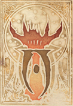

## L'École de la Divination

La Divination est l’art de voir au-delà du visible, de percevoir ce qui échappe aux sens ordinaires, et d’entrevoir ce qui fut, ce qui est… ou ce qui pourrait être. Les mages de cette école cherchent à comprendre le monde à travers ses secrets : détection d’aura, visions lointaines, intuitions précises, dialogues à distance ou lectures de futurs possibles. Les Devins, comme on les nomme, ne lancent pas seulement des sorts : ils scrutent le tissu même de la réalité à la recherche de vérités cachées.

|  |
| --- |
