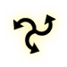

## Liste des Styles Incantatoires

Comme pour tout ce qui est de l’ordre des confrontations il existe des styles et donc des écoles pour l’usage de la magie. Il s’agira généralement de se spécialiser dans une école, un domaine ou un focalisateur mais pas quelques styles ne sortent de l’ordinaire en proposant un peu plus que cela.

!!! info "Rappel"
    

    Ce chapitre traite des styles, une règle spécifique ajoutée par l’extension des confrontations. Ignorez donc celui-ci si vous ne jouez pas avec celles-ci.

La liste des styles incantatoires relève l'ensemble des possibilités offertes via le principe des styles (voir le sujet dans l’extension des confrontations pour plus de détails sur le sujet).

### Corpus « Focalisateur » de Magie

Voici la liste des corpus basés sur l’usage de focalisateur associés à l’usage de la magie.

#### Puissance du Bâton

Requis : Usage d’un focalisateur de type « bâton ». Effet : L’utilisateur profite d’un bonus de puissance de sort de +2/3/4.

#### Suprématie du Bâton

Requis : Usage d’un focalisateur de type « bâton ». Effet : L’utilisateur profite d’un bonus de maîtrise avec ses sorts de +1/2/3.

#### Gestion du Sceptre

Requis : Usage d’un focalisateur de type « bâton ». Effet : L’utilisateur profite d’un bonus d’adresse et de criticité au lancement de ses sorts de +1/2/3.

#### Gérance du Sceptre

Requis : Usage d’un focalisateur de type « sceptre ». Effet : L’utilisateur profite d’une résistance au drain de mana de +1/2/3. N’affecte donc pas les brûlures de mana le cas échéant.

#### Prudence du Sceptre

Requis : Usage d’un focalisateur de type « focus ». Effet : L’utilisateur profite d’une résistance aux brûlures de mana de +2/3/4. N’affecte donc pas le drain de mana le cas échéant.

#### Extension du Totem

Requis : Usage d’un focalisateur de type « totem ». Effet : L’utilisateur profite d’un bonus de portée des sorts de +1/2/3.

#### Charge du Totem

Requis : Usage d’un focalisateur de type « totem ». Effet : L’utilisateur profite d’un bonus aux charges de ses sorts de +2/4/6 si ces derniers sont des invocations.

#### Assistance du Focus

Requis : Usage d’un focalisateur de type « focus ». Effet : L’utilisateur profite d’un bonus de focus des sorts de +2/3/4.

#### Réunion du Focus

Requis : Usage d’un focalisateur de type « fétiche ». Effet : L’utilisateur profite d’un bonus de réunion du mana de +2/3/4.

#### Providence du Focus

Requis : Usage d’un focalisateur de type « fétiche ». Effet : L’utilisateur profite d’un bonus aux charges de ses sorts de +2/4/6 si ces derniers sont des bénédictions.

#### Maître du Grimoire

Requis : Usage d’un focalisateur de type « grimoire ». Effet : L’utilisateur profite d’un bonus au lancement des sorts de +1/2/3 si ces derniers figures dans son grimoire. De plus, ces derniers peuvent comporter 1/2/3 mots de plus que la limite normale.

#### Proximité du Kriss

Requis : Usage d’un focalisateur de type « kriss ». Effet : L’utilisateur profite d’un bonus globale des sorts de +1/2/3 si ces derniers sont d’alignement négatifs et de portée nulle. Ce bonus affecte aussi bien le test d’incantation que les chances de toucher ou affecter la cible du sort.

#### Sournoiserie du Kriss

Requis : Usage d’un focalisateur de type « kriss ». Effet : L’utilisateur profite d’un bonus de puissance de sort de +4/6/8 lorsqu’il réalise un sort d’alignement négatifs sur une cible à proximité et à revers et/ou qui n’a pas connaissance de la présence du personnage.

#### Silence du Kriss

Requis : Usage d’un focalisateur de type « kriss ». Effet : L’utilisateur profite d’un bonus de +2/4/6 à ses tests de discrétion lorsqu’il lance un sort.

#### Pertinence de la Baguette

Requis : Usage d’un focalisateur de type « baguette ». Effet : L’utilisateur profite d’un bonus d’expertise des sorts de +1/2/3.

#### Malice de la Baguette

Requis : Usage d’un focalisateur de type « baguette ». Effet : L’utilisateur profite d’un bonus aux charges de ses sorts de +2/4/6 si ces derniers sont des malédictions.

### Corpus « Écoles » de Magie

Voici la liste des corpus basés sur l’usage d’écoles de magie et les écoles qui en font usage visent à renforcer ces dernières uniquement. Ces corpus se déclinent donc en autant d’écoles de magie existantes (mais pas en domaine ou pratique). Il existe cependant des variantes sous couverts des concepts suivants : - Inclusif : C’est le corpus normal sans contrepartie. - Exclusif : C’est un corpus qui augmente le bonus associé à l’école du style mais qui implique un malus à toutes les autres. Le style ne peut être changé qu’après un repos.

#### Maitrise de « Ecole de Magie »

Requis : Usage de l’école en question. Effet : Les sorts de l’école en question reçoivent un bonus de puissance des sorts et de réduction de drain de 1/2/3 si inclusif et 2/3/5 si exclusif.

#### Expertise de « Ecole de Magie »

Requis : Usage de l’école de la guérison. Effet : Les sorts de l’école en question reçoivent un bonus d’adresse, criticité de 1/2/3 si inclusif ou exclusif. Puis il reçoit un bonus d’incantation de 0/1/2 si inclusif et 2/3/4 si exclusif.

### Corpus « Spéciaux » de Magie

Voici la liste des corpus « spéciaux » associés à l’usage de la magie.

#### Galvanisé par la Magie

Requis : n/a. Effet : Après le lancement d’un sort le reçoit le bénéfice de 2/4/6 points d’endurance temporaire.

#### Reflux du Mana

Requis : n/a. Effet : Après le lancement d’un sort le reçoit le bénéfice de 2/4/6 points de mana temporaire.

#### Magie Expansive

Requis : n/a. Effet : Le personnage reçoit un bonus 2/3/4 en puissance de sort et 1/2/3 d’incantation mais le drain de ses sorts est augmenté de 2/3/4.

#### Magie Contrôlée

Requis : n/a. Effet : Le personnage reçoit un bonus 2/3/4 en puissance de sort et une réduction de drain de 1/2/3 mais subit une pénalité de 1/2/3 à tous ses tests d’incantation.

#### Magie Maitrisée

Requis : n/a. Effet : Le personnage reçoit un bonus d’incantation de 1/2/3 et une réduction de drain de 1/2/3 mais subit une pénalité équivalant à la puissance des sorts de 2/3/4.

### Corpus de « Sorceleur »

Voici la liste des corpus de « sorceleurs » associés à l’usage unique des signes. Notons que les signes peuvent être employés avec n’importe quel autre style, mais ceux issus des corpus de sorceleurs ont un usage centré sur eux.

Si un personnage a, pour une raison ou une autre, appris deux styles différents de sorceleur il peut mélanger les effets a), b) et c) lorsqu’il créait son propre style. a) est un effet affectant le combat à l’arme blanche et l’usage des signes en générale. b) est un effet affectant un signe donné. c) est une condition d’usage. Le personnage peut ainsi choisir par les deux conditions de son choix, selon l’orientation qu’il préfère donner à son style.

Les styles de sorceleur est particulièrement hybride et leurs focus sont forcément d’ordre physique (à moins de créer son propre style).

#### Style du Loup

Requis : Pratique des Signes. Effet : a) Lorsque le personnage pratique une attaque de mêlée ou de jet sur une cible qui vient (moins d’un cycle) d’être affectée par un signe, celle-ci subit une pénalité de 1/2/3 à ses défenses. Lorsque le personnage pratique sur un signe sur une cible qui vient (moins d’un cycle) d’être touchée en mêlée ou par jet, celle-ci subit une pénalité de 1/2/3 à ses défenses. b) Le signe Igni voit sa portée augmentée de 1/2/3m. Le signe Igni ajoute 10/20/30% de l’endurance manquante du lanceur de sort à sa puissance de sort. c) Une arme et armure intermédiaire sont requises pour les effets en attaque. Une armure intermédiaire est requise pour les effets via les signes.

#### Style de l’Ours

Requis : Pratique des Signes. Effet : a) Lorsque le personnage reçoit une attaque de mêlée ou qu’il fait usage d’un signe la perte d’endurance est réduite de 2/3/4. b) Le signe de Quen déclenche une explosion lorsque ses dernières charges sont emportées par l’attaque de mêlée d’un adversaire : Celle-ci inflige des dégâts équivalant au du signe Quen ET peuvent repousser l’individu, traité ces effets comme étant issus d’un sort de niveau équivalant à celui du signe Quen -2/-1/-0. Les charges de Quen se régénèrent de 0/3/6 par tours au lieu de chuter. c) Une armure lourde est requise pour cet effet en défense. Une armure lourde est requise pour cet effet via les signes.

#### Style du Chat

Requis : Pratique des Signes. Effet : a) Lorsque le personnage pratique une attaque de mêlée ou un signe sur une cible qui ne lui est pas hostile celle-ci subit une pénalité de 1/2/3 à ses défenses. b) Au premier rang le signe Axii ne trahis pas les intentions du lanceur de sort face à sa victime. Au second rang le signe Axii ne trahis pas les intentions du lanceur de sort même face à des spectateurs. Au troisième rang le signe Axii peut être pratiqué à distance (5m). c) Une arme et armure légère sont requises pour les effets en attaque. Une armure légère est requise pour les effets via les signes.

#### Style de la Vipère

Requis : Pratique des Signes. Effet : a) Lorsque le personnage pratique une attaque de mêlée ou un signe sur une cible qui ne lui est pas hostile celle-ci subit une pénalité de 1/2/3 pour y résister. b) Le signe Yrden voit sa zone augmentée de 1/2/3m. Le signe Yrden régénère l’endurance du lanceur de sort de 2/4/6 (par tours) lorsque celui-ci et un adversaire se tiennent dans la zone d’effet. Le personnage voit sa zone de contrôle étendue à toute la zone du signe Yrden lorsqu’il est dans celle-ci et il reçoit un bonus de +1/2/3 à tous les tests d’opportunité ou de contrôle. c) Une arme et armure légère sont requises pour les effets en attaque. Une armure légère est requise pour les effets via les signes.

#### Style du Gryphon

Requis : Pratique des Signes. Effet : a) Le personnage peut lancer un signe à la place d’une contre-attaque. Ses contre-attaques (normale ou signe) reçoivent un bonus de +1/2/3. Au troisième rang une contre-attaque normale réduit la surchauffe de ses signes de 1 (une fois par tour maximum). b) Le signe Aard génère chez le personnage une montée de 2/4/6 en Adrénaline lors de son lancement OU fait perdre aux cibles affectées 2/4/6 d’endurance. Une arme et armure intermédiaire sont requises pour les effets en attaque. c) Une armure intermédiaire est requise pour les effets via les signes.

### Corpus de « Caste » de Magie

Voici la liste des corpus « de Caste » associés à l’usage de la magie.

!!! info "Rappel"
    

    Cette section traite des castes, une règle spécifique ajoutée par l’univers de Thalifen. Ignorez donc celui-ci si vous ne jouez pas dans cet univers.

?

### Les Focus en Magie

Voici la liste des focus en magie.

Puissance Accrue : La puissance des sorts est augmentée de 1/2.

Drain Décrue : La résistance au drain et aux brûlures est augmentée de 1/2.

Focus Accrue : Le focus est augmentée de 2/3.

Réunion Accrue : La réunion du mana est augmentée de 2/3.

Défense en Incantation : Lorsqu’il est en train de réaliser une incantation la défense passive est augmentée de 1/2.

Limite Accrue : Le niveau maximum auquel un sort peut être lancé est augmentée de 1/2.

Expertise des Sorts : L’expertise des sorts est augmentée de 1/2.

Maitrise des Sorts : La maitrise des sorts est augmentée de 1/2.

Portée des Sorts : La portée des sorts est augmentée de 1/2.
