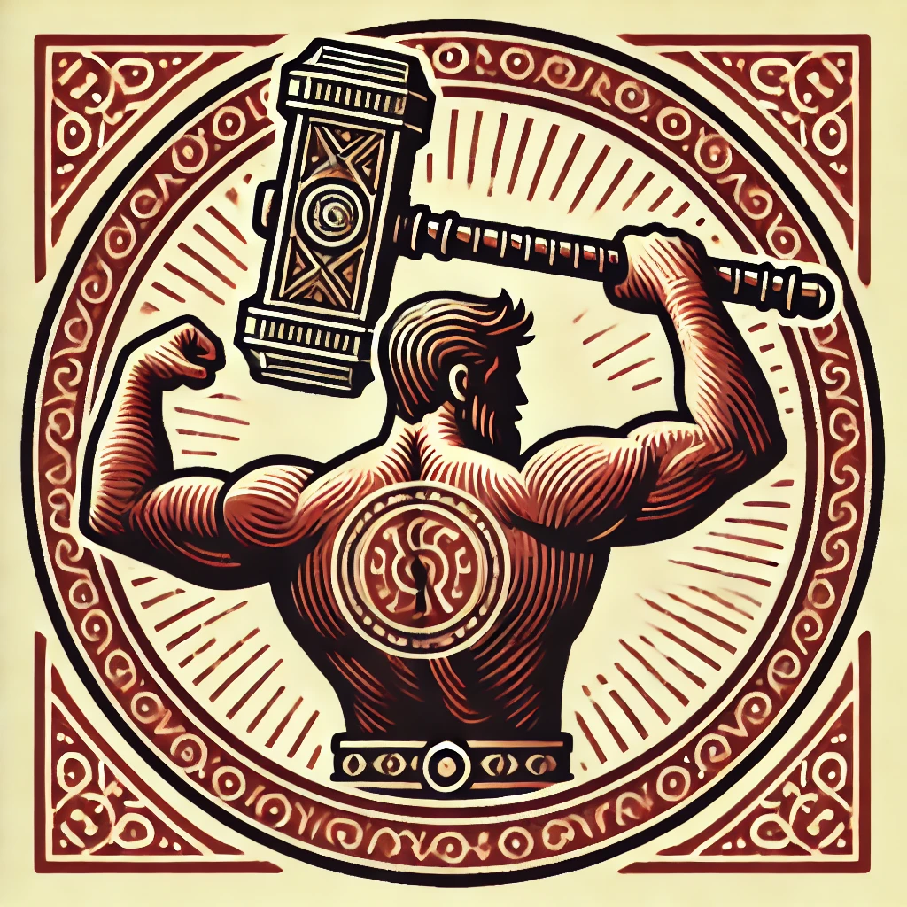
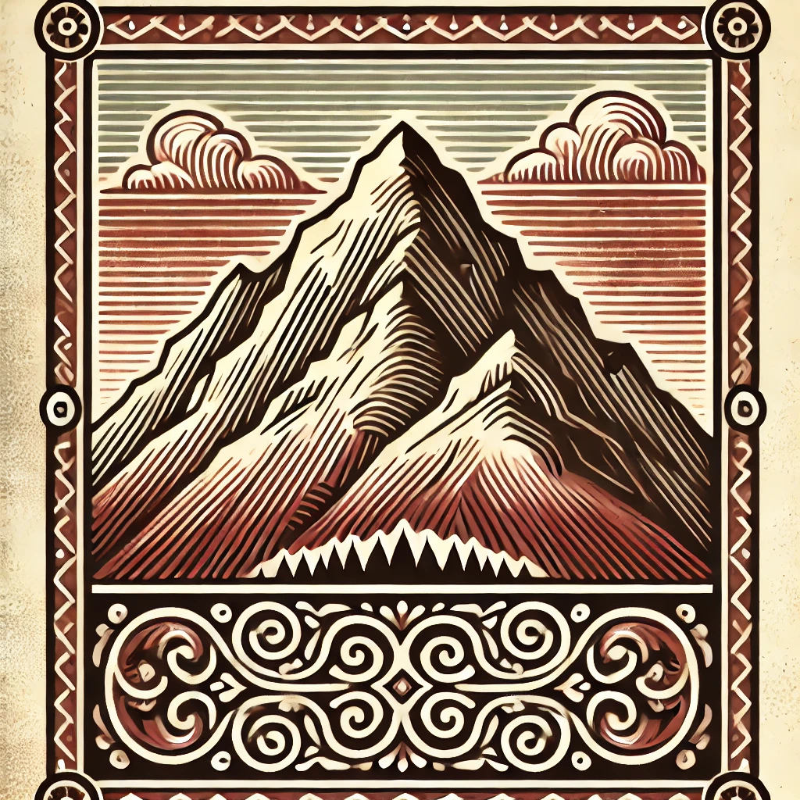
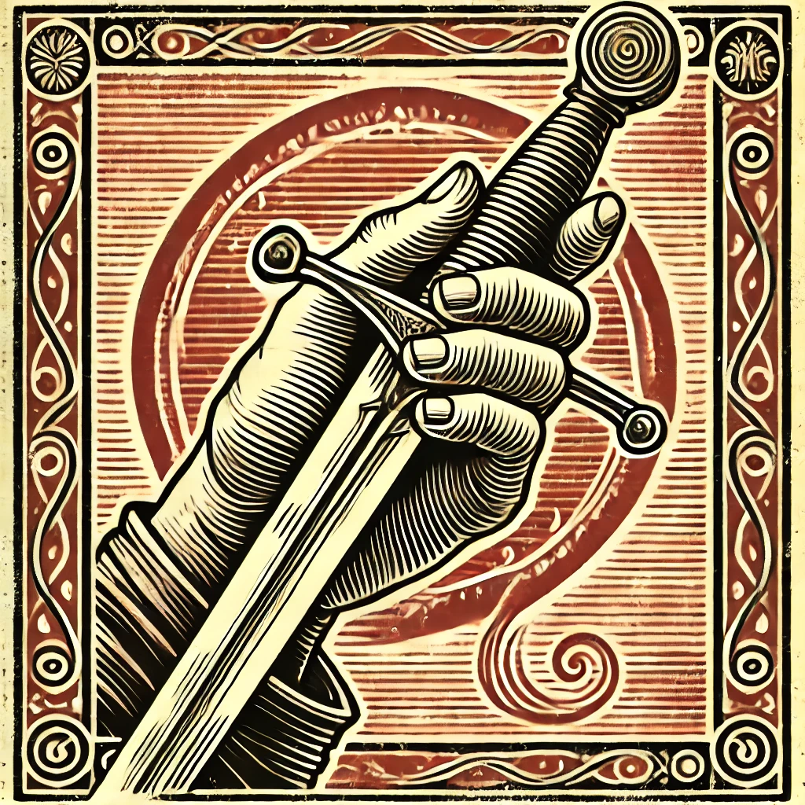
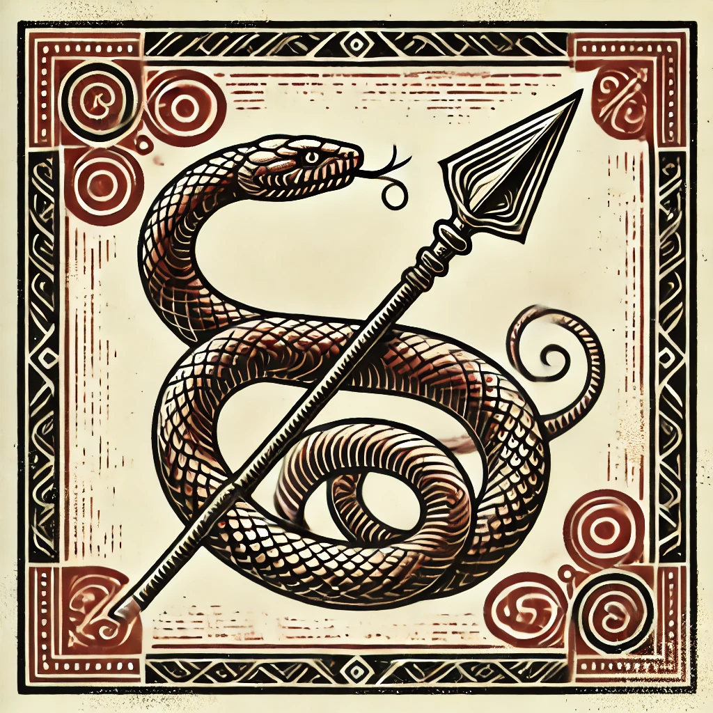
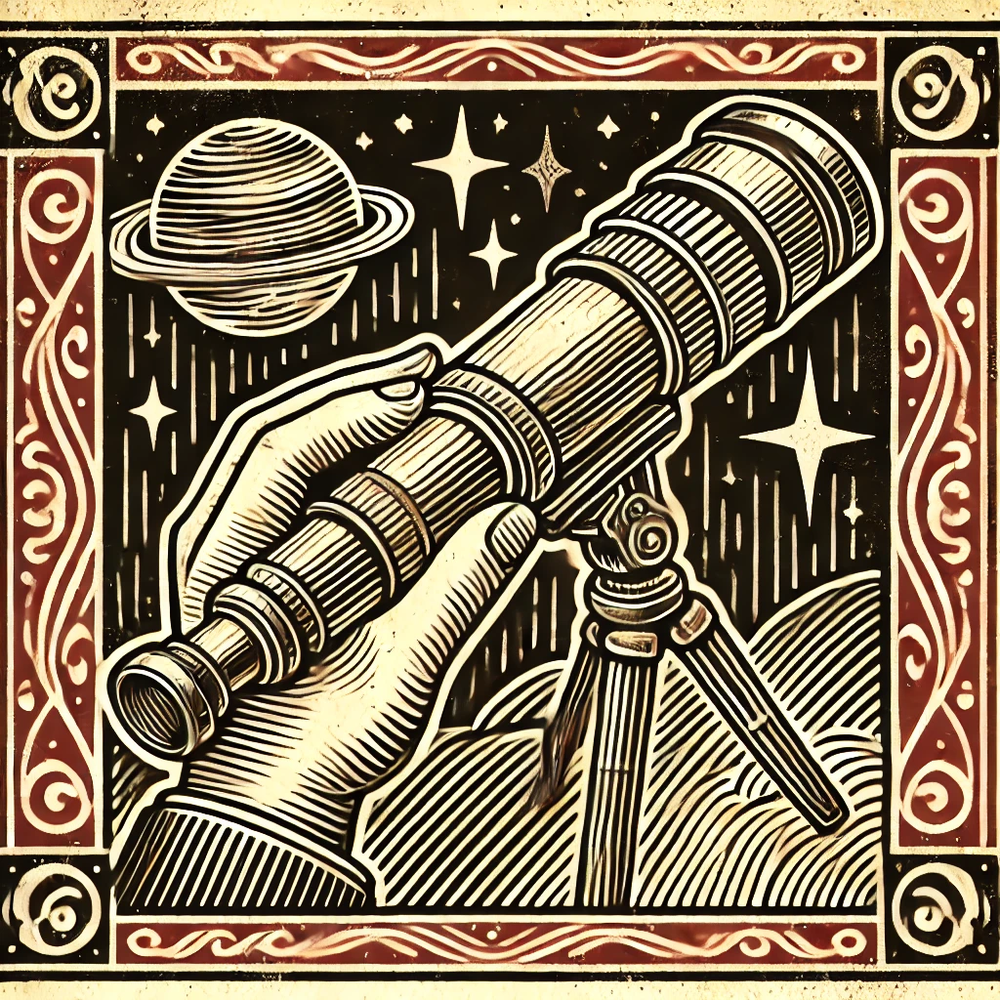
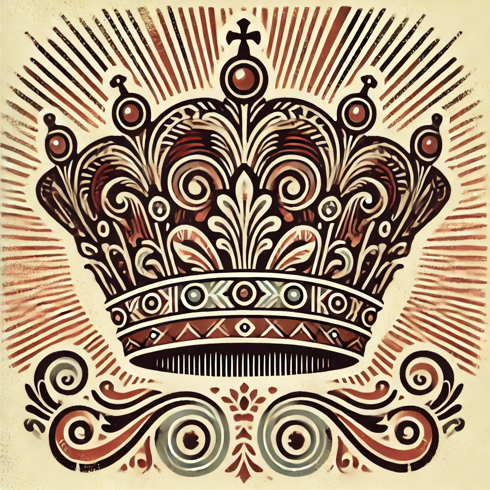
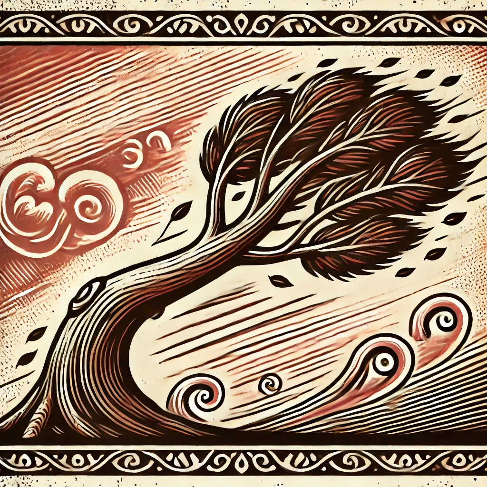
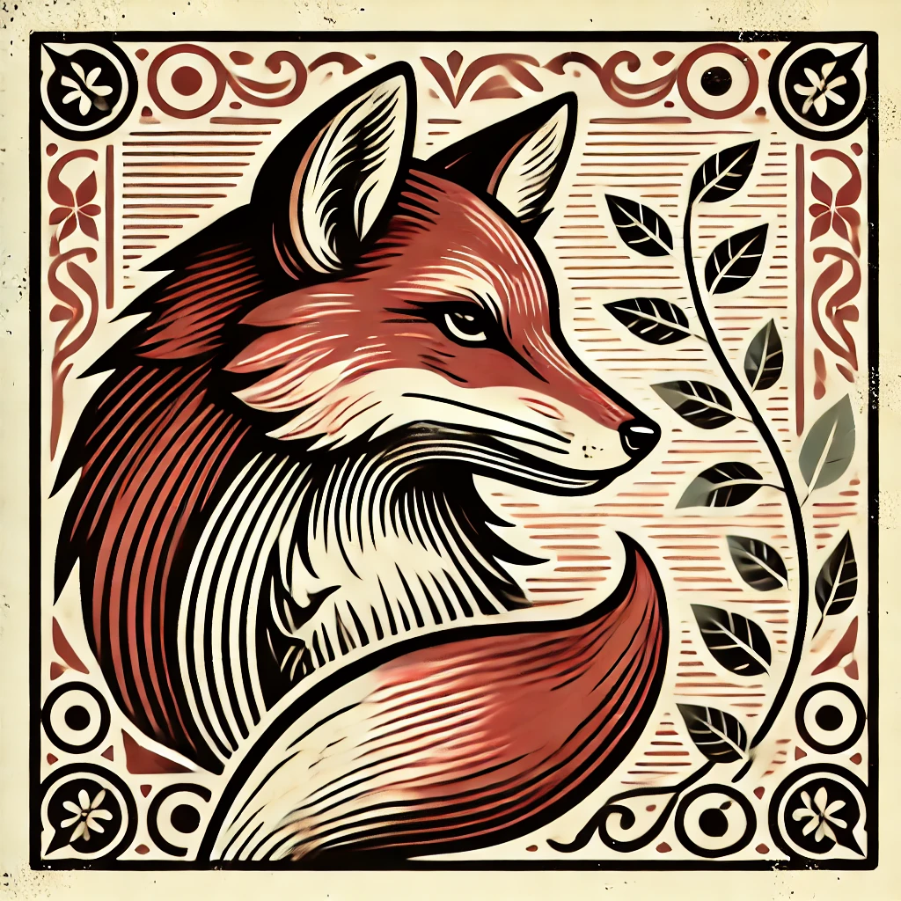
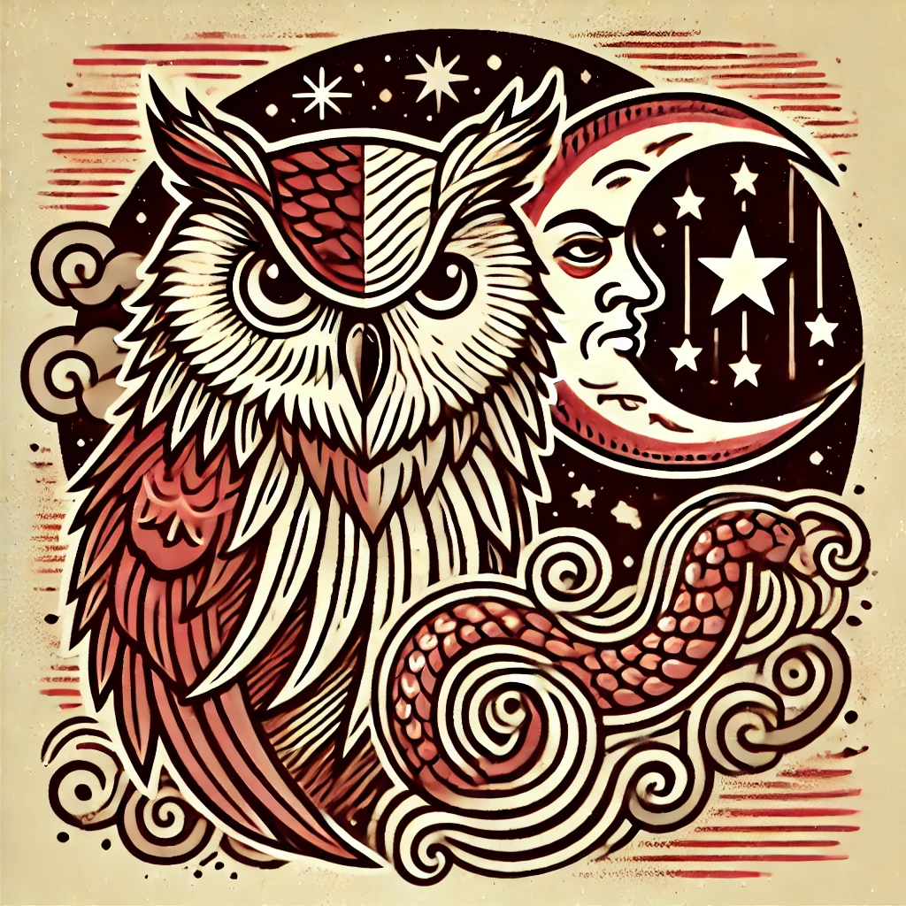

# Chapitre 1 : Les Attributs

## Généralités

Un attribut incarne une des multiples facettes du personnage. Les attributs principaux servent à réaliser des tests ou à mesurer les défenses passives du personnage. Les attributs du corps et de l’esprit constituent cette catégorie. Les attributs secondaires ont des usages différents en fonction de leurs natures. On ne réalise pas de tests grâce à eux, et ils ne mesurent pas de défense passive non plus. Ce sont des informations dont l’usage est particulier pour chaque attribut secondaire.

La moyenne humanoïde est située entre 10 et 11. C’est la valeur de référence des humanoïdes ne présentant aucune particularité dans le domaine en question. Cependant dans les faits, au vu de la variété de personnes pouvant peupler un monde, rares sont ceux qui sont ainsi proportionnés en tous points.

### Valeur de Base

La valeur de base d’un attribut correspond à la valeur sans les ajustements liés à la race, etc… C’est sur cette valeur qu’est indexé le coût d’amélioration d’un attribut (voir la section concernant la Progression).

| Valeur d’un Attribut | Correspondance Humaine |
| --- | --- |
| 0-1 | Morbide |
| 2-3 | Maladif |
| 4-5 | Carence |
| 6-7 | Faible |
| 8-9 | Moyenne Faible |
| 10-11 | Moyenne |
| 12-13 | Moyenne Haute |
| 14-15 | Haute |
| 16-17 | Très Haute |
| 18-19 | Impressionnante |
| 20-21 | Exceptionnelle |
| 22-23 | Sommité |
| 24-25 | Légendaire |
| 26 et + | Surhumain |

### Valeur fixe

La valeur fixe d’un attribut correspond à la valeur de base auquel on ajoute les ajustements « fixes », c’est-à-dire qui n’évoluent pas dans le temps. Il y a notamment : - Les ajustements dû à l’ethnie (univers thalifen). - Les ajustements dû au milieu de vie (univers thalifen). - Les ajustements dû à l’allégeance (univers thalifen). - Les ajustements dû à la caste (extension confrontation).

C’est sur cette valeur que se base vraiment le personnage lorsqu’il s’agit de calculer ses caractéristiques (ressources, défenses, etc).

### Valeur Ajustée

La valeur ajustée d’un attribut correspond à la valeur fixe auquel sont ajoutés tous les ajustements situationnels, tel que l'équipement employé pour réaliser celle-ci, le style de combat/joutes employé le cas échéant (extension) etc…

C’est sur cette valeur que se base vraiment le personnage lorsqu’il réalise des tests.

### Valeur Minimum

Si la valeur d’un attribut est réduite en deçà de 0 le personnage n’est plus en état de réaliser des tests qui sollicite l’attribut en question.a

## Les Modificateurs

Un attribut principal peut être observé de deux façons : 1) Pour sa valeur ajustée. 2) Pour le modificateur qui découle de cette valeur. Le modificateur est un ajustement +/- qui affecte les tests et les jets.

Notons que pour calculer une défense passive l’attribut associé est augmenté de 1 dans ce même calcul, de sorte que les modificateurs progressent sur les valeurs paires et les défenses passives sur les valeurs impaires.

| Valeur de l’Attribut | Modificateur | Défense passive |
| --- | --- | --- |
| 0 | -5 | 5 |
| 1 | -5 | 6 |
| 2 | -4 | 6 |
| 3 | -4 | 7 |
| 4 | -3 | 7 |
| 5 | -3 | 8 |
| 6 | -2 | 8 |
| 7 | -2 | 9 |
| 8 | -1 | 9 |
| 9 | -1 | 10 |
| 10 | +0 | 10 |
| 11 | +0 | 11 |
| 12 | +1 | 11 |
| 13 | +1 | 12 |
| 14 | +2 | 12 |
| 15 | +2 | 13 |
| 16 | +3 | 13 |
| 17 | +3 | 14 |
| 18 | +4 | 14 |
| 19 | +4 | 15 |
| 20 | +5 | 15 |
| 21 | +5 | 16 |
| 22 | +6 | 16 |
| 23 | +6 | 17 |
| 24 | +7 | 17 |
| 25 | +7 | 18 |
| 26 | +8 | 18 |
| 27 | +8 | 19 |
| 28 | +9 | 19 |
| 29 | +9 | 20 |
| 30 | +10 | 20 |

## Les Attributs Principaux

Il y a 10 attributs principaux caractérisant un personnage. Ces attributs peuvent être employés pour réaliser des tests de compétences ou d’attributs. Pour un personnage joueur, la valeur de base de ces attributs est de 10, sauf dans le cas d'une création de personnage avec des points à répartir (voir la section concernant la Création de personnage).

| Abréviation | Attributs Principaux |
| --- | --- |
| **Attributs du Corps** | |
| FOR | Force |
| CON | Constitution |
| DEX | Dextérité |
| AGI | Agilité |
| PER | Perception |
| **Attributs de l’Esprit** | |
| CHA | Charisme |
| VOL | Volonté |
| INT | Intelligence |
| RUS | Ruse |
| SAG | Sagesse |

### La Force

|  | Attribut du corps Aspect du Feu  |
| --- | --- |
| La force représente la puissance physique brute d’un personnage, même si elle n’indique pas directement la masse musculaire. Un personnage peut être fort sans une stature imposante ; La stature reflète mieux la masse corporelle. La force est cruciale pour manier des armes à impact, telles que des marteaux et des haches, où un coup puissant fait toute la différence. Il prend également en charge des tâches physiques exigeantes telles que soulever des objets lourds, briser des barrières et gravir des surfaces abruptes. Au-delà de la force brute, la Force améliore les compétences physiques et les interactions comme la forge et l'intimidation, où un physique solide devient un atout clé. |

### La Constitution

|  | Attribut du corps Aspect de la Terre  |
| --- | --- |
| La Constitution représente la santé, la vitalité et la résilience d'un personnage, cruciales pour supporter à la fois l'effort physique et la douleur. Il joue un rôle clé dans l’utilisation d’équipements défensifs comme les boucliers, où une endurance soutenue est essentielle. La constitution mesure l'endurance et la force d'un personnage, lui permettant de résister à la maladie, de se remettre de blessures et de supporter un effort prolongé. |

### La Dextérité

|  | Attribut du corps Aspect de l’Eau  |
| --- | --- |
| La dextérité mesure la coordination œil-main et la précision d’un personnage, essentielles pour manier des armes protégées comme les épées, où le contrôle et la finesse sont essentiels. Cet attribut est vital pour les manipulations fines, permettant des compétences telles que le crochetage, le recyclage, la jonglerie et le sabotage. La dextérité définit la capacité d'un personnage à effectuer des tâches délicates avec précision, ce qui la rend inestimable dans les situations qui nécessitent de la précision et une main ferme. |

### L’Agilité

|  | Attribut du corps Aspect de l’Air  |
| --- | --- |
| L'agilité reflète la vitesse, la flexibilité et le contrôle du corps d'un personnage, lui permettant de manœuvrer avec grâce et fluidité. Cet attribut est essentiel lors du maniement des armes d'hast, telles que les lances ou les hallebardes, où l'agilité et la précision du jeu de jambes sont essentielles pour une manipulation efficace. L'agilité permet des actions nécessitant de la flexibilité et de la dextérité des jambes, ce qui la rend inestimable pour éviter les obstacles, maintenir l'équilibre et effectuer des mouvements qui exigent une réponse rapide et contrôlée de la part du corps. |

### La Perception

|  | Attribut du corps Aspect du Vide  |
| --- | --- |
| La perception mesure la conscience sensorielle et l’attention d’un personnage aux détails subtils de son environnement. C’est également l’attribut principal des attaques à distance, car une perception fine est essentielle pour la précision à distance. De plus, Perception améliore la réactivité d'un personnage, le rendant plus sensible aux rythmes du combat et mieux capable de réagir rapidement aux changements et aux ouvertures. |

### Le Charisme

|  | Attribut de l’esprit Aspect du Feu  |
| --- | --- |
| Le charisme décrit la force de la personnalité d’un personnage et sa capacité à avoir un impact sur les autres. C’est l’attribut clé de la persuasion, permettant à un personnage d’influencer, de motiver ou de démoraliser positivement ou négativement ceux qui l’entourent. Le charisme permet à un personnage d'inspirer confiance ou de susciter le doute, ce qui le rend essentiel pour les interactions sociales où l'influence est primordiale. |

### La Volonté

|  | Attribut de l’esprit Aspect de la Terre  |
| --- | --- |
| La volonté mesure la détermination et la force mentale d'un personnage, lui permettant de résister à la manipulation et à la fatigue. C’est également crucial pour puiser dans sa détermination intérieure d’accomplir des exploits remarquables qui défient les attentes. |

### L’Intelligence

|  | Attribut de l’esprit Aspect de l’Eau  |
| --- | --- |
| L'intelligence indique la capacité d'un personnage à raisonner, à apprendre et à résoudre des problèmes complexes. Il est indispensable pour lire entre les lignes d'un document, rédiger efficacement en restituant parfaitement les informations et en insérant des messages cachés, ainsi que relier les éléments lors d'une enquête. L’intelligence joue également un rôle crucial dans la capacité à se souvenir des choses, facilitant ainsi la mémorisation et le rappel des informations importantes. |

### La Ruse

|  | Attribut de l’esprit Aspect de l’Air  |
| --- | --- |
| La ruse représente l'ingéniosité et la réactivité d'un personnage, sa capacité à réfléchir rapidement et à s'adapter à de nouvelles situations. La ruse est particulièrement utile pour naviguer dans des environnements urbains complexes et interagir avec les animaux domestiques, permettant de manipuler facilement les éléments sociaux et les environnements construits par l'homme. |

### La Sagesse

|  | Attribut de l’esprit Aspect du Vide  |
| --- | --- |
| La sagesse reflète l'expérience et le jugement d'un personnage, sa capacité à prendre des décisions réfléchies basées sur ses expériences. Il joue un rôle essentiel dans la guérison, la navigation en milieu rural et l'interaction avec les animaux sauvages, permettant l'harmonie avec le milieu naturel. |

## Les Attributs Secondaires

Il y a donc 6 attributs secondaires qui complètent un personnage. Ces attributs ont pour base une valeur de 10, sauf cas particuliers (l’équilibre).

| Abréviation | Attributs Secondaires |
| --- | --- |
| EGO | Ego |
| APP | Apparence |
| STA | Stature |
| TAI | Taille |
| EQU | Equilibre |
| CHN | Chance |

### L’Apparence

L’apparence mesure l’impression et le feeling que véhicule le physique du personnage. Certains parlerons de beauté, mais ce serait peut-être un peu trop sensualiser le concept. Un personnage avec une forte valeur d’apparence est attirant, donne envie de s’engager. Un personnage avec une faible valeur d’apparence est repoussant, ne donne pas confiance. L'apparence est à l’esprit ce que la Taille est au corps. L’Ego est donc rattaché à l’esprit.

### L’Ego

L’égo mesure la confiance en soi du personnage et sa capacité à accepter les remises en question. Un personnage avec une forte valeur d’égo est sûr de lui. Un personnage avec une faible valeur d’égo n’est pas sûr de lui. L’Ego est à l’esprit ce que la Stature est au corps. L’Ego est donc rattaché à l’esprit.

### La Stature

La stature mesure la masse du personnage, peu importe à quoi celle-ci est due. Un personnage avec une forte valeur de stature est large vis-à-vis de la norme humaine. Un personnage avec une faible valeur de stature est fin. La Stature est au corps ce que l’égo est à l’esprit. La Stature est donc rattachée au corps.

### La Taille

La taille mesure la hauteur du personnage. Un personnage avec une forte valeur de taille est grand vis-à-vis de la norme humaine. Un personnage avec une faible valeur de taille est petit. La Taille est au corps ce que l'apparence est à l’esprit. La Taille est donc rattachée au corps.

!!! note "Note"
    

    En toute logique un personnage est relativement normal si sa stature et sa taille son identique. Si la stature est inférieure à la taille, ce dernier est marqué d’une forme de maigreur, et inversement.

### La Chance

La chance joue un petit rôle dans le quotidien de chacun, notamment lorsque le hasard a son mot à dire. Un personnage avec une forte valeur de chance est chanceux. Un personnage avec une faible valeur de chance est malchanceux. La chance n’est rattachée ni au corps, ni à l’esprit.

### L'Équilibre

L’Équilibre représente l’état général de bien-être et d’harmonie du personnage, tant sur le plan physique que mental. Un personnage doté d’un bon équilibre récupère plus rapidement au quotidien et fait preuve d’une meilleure résistance face aux épreuves, notamment en termes d’endurance.

Sa valeur de base correspond à la moyenne entre :

- la valeur de base du deuxième attribut principal le plus élevé,
- et la valeur de base de l’attribut principal le plus faible.

### Les Attributs Supplémentaires

Les modules d’univers ou de jeu visant à compléter les règles de base de Terre Natale peuvent contenir des attributs supplémentaires (nécessairement secondaires) en phase avec l’univers ou les notions apportées dans celui-ci.
